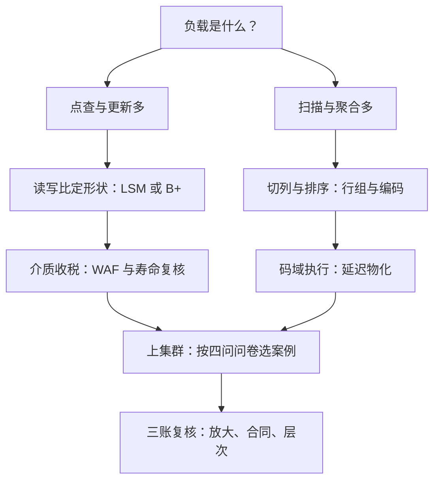

# 存储深化收束

存储系统的设计不是在好坏之间选，而是在三本放大账之间转移成本；能读懂转移发生在哪一层的人，才谈得上选型。

<footer>—— 据 O'Neil et al., 1996；Graefe, 2010；Agrawal et al., 2008；Melnik et al., 2010 各自的取舍陈述整理</footer>

[上一课](/cs/st-distributed-cases)用四份答卷把单机的页、日志与格式带进集群。本课程到此收束：本课把七课与主干拼成三张总账——放大账、合同账、层次账，并给出一个通用的读法：先问成本转移到哪了，再问合同签给谁，最后问层次插在哪。主干课钉过单点机制，深化课补的是机制之间的账。

## 问题

决策变量从来不是「哪个结构最好」，而是四组：读改写比与负载形状（点查、范围、扫描、嵌套分析）、介质与耐久（盘会擦写几次、随机写贵几倍）、规模与一致性（单机到集群、最终到外部一致）、可接受的运维复杂度。[LSM 的深入](/cs/st-lsm-deep)服务写多读少的点查，[B+ 树的实现细节](/cs/st-btree-implementation)服务读路径短而随机的更新，[SSD 与 FTL](/cs/st-ssd-ftl) 决定前两家每页写被乘几倍，[Parquet 解剖](/cs/st-parquet-anatomy)与[压缩列存](/cs/st-compressed-columnar)服务扫描为主的列式分析，[缓存的层次](/cs/st-cache-tiers)把单机各层拼图，[分布式存储的案例](/cs/st-distributed-cases)把拼图带上集群。缺一课都不成图。

## 方法

三张账的读法。放大账：写、读、空间三种放大在结构（LSM 形状）、实现（B+ 填充率与分隔键）、介质（FTL 的 WAF）三层各自记账又互相作用——LSM 的顺序刷盘讨好 FTL 的 log 区，随机 UUID 主键惩罚 FTL 的 GC，也惩罚 B+ 的页占用率；压缩把读放大的字节变成解压的周期。账要先在每层分开记，再合并算总账，只看任何一层都会得出方向正确的错误结论。合同账：本课程每课都在签合同——页（引擎对介质）、文件格式（引擎对存储）、映射（LBA 对物理页）、缓存（层对层）、时间戳（事务对时钟）。合同越往下越难重签：FTL 固化在盘里，文件格式固化在数据湖里，改合同的成本就是迁移的成本。层次账：每一层缓存的准入、旁路与写序，每一层结构的插入判据（比下层快得多、比上层大得多、有人为替换负责）。

## 机制

贯穿课程的机制母题有三个。摊销固定成本：与高性能网络课同一句话——LSM 的顺序刷盘把随机页写换成一次付清的归并带宽，批量装载把分裂税一次付清，ZNS 把 GC 的账整体搬回主机；凡是「每次都付的小钱」，都值得问能否「一次付清」。顺序化：LSM、LFS、FTL 的 log 区、排序的列存、自底向上建树，是同一个母题在五层的五个名字；顺序化的对手永远是随机访问，识别负载里谁是随机的那一方，就找到了设计的第一杠杆。排序与局部性：分隔键截断靠比较语义、列存的统计跳过靠数据局部性、编码收益靠有序度、缓存命中靠访问局部性——局部性是这套系统里唯一反复兑现的免费午餐，所有换它的成本（排序、聚簇、维护）都在写入端明码标价。

跨课程呼应：网络课的「每下移一层，固定税改固定成本」与本课程「放大成本在层间转移」是同一原理的两种记账；量化栏的执行课把它写成行情数据的函数——三栏共用的是摊销与局部性，不是同一批结论。

## 边界

本课程不写云厂商产品选型与价格对照，不进纠删码的数学与一致性理论的证明，不展开向量化执行引擎的完整实现；安全（加密、多租户隔离）与备份恢复各有专课。深化课的主张始终是读法：机制在主干，账在这里。本课程到此收束。

## 小结

- 三张账：放大账在结构、实现、介质三层分记再合并；合同账看签给谁、重签多贵；层次账看准入、旁路、写序。
- 摊销固定成本与网络课同源：把每次付的小钱改写成一次付清的大钱。
- 顺序化是第一母题：LSM、LFS、FTL、列存排序、批量装载是它在五层的名字。
- 局部性是唯一的免费午餐，成本在写入端明码标价。
- 出处：O'Neil et al. 1996；Graefe 2010；Agrawal et al. 2008；Melnik et al. 2010；据各文献取舍陈述整理。
