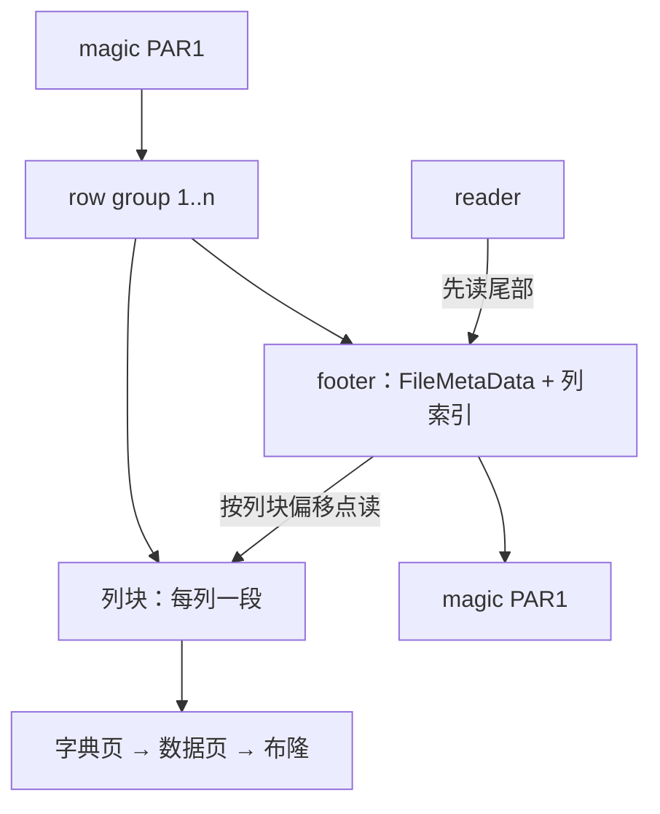

# 列存格式：Parquet 解剖

Parquet 把「表」变成一个自描述文件：先读尾部元数据，再按列寻址。格式自己就是合同，读完这份合同，引擎可以换、存储可以换。

<footer>—— 据 Melnik et al., Dremel, VLDB 2010；Apache Parquet 格式规范（parquet-format）整理</footer>

[上一课](/cs/st-ssd-ftl)收在块接口下有介质税单。前几课的结构都活在引擎自己的页合同里；分析型数据要离开引擎、装进开放文件时，格式必须自己当合同。主干已钉过 [列存与 PAX](/cs/columnar-pax) 的页内列化、[列压缩](/cs/column-compression)的字典与 RLE、[Parquet / ORC](/cs/parquet-orc) 的 row group、列块与统计合同。本课解剖文件本体：字节怎么排、嵌套怎么存、统计怎么细到页、行组怎么定大小。后课默认：读 Parquet 就是先读合同再取列块。

## 问题

主干说了「读 footer 的统计跳 row group」。缺口在合同的具体条款。其一，字节布局：文件以 4 字节 magic 开头，中间是若干 row group，尾部是元数据、4 字节长度加 magic——所以一切 reader 的第一步是 seek 到文件末尾倒着读，拿到 schema、每列块的偏移与统计后，按列独立发起点状读取，对象存储上这正是并行度的来源。其二，嵌套：扁平列存装不下嵌套记录，Dremel 的 repetition/definition levels 把嵌套路径压成两列小整数——definition 记这条值路径上有几层 optional 字段有定义，repetition 记相对上一条记录在同一重复层走回了第几级，重组靠它们，不靠把记录拼回 JSON。其三，统计的粒度：只有 row group 一层 min/max，跳过太粗；细到页才有得挑。

## 方法

条款按读取路径排。元数据层：footer 里的 FileMetaData 记每行组每列块的类型、编码、压缩、偏移与统计；列索引（ColumnIndex / OffsetIndex）把 min/max 与行号范围再细分到页，谓词在页级就能说不命中——这是 [zone map](/cs/zone-maps) 的文件版。页层：列块内先字典页（若字典编码）再数据页，数据页 v1/v2 的差别在 level 与值的编码组织方式，页级还有布隆过滤器页兜点查。行组大小与底层分配单位对齐（HDFS 块或对象大小，常在一两百 MiB 量级）：太小则元数据与请求数爆炸、统计层失去过滤价值；太大则写入端缓冲大、失败重试与内存物化的粒度变粗。文件不可变，更新与事务交给元数据层组织——主干课已钉过这句合同，本课补的是它的物理前提：列块可独立寻址，替换一个行组不必重写全文件。

## 机制

为什么条款这样定。列块独立寻址，是因为分析查询只碰少数列：只拉需要的列、只读命中的页，I/O 才从「扫整表」缩到「扫谓词可能命中的页」。统计的粒度是过滤收益与元数据量的折中：粒度越细，跳过越准，footer 与索引也越占读取预算。rep/def levels 让嵌套不破坏列独立：每列自带两级小整数（各占一字节内），重组只读涉及的列，谓词还能在重组之前先过滤——嵌套于是没有把列存拖回行存。不可变加自描述 footer，让文件成为 catalog 的最小单位：引擎、计算框架、元数据服务各自独立演进，互不锁死。

易错点：小文件病不是 Parquet 的错而是行组规划的错——每个文件自带一份 footer 与列索引，行组按 MiB 以下切分时，元数据读取的时间会超过它帮你省下的数据扫描。

## 边界

本课不重比 Parquet 与 ORC 的编码取舍（[主干对照课](/cs/parquet-orc)已钉），不重讲字典与 RLE 的定义（[列压缩课](/cs/column-compression)是前置），位图与倒排等索引另课。ORC 的轻量级索引与 ACID 扩展不展开。后课默认：文件是自描述、按列可寻址的不可变单元。下一课进入列块内部：编码与压缩的两层栈怎么叠、查询怎么不解码就过滤。

## 小结

- 读法先倒读 footer：schema、列块偏移与统计都在尾部，列块可独立点读。
- 嵌套靠 rep/def levels 两个小整数：列独立保持，谓词可在重组前过滤。
- 列索引把 min/max 细到页；统计粒度是过滤收益与元数据量的折中。
- 行组对齐存储分配单位；太小元数据爆炸，太大缓冲与重试粒度变粗。
- 出处：Melnik et al., Dremel, VLDB 2010；Apache Parquet 格式规范；Apache ORC 文档。
