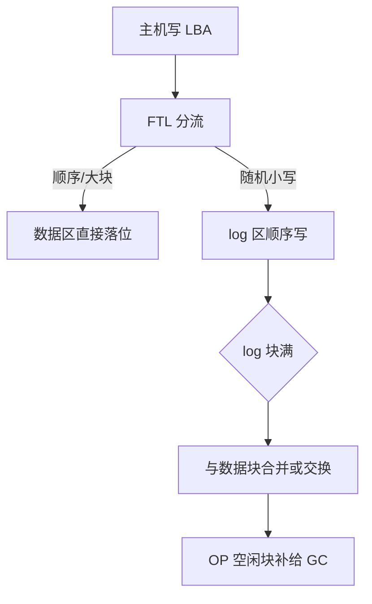
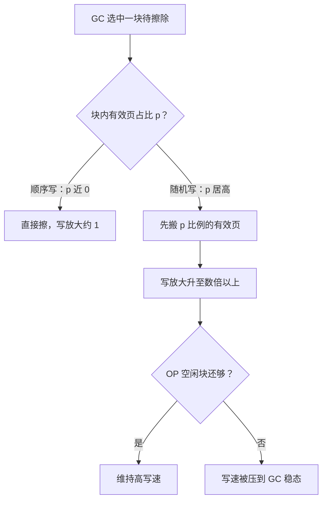

# SSD 与 FTL

块接口许诺页可以原地覆盖；闪存只按页写、按块擦。FTL 在两者之间签一份翻译合同，写放大就是这份合同的价格表。

<footer>—— 据 Agrawal et al., USENIX ATC 2008；Desnoyers, SYSTOR 2012；NVMe ZNS 规范整理</footer>

[上一课](/cs/st-btree-implementation)把 B+ 实现的合同钉在页上，页可原地覆盖读写是合同成立的前提。本课去收介质对这份前提开的税单。主干已钉过 [NAND 闪存与 FTL](/cs/nand-ftl) 的页写块擦与 L2P 映射的可恢复性、[SSD 内部并行、GC 与磨损](/cs/ssd-gc-wear)的回收与均衡、[discard 与 TRIM](/cs/discard-trim) 的空闲告知。深入问四个问题：映射粒度怎么选、超配留多大、随机写到底贵几倍、主机能替 FTL 做什么。后课默认：块设备的写放大是有价格表的，引擎与文件系统都是这张表的读者。

## 问题

页级映射：每个逻辑页一条表项，随机写零合并开销，但 1 TiB 盘按 4 KiB 粒度要两亿多条表项，几 GiB 的表自身要在 DRAM 与 NAND 间分级——映射表的容量本身就是成本。数字实例：$1\ \text{TiB} \div 4\ \text{KiB} \approx 2.68$ 亿条表项，每条 4 字节就是约 1 GiB 的映射表——这笔 DRAM 要常驻在盘里，这就是页级映射「随机写零合并」的定价。块级映射：表极小，但小随机写逼着 FTL 搬整块有效页来腾位置。折中是混合式：新写先进 log 区顺序落，log 块装满再按数据块做合并或交换；顺序写近乎免费，随机写把 log 块与数据块的交换搅成搬运风暴。粒度选择因此是表容量与随机写搬运量的三方权衡，没有两端都赢的解。

## 方法

第二个旋钮是超配（OP）：物理容量中不开放给用户的那部分，专供 GC 挑空块。预留越多，GC 选块越从容，随机写的写放大越低；消费级常见约 7%，企业级 20% 到 28%——同一份 NAND，OP 差三倍，随机写寿命兑现可以差数倍。[TRIM](/cs/discard-trim) 把已删空间提前告诉 FTL，相当于临时扩大 OP，这是软件不花钱就能买到的写放大折扣。常见误区：以为删除文件就腾出了盘内的空间。块接口并不知道哪些页已经死了，TRIM（discard）就是把这个消息递给 FTL 的接口——不开 TRIM，已删数据照样占着 GC 的搬运量。耐久账随之而来：TLC 颗粒的擦写次数以千计，若业务持续随机写被 FTL 放大十倍，介质承受的字节流速就是十倍，寿命按同倍数折损——「这块盘写不死」的判断必须用 WAF 校正后再下。

主机能替 FTL 做的事按介入深度排：把负载顺序化（[LFS](/cs/log-structured-fs) 与 [F2FS](/cs/f2fs) 已在文件系统层做过一遍）；用 multi-stream 给写打流标签，让 FTL 按流分区回收，冷热不再混块；更彻底是 ZNS，把空间划成必须顺序写的区域，合并逻辑整体还给主机——FTL 退化成一个薄映射，GC 的账由文件系统自己算。介入越深，主机接管的责任越多，与网络课「每下移一层，内核职责改名由你承担」是同一句合同。

## 机制

随机写贵的机制可以一笔账写清：GC 选中的擦除块里有效页占比 $p$，释放一块就要先搬 $p$ 块的数据。顺序写让块整块变旧、$p$ 趋近于零，写放大约为 1；持续的小随机写让每个块都半新不旧，$p$ 居高不下，写放大随之爬到数倍到十倍。OP 的作用就是给 FTL 挑选低 $p$ 块的余地。这也解释了为什么「随机写性能」在 SSD 上是一段会掉下去的曲线：写入速率长期超过 GC 消化速率时，盘先是耗尽 OP 空闲块，再把主机写速压到 GC 速率——稳态吞吐由回收速率决定，不由颗粒的编程带宽决定。直觉类比：GC 像搬宿舍——房间里还留着九成没拆封的纸箱（$p=0.9$），为腾这一间得先搬九间的东西；住满即搬空的房间（顺序写）几乎是白腾。

数字锚点：TLC 页编程以数百微秒到毫秒计，擦除以毫秒到十毫秒计，而页读只要几十微秒——GC 搬一块等于整块的读加写，这就是为什么读为主的盘几乎感受不到 FTL，写为主的盘处处是它。

## 边界

本课不重讲 NAND 物理与 L2P 恢复（[NAND 闪存与 FTL](/cs/nand-ftl) 已钉）、不展开并行结构与磨损均衡（[SSD 内部课](/cs/ssd-gc-wear)已给）、不进 NVMe 队列细节（[NVMe 驱动](/cs/nvme-driver)另有专课）。读扰动、保持期与纠错只点名存在，不展开工艺。后课默认：块接口下有按块擦写的介质，WAF 是 FTL 对写负载的报价。下一课转向分析型负载：当数据离开引擎自己的页合同、装进开放文件时，合同怎么签。

## 小结

- 映射粒度三方权衡：页级表大随机写零合并，块级表小小随机写搬块，混合式居中。
- OP 是写放大的价格旋钮：7% 到 28% 的预留差，随机写寿命兑现差数倍；TRIM 是免费的 OP 补贴。
- GC 成本由块内有效页占比决定：顺序写近似免费，小随机写把曲线压到 GC 稳态。
- 主机介入谱系：顺序化、multi-stream、ZNS，介入越深责任越多。
- 出处：Agrawal et al., USENIX ATC 2008；Desnoyers, SYSTOR 2012；NVMe ZNS 与 ONFI 规范。
