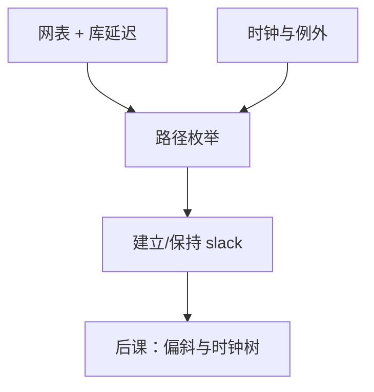

# 静态时序分析 STA

  
不必穷举向量：把组合路径的最大/最小延迟加起来，对照建立与保持不等式，就能判定这张网表在给定周期下是否违例。

  <footer>—— 据 Harris and Harris, Digital Design and Computer Architecture；Hennessy and Patterson, CA:AQA 整理</footer>

[上一课](/cs/synthesis-netlist)交出网表。组成课已有[建立保持](/cs/setup-hold)不等式。缺口是工程上的**静态时序分析**：在所有（或约束声明的）寄存器到寄存器路径上检查建立/保持，而不是靠仿真碰巧打到关键路径。

## 问题

功能仿真再久也覆盖不了指数级输入。时序是另一类性质：路径延迟是否 ≤ 周期预算。STA：图上节点是引脚，边是单元延迟与线延迟（先用线负载模型，布局后再用提取寄生）。缺口不是再定义 $t_{su}$，而是：**时序弧、时钟定义、伪路径、多周期路径**如何让分析与设计意图一致。

建立用最大延迟（慢角、晚时钟），保持用最小延迟（快角、早时钟）。与后课偏斜/CTS 衔接：时钟到达时间进入同一组不等式。

### STA 不是「证明功能正确」

全 0 的网表可以时序干净。功能靠仿真、断言与后课等价检查。把 STA 通过当成芯片功能签核，算术单元的饱和 MUX 接错也看不见。

Harris 把时序分析接到建立保持。CA:AQA 从周期与 CPI 看时钟。工业 SDC 是约束语言，本课用它的概念不背命令全集。

## 方法

1. 声明时钟周期与波形。2. 输入/输出延迟相对该时钟。3. 工具枚举 FF→组合→FF 路径，报告 slack。4. 假路径（异步输入未同步前）必须声明，否则误报。5. 多周期路径（除法器迭代）放宽建立。保持通常仍是单周期关系。

与[关键路径](/cs/critical-path)课对照：组成课画数据通路最长组合；STA 在真实库上把那条路径量化成 ns。

## 机制

负 slack → 降频、改 RTL、换快单元、或后课物理设计缩短线。保持违例降频无效——与建立保持课同一句。跨时钟域路径默认不该当同步路径分析，下一课之后的 FIFO 才是合法结构；错误地用 STA「对两个无关时钟做建立检查」会产生无意义违例或虚假通过。

## 边界

本课不讲统计时序（SSTA）的全部相关模型，不把电源噪声时序（SI）写完。不引入光刻 OPC 对延迟的影响——那是光刻栏。也不把 GPU 训练迭代当时序向量。

后课默认：周期约束下的建立/保持由 STA 在网表上检查；时钟到达时间的差异是下一课 CTS 的缺口。

## 小结

- STA 静态累加路径延迟，对照 $t_{su}$/$t_h$。
- 不替代功能验证。
- 假路径与多周期必须声明，否则分析与意图分裂。
- 出处：Harris and Harris；Hennessy and Patterson, CA:AQA。
