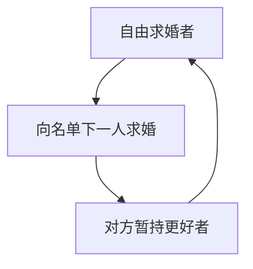

# 稳定婚姻算法

双方提交全序偏好；Gale–Shapley 求婚直到没有人被拒绝得动：结果稳定，且提出方最优。

<footer>—— 据 Gale and Shapley, College Admissions and the Stability of Marriage, 1962；Knuth, Stable Marriage and Its Relation to Other Combinatorial Problems, 1976 整理</footer>

上一课[Edmonds 带花树](/cs/blossom-matching)求一般图最大基数匹配。本课匹配仍是一对一，但目标换成**稳定**：没有阻塞对 $(m,w)$ 使得二人都更喜欢对方而非当前配偶。不重写花。缺口是 Gale–Shapley 的求婚过程。后课图着色，离开匹配。

## 问题

二分（男–女，或申请人–学校一席）。偏好严格全序。匹配稳定：不存在互相更偏好的未匹配对。稳定匹配一定存在。Gale–Shapley：一方求婚，另一方暂持当前最好、可悔。未匹配求婚者向尚未拒绝他的名单下一人求婚。终止时稳定。

提出方最优：每个提出者得到所有稳定匹配中自己能得到的最好对象；接受方最差。缺口是稳定性，不是权和最大（那是 KM）。

### 不是最大匹配

基数在完全偏好下自然完美（双方人数相等）。不稳定的完美匹配很多。医院–居民有容量时是 HR 问题，GS 可推广；本课先一对一。

Gale–Shapley 1962。Knuth 1976 讲义把变体与循环讲清。Roth–Sotomayor 是经济学侧，本课算法：终止、稳定、最优侧。后课着色是另一组合标签。

## 方法

每人列表指针。循环：取一个自由求婚者，向列表下一人求婚；对方若更偏好则甩掉旧的。$O(n^2)$ 次求婚（每人每条偏好至多一次）。

平局偏好要事先破，否则稳定定义要改弱。

## 机制

不变式：被拒绝的人以后不会被该接受方接受（接受方偏好只升不降）。终止后若有阻塞对，可推出某次求婚应被接受而未发生，矛盾。提出方最优：任何稳定匹配里，提出者都不会得到比 GS 更好的对象——否则最早被「更好」拒绝的时刻可造阻塞。

与带花：那里没有偏好，只有边在不在。本课边都在，质量来自序。

## 边界

本课不写宿舍问题（非二分稳定匹配可能空）、不写策略操纵全文。不把匹配市场当金融课。后课默认：稳定婚姻 = GS；$O(n^2)$；提出方最优。下一课图着色与贪心启发。

## 小结

- 稳定 = 无阻塞对；GS 求婚保证存在。
- 提出方最优、接受方最差。
- 目标不是最大权或最大基数本身。
- 出处：Gale and Shapley, 1962；Knuth, 1976。
