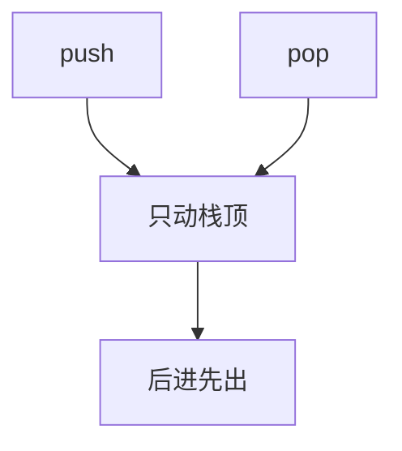

# 栈与调用

只允许在一端插入删除，后进先出就自动对齐过程调用的进入与返回。

<footer>—— 据 Dijkstra, Recursive Programming, Numerische Mathematik 1960；Cormen, Leiserson, Rivest and Stein 整理</footer>

[上一课](/cs/dll-circular)给出序列的两种表示。[调用约定与栈](/cs/calling-convention-stack)已经在 ISA 里用连续栈传参、存返回地址。本课不重讲 `jal`/`ret` 和帧指针。缺口是把栈写成 ADT：操作只有 push/pop/peek，从而同一合同既能解释硬件调用栈，也能解释后课的括号匹配与 DFS 控制。表示可以是数组顶指针，也可以是链表头。

## 问题

通用序列允许在中间改。调用需要的纪律更窄：被调者返回前，调用者的局部必须原样在。缺口不是再讲一遍 RISC-V 栈约定，而是**LIFO 合同**：后压入的先弹出，空栈弹出无定义。有了合同，硬件栈只是一种表示；表达式求值、递归改为迭代，用同一套操作。

[渐近记号](/cs/asymptotic-notation)下，数组表示的 push/pop 是 $\Theta(1)$ 摊还或最坏（定容则最坏）。链表表示最坏 $\Theta(1)$ 但局部性差。调用栈选数组，因为帧连续、地址可算。

Dijkstra 用栈把递归从硬件里解放成程序员可推理的结构。本课把 ISA 已有的那一端和 ADT 对齐。

## 方法

抽象状态是序列，只暴露尾端。push 把元素接到尾，pop 去掉尾。空与满是前置条件或返回值，本课不规定异常政策。

硬件调用：push 返回地址与溢出寄存器，pop 恢复。递归深度对应栈高。本课不把堆分配的「调用栈溢出检测」写成操作系统课。

## 机制

LIFO 匹配嵌套寿命：内层帧活着时外层不能先弹。括号、树的后序、函数调用是同一模式。队列下一课改成 FIFO，嵌套寿命对不上，但生产者-消费者对得上。

数组定容栈会满：递归过深是合同失败，不是加法溢出。动态数组把满变成摊还扩容，分析在后课。peek 不改状态，只读顶端；空栈上的 peek 与 pop 同一前置条件。

## 边界

本课不引入双端队列，不把栈写成可随机访问的数组——即便表示是数组，合同也不给下标。线程各有调用栈，共享堆，那是操作系统课；此处单线程顺序执行。

后课默认：谈到栈，指 LIFO 操作，常数时间一端更新。缓冲与异步需要另一端进、一端出。

## 小结

- 栈 = 序列合同收窄到 LIFO；与调用帧嵌套同构。
- 表示可用数组顶或链表头；调用栈选连续数组。
- FIFO 缓冲是下一课的缺口。
- 合同不提供按下标取元素，即使表示恰好是数组。
- 出处：Dijkstra, 1960；Cormen et al. 栈；本栏调用约定课。
