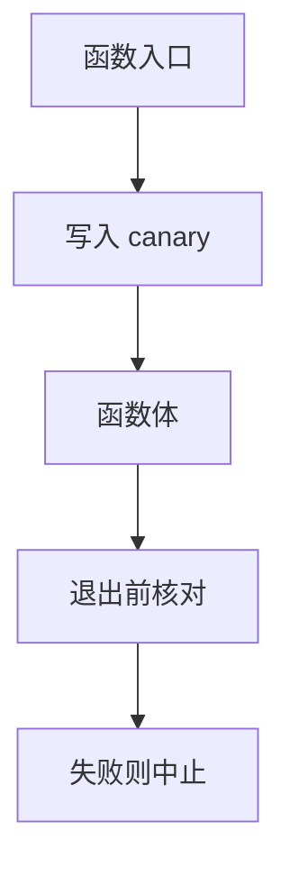

# canary

在返回地址前放一枚秘密值，函数退出前核对。踏过缓冲往往会先改掉它，于是程序选择中止而不是跳进地狱。它检测相邻覆盖，不定义所有内存安全。

<footer>—— Cowan et al., StackGuard；对照 GCC `-fstack-protector` 的合同</footer>

## 定位

上一课[栈溢出](/cs/stack-smashing-shellcode)说明返回地址可被邻接覆盖。缺口是**编译器插入的检测**：canary。不是形式验证，是廉价完整性检查。

后课默认已经读完本课钉下的合同，只补差，不从该领域第一性原理重开。

## 问题

若覆盖是从低地址连续写到返回地址，中间的 canary 会被改。核对失败则 abort。缺口：跳过 canary 的写（指针写）、泄漏 canary 值、不保护的函数未插桩。本课不给绕过步骤。

### 终止策略

发现后应中止进程。试图「修复栈再继续」会把完整性游戏做坏。

StackGuard。SSP 把 canary 当每线程秘密。Fork 后要重种的讨论点名即可。

## 方法

对照无保护帧与插桩帧。指出优化可能不给叶子函数插 canary。强调与 NX 正交：一个管执行许可，一个管邻接覆盖检测。

图中节点是本课的机制骨架；课程不把图展开成可运行的攻击步骤。

## 机制

缓解是概率与覆盖形状上的：连续溢出被抓住，任意写不一定。下一课 ROP：在不可执行栈上仍可能拼已有代码碎片——只讲存在性与防御方向，不给 gadget 序列。

前提写进合同之后，游戏外的误用只当失败模式点名，不在本课写成操作程序。

## 边界

本课不写泄漏 canary 的方法。ROP 下一课。

## 小结

- 邻接覆盖返回地址时，中间秘密可被踏到。
- 核对失败则中止；不是内存安全。
- 任意写与泄漏不在 canary 合同内。
- 下一课 ROP（机制，无 gadget 教程）。
- 出处：Cowan et al., StackGuard；GCC 栈保护文档。
