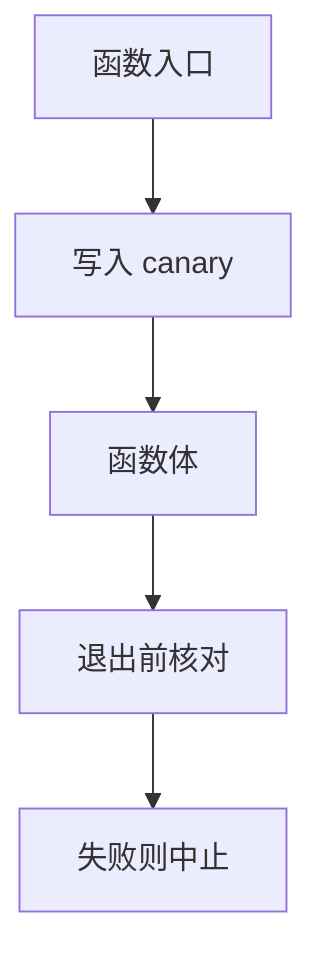
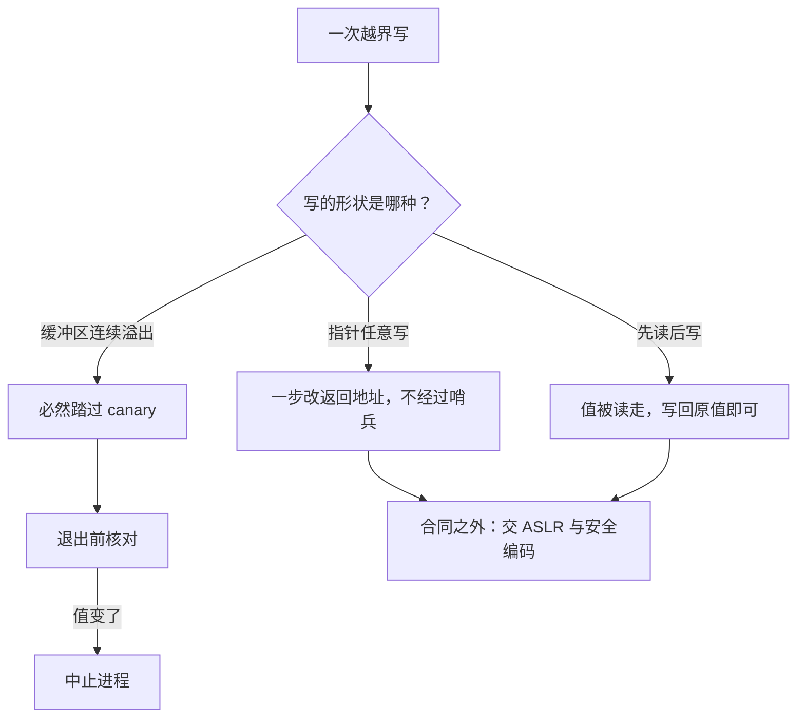

# canary

在返回地址前放一枚秘密值，函数退出前核对。踏过缓冲往往会先改掉它，于是程序选择中止而不是跳进地狱。它检测相邻覆盖，不定义所有内存安全。

<footer>—— Cowan et al., StackGuard；对照 GCC `-fstack-protector` 的合同</footer>

上一课[栈溢出](/cs/stack-smashing-shellcode)说明返回地址可被邻接覆盖。缺口是**编译器插入的检测**：canary。不是形式验证，是廉价完整性检查。

后课默认已经读完本课钉下的合同，只补差，不从该领域第一性原理重开。

## 问题

若覆盖是从低地址连续写到返回地址，中间的 canary 会被改。核对失败则 abort。缺口：跳过 canary 的写（指针写）、泄漏 canary 值、不保护的函数未插桩。本课不给绕过步骤。术语翻译：canary（金丝雀）就是函数帧里放在缓冲区与返回地址之间的一枚随机哨兵值——矿工带金丝雀下井，它先出事就先报警；这里的哨兵先被踩坏，退出前核对不上就中止进程。

### 终止策略

发现后应中止进程。试图「修复栈再继续」会把完整性游戏做坏。

StackGuard。SSP 把 canary 当每线程秘密。Fork 后要重种的讨论点名即可。

## 方法

对照无保护帧与插桩帧。指出优化可能不给叶子函数插 canary。强调与 NX 正交：一个管执行许可，一个管邻接覆盖检测。直觉类比：NX 与 canary 是两把不同的锁——NX 锁「这块内存能不能执行」，canary 管「返回地址有没有被顺路改坏」；只装一把，另一条路照样开着。

```mermaid
flowchart TD
  ENT["函数入口"] --> CAN["写入 canary"]
  CAN --> BODY["函数体"]
  BODY --> CHK["退出前核对"]
  CHK --> AB["失败则中止"]
```

## 机制

缓解是概率与覆盖形状上的：连续溢出被抓住，任意写不一定。下一课 ROP：在不可执行栈上仍可能拼已有代码碎片——只讲存在性与防御方向，不给 gadget 序列。常见误区：以为开了栈保护就等于内存安全。canary 的合同只覆盖「从缓冲区连续写过去」这一种形状——指针任意写可以一步跳到返回地址，根本不经过哨兵。

```mermaid
flowchart TD
  WR["一次越界写"] --> KIND{"写的形状是哪种？"}
  KIND -->|"缓冲区连续溢出"| PASS["必然踏过 canary"]
  PASS --> HIT["退出前核对"]
  HIT -->|"值变了"| ABORT["中止进程"]
  KIND -->|"指针任意写"| SKIP["一步改返回地址，不经过哨兵"]
  KIND -->|"先读后写"| LEAK["值被读走，写回原值即可"]
  SKIP --> GAP["合同之外：交 ASLR 与安全编码"]
  LEAK --> GAP
```

## 边界

本课不写泄漏 canary 的方法。ROP 下一课。

## 小结

- 邻接覆盖返回地址时，中间秘密可被踏到。
- 核对失败则中止；不是内存安全。
- 任意写与泄漏不在 canary 合同内。
- 下一课 ROP（机制，无 gadget 教程）。
- 出处：Cowan et al., StackGuard；GCC 栈保护文档。
