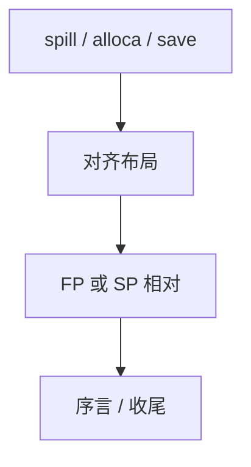

# 栈帧布局与帧指针

帧里放溢出槽、alloca、保存的 callee-save、对齐填充。帧指针使动态大小与调试稳定；省略帧指针把基址改成栈指针相对，省一个寄存器。

<footer>—— 据 System V ABI 栈布局；龙书 7.2；组成课栈约定整理</footer>

上一课[调用约定实现](/cs/calling-convention-impl)把参数放进槽或寄存器。缺口是**整帧地图**：偏移谁算、`FP` vs `SP` 寻址、red zone、可变 alloca。本课钉布局，展开表下一课。

## 问题

静态槽：编译期定偏移，可用 `SP+k`（若帧大小固定）。VLA/`alloca`：大小运行时才知，常用 `FP` 指向固定区，动态区在另一侧。缺口是**寻址基址选择**，不是 ABI 分类。

省略 FP（`-fomit-frame-pointer`）：多一个 GPR，调试与 unwind 靠 DWARF 的 CFA 规则补偿。

### 帧指针不是指令指针

`FP`/`rbp` 指向当前帧的固定锚。不要和 `PC` 混。

SysV 栈增长方向。x86-64 red zone。本课与组成课 calling-convention-stack 分工：那里是约定，这里是后端如何填。

## 方法

分配器交出 spill 槽数量。算总大小、对齐。序言：保存 FP、移动 FP、减 SP。收尾逆序。 outgoing 参数区在调用前再减或预留。

与尾调用：收尾可与 jmp 合并，帧必须能在跳前拆掉。

## 机制

安全：栈金丝雀在返回地址附近，布局要给 sanitizer 留位。不要把溢出槽和 incoming 参数重叠除非约定允许。

异步信号：red zone 可被信号踩，内核代码禁用。

## 边界

本课不写 CFI 指令全文。后课默认：帧有确定布局；可 omit FP。下一课栈展开与 unwind 表。

也不把帧当网络协议帧。

## 小结

- 帧布局：spill、保存寄存器、动态区、对齐。
- FP 服务动态大小与调试；omit 省寄存器。
- 序言/收尾实现布局。
- 出处：System V ABI；Aho et al. 龙书 7.2。
