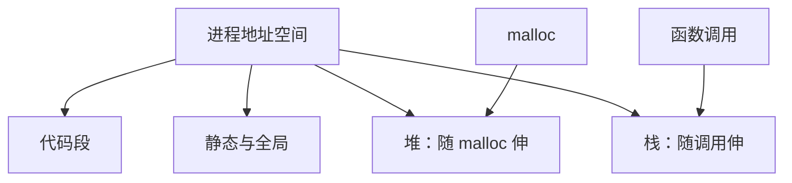

# 栈、堆与静态存储

自动变量随调用生灭；静态与全局贯穿进程寿命；堆上的块由申请与释放配对，寿命不跟任何花括号走。

<footer>—— 据 Kernighan & Ritchie, The C Programming Language, 2nd ed.；Bryant and O'Hallaron, Computer Systems: A Programmer's Perspective 整理</footer>

上一课[编译、链接与入口](/cs/compile-link-entry)把源到镜像的流水线钉死：加载之后从入口进 `main`。本课不重讲符号解析，也不从页表另起。缺口是：镜像进了进程，**同名「变量」为何有的随函数返回消失、有的活到进程结束**？三种存储期各对应哪片地址习惯，谁负责回收。

## 问题

函数里的局部变量通常在栈上：调用时分配一帧，返回时帧弹出，那片地址可被下次调用复用。文件作用域的对象与 `static` 局部在数据段（含 `.data` 与 `.bss`），链接时已定址，进程结束前一直有效。`malloc` 得到的块在堆上，寿命与指针绑定，直到 `free` 或泄漏。缺口因此不是关键字清单，而是**寿命与地址区域的对应**——后课的悬挂、栈溢出、别名都建立在这张图上。

把三种区域当成「编译器随便放」会写错所有权：返回局部数组的地址、把全局当临时缓冲、把堆指针当栈指针用，后课会一律落成未定义行为，但根子在本课没分清谁活多久。

### 栈不是「比较快的数组」

栈帧大小在进入函数时大体定好，不能当成任意增长的缓冲。把大对象或递归深度无界的工作丢进自动存储，碰到的是栈上限，不是堆的 `ENOMEM`。堆也不是无限：碎片与失败是运行时问题。本课只认区域分工，分配器内部结构交给后课。

K&R 用 storage duration 同时描述可见性与寿命。CSAPP 把栈向下、堆向上画成程序员可用的地址空间草图；精确边界由操作系统与链接脚本定，[进程地址空间一览](/cs/process-addrspace-tour)再收一次。

## 方法

自动存储：进栈帧，寿命是块作用域。静态存储：数据段，零初始化进 `.bss`，显式初值进 `.data`。动态存储：`malloc`/`free` 在堆区切块。线程局部静态是后课线程模型的缺口；本课默认单线程，三种区域已够用。

常见用户空间布局里栈与堆相向增长，中间留出扩展空隙。这是直觉，不是 ABI 保证。重要的是：返回之后栈上的对象结束寿命；堆上的块除非释放，否则一直占着，即使指针变量本身已经离开作用域。

线程局部存储是第四种常见区域，本课刻意不引入：默认单线程里，静态对象的共享已经够说明「不是每次调用一份」。堆与栈的相向增长在 64 位宽地址上很少撞上，但各自上限仍独立存在（`ulimit`、映射大小）。`alloca` 或变长数组在栈上动态伸一截，失败模式仍是栈而不是 `NULL`。后课指针会指向这三区中的对象；区域搞错时，别名与寿命分析会从错误的假设出发。

## 机制

每次调用压栈：返回地址、保存的寄存器、局部与临时量。递归每深一层多一帧，深度受栈上限约束。堆分配可能触发系统调用抬高堆顶；释放后块可再分配给别人，**同一地址稍后可能属于另一个对象**——这是[指针与别名](/cs/pointer-alias)与悬挂的共同土壤。

静态对象在 `main` 之前已完成初始化（C 保证），因此可以在任何函数里当稳定锚点。它们也因此不能表达「这次调用私有」的状态；那是栈的职责。三种区域不是性能技巧，是寿命的三种答案。

三种存储期一旦钉死，所有权问题才有落点：栈对象不能交给返回之后的调用方；堆对象必须在某个函数契约里写明谁 `free`；静态对象则对所有调用同时可见，因此不能表达「这一次调用私有」的缓冲。后课指针只是给这些区域里的对象起第二个名字，并不创造第四种寿命。把 `static` 局部当成「栈上但活得久」，会在递归里共享同一份存储，帧图立刻说不通。CSAPP 的地址空间草图在此够用：精确的段排列可以变，寿命分类不变。

## 边界

本课不展开分配器空闲链表，也不讲多线程各有栈。对齐与结构体里的洞是[对齐与填充](/cs/alignment-padding)的缺口。后课默认：自动→栈，静态/全局→数据段，动态→堆且需显式或日后 [RAII](/cs/raii) 管理寿命。

## 小结

- 栈随调用分配帧，返回即失效；堆由 `malloc`/`free` 管寿命；静态与全局活过整个进程。
- 常见布局里栈与堆相向增长；数据段在链接时定址。
- 混淆区域是悬挂与别名的根源，不是「写法风格」。
- 下一课用指针给这些区域里的对象起第二个名字。
- 出处：K&R storage duration；CSAPP 对程序地址空间的程序员模型。
