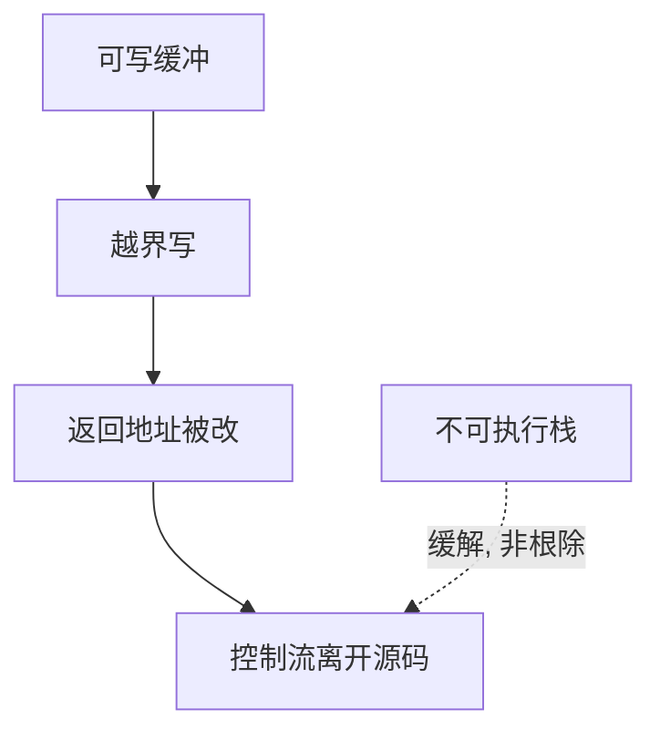

# 栈溢出到 shellcode

返回地址也是栈上的数据。写过边界的字节若覆盖了它，CPU 就会跳到源码从未写过的地方。这是控制流完整性的开口，不是又一种密码分析。

<footer>—— Aleph One, Smashing the Stack for Fun and Profit, Phrack 49, 1996；对照 Cowan 等对 canary 的后续</footer>

## 定位

上一课[Needham–Schroeder](/cs/needham-schroeder-lowe)假设进程按规范走。缺口是**实现把控制数据与普通对象放在同一可写栈上**。本课只说明机制与为何出现 NX/canary，不提供可运行载荷或注入步骤。

后课默认已经读完本课钉下的合同，只补差，不从该领域第一性原理重开。

## 问题

C 的数组与 `gets` 一类接口不携带长度。局部缓冲之后是保存的帧指针与返回地址。越界写一旦到达返回地址，函数返回就离开编译器安排的图。历史叙述里这曾被用来把处理器引向注入的字节——今日有 NX 等缓解，本课不教如何做。

### 课程边界

禁止 shellcode、禁止复现步骤。需要的只是：空间安全失败 ⇒ 控制流不再等于源码。防御在后课层层加。

Aleph One 是历史文献，本课当反例引用，不当实验指导。Anderson 把这类失败归为实现与语言。

## 方法

画栈帧槽位：局部变量、控制数据。指出语言与编译器可插入界检查或把返回地址移走（后课影子栈）。对照：协议逻辑再对，这一个写仍能接管进程。

图中节点是本课的机制骨架；课程不把图展开成可运行的攻击步骤。

## 机制

进程作为 TCB 的一部分：用户输入变成了跳转目标。下一课 canary：用秘密值检测「帧被踏过」，不修复语言。

前提写进合同之后，游戏外的误用只当失败模式点名，不在本课写成操作程序。

## 边界

本课不给任何 payload。canary 下一课是第一道常见编译器缓解。

## 小结

- 协议正确仍可能被内存破坏接管。
- 返回地址与数据同栈，越界写破坏控制流。
- 不提供注入方法；NX 等是缓解。
- 下一课栈 canary。
- 出处：Aleph One, Phrack 49（历史）；Anderson, *Security Engineering*；对照 Cowan et al.。
