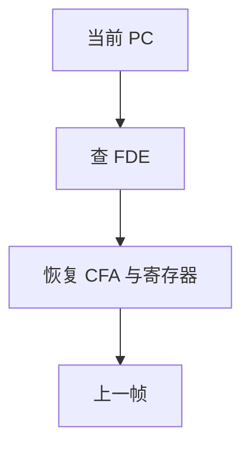

# 栈展开与 unwind 表

异常、调试器、profiler 要沿帧走回调用者。省略帧指针后，靠 DWARF CFI 或 `.eh_frame` 描述如何恢复寄存器与 CFA。

<footer>—— 据 DWARF Debugging Information Format；Itanium C++ ABI 异常；主干[异常表](/cs/exception-table) 整理</footer>

上一课[栈帧布局](/cs/stack-frame-layout)可 omit FP。缺口是**运行时如何展开**：表驱动恢复。C++ `throw`、Rust panic、`backtrace` 都读 unwind 表。本课钉 CFI 与 LSDA，不写完整语言异常语义。调试信息下一课更广（类型、行号）。

## 问题

有 FP：链简单。无 FP：必须知道每条指令处 SP 相对 CFA、callee-save 存在哪。CFI：状态机，`advance_loc`、`offset`。缺口是**编译器发表**，不是 catch 语法。

异常：personality 例程 + LSDA 决定这一帧是否处理。与[尾调用](/cs/tail-call-opt)：被优化掉的帧在表上消失。

### unwind 不是「反汇编猜 push」

启发式 backtrace 在优化代码上失败。可靠路径是表。JIT 必须运行时注册表。

DWARF 标准。Itanium C++ ABI。libunwind。主干 exception-table 课已有直觉，本课接后端发射。

## 方法

对序言/收尾每步发 CFI。压缩成 CIE/FDE。链接器合并 `.eh_frame`。可选 `.eh_frame_hdr` 加速查找。

与分配：spill 位置必须与 CFI 一致，否则展开读垃圾。

## 机制

异步 unwind（信号中）要求每条指令都正确，代价高；同步（throw 点）可只在可能抛的点精确。不要在省略表（`-fno-exceptions`）的 C 里假设能 catch。

安全：伪造表可跳到任意 personality——加载信任。

## 边界

本课不写全部 DWARF 表达式。后课默认：无 FP 靠 unwind 表。下一课 DWARF 调试信息（行号、类型）。

也不把 unwind 当栈溢出利用教程。

## 小结

- 展开：CFI/FDE 描述如何从 PC 恢复上一帧。
- 异常用同一基础设施加 LSDA。
- 与帧布局、分配必须一致。
- 出处：DWARF；Itanium C++ ABI；对照龙书异常。
