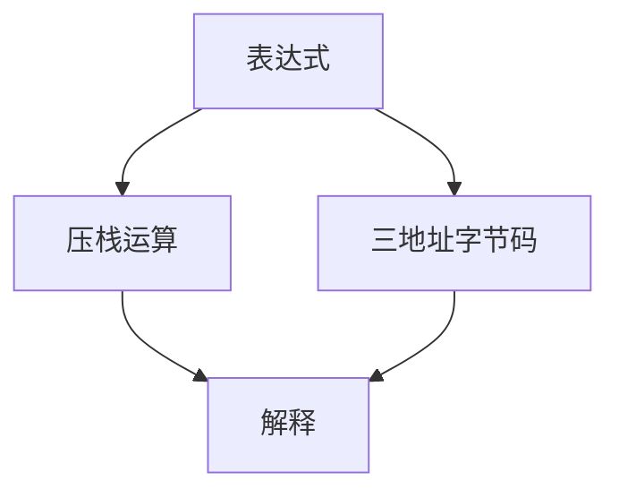

# 栈式对寄存器式 VM

栈式用隐式栈顶当操作数，编码短；寄存器式把操作数编号写进指令，少压栈，利于映射到真实寄存器与 JIT。

<footer>—— 据 Shi et al., Virtual Machine Showdown；Davis et al., The Case for Virtual Register Machines；Java vs LuaJIT/Dalvik 对照整理</footer>

上一课[字节码解释器](/cs/bytecode-interpreter) 未钉操作数形态。缺口是 **stack vs register**：JVM 典型栈式；Lua 5、Dalvik 寄存器式。本课钉编码与分派成本，线程化下一课。

## 问题

栈式：`iadd` 无操作数字段。编译简单（表达式 SDT 自然）。执行：多次 push/pop，解释器内存流量大。寄存器式：`add r1,r2,r3`，编译要做一次「虚拟寄存器分配」（可简化）。缺口是**这笔税**，不是 GC。

Showdown 论文：寄存器式解释往往少指令数，但指令更大。

### 虚拟寄存器不是物理寄存器

VM 寄存器是解释器数组槽。JIT 再映射到硬件。不要把 Dalvik `v0` 当 `x0`。

Shi, Gregg, Beatty, Ertl。Davis 等。本课不把 WebAssembly 的操作数栈当已讲完，后课 wasm 再接。

## 方法

栈式生成：后序遍历。寄存器式：把 SSA 名或栈槽编号写进指令。局部变量：JVM 用局部表+栈；寄存器 VM 把局部直接当寄存器。

与 SSA：寄存器 VM 更接近中端 IR，JIT 少一层 lowering。

## 机制

调用约定：栈式把参数压栈；寄存器式规定窗口或移动。异常与 GC 根：栈式要精确栈深度图；寄存器式要 live 寄存器位图。

不要混用两种编码当「优化开关」而不改生成器。

## 边界

本课不写线程化。后课默认：两种编码都是合法字节码。下一课线程化分派：减 switch 开销。

也不把寄存器 VM 当 GPU。

## 小结

- 栈式编码密、解释器栈操作多；寄存器式指令少、编译稍复杂。
- JIT 路径上寄存器式更近 SSA。
- 根枚举方式随编码变。
- 出处：Shi et al.；Davis et al.；对照 JVM 规范、Lua。
