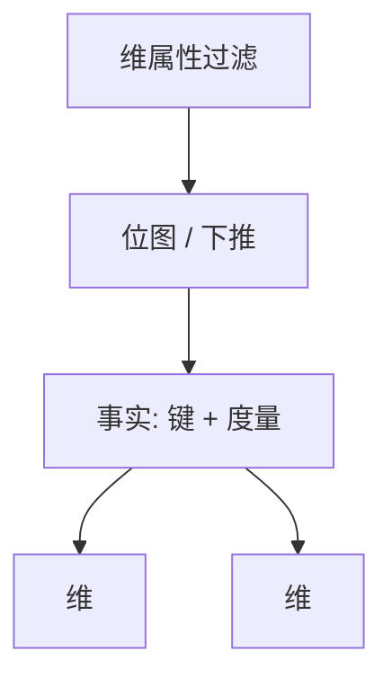

# 星型模式

事实表存度量与外键，维表存描述属性：分析查询沿键连维，是受控反规范化，不是忘了 3NF。

<footer>—— 据 Kimball 维建模；Inmon 对照；5NF 反规范化课的分析落地</footer>

[上一课](/cs/sqlite-architecture)收束嵌入式 OLTP。本课打开分析与流：数仓经典星型（star schema）。缺口是查询形状：`SUM` 按多个描述属性切。规范化 OLTP 要许多跳连接；星型把维退化成键，事实极窄、极长。雪花是维再规范化。OLAP 立方下一课预聚合。

## 问题

度量（销售额）在事实；谁、何时、何地在维。缺口是**键**：代理键、退化维、缓慢变化维（SCD）类型——维上属性改了历史事实如何指。与 3NF：维常不满足 BCNF，这是读路径合同，写走 ETL 受控。

位图索引、列存在事实与低 NDV 维上极合适。分区按时间在事实表。

Kimball 维建模。Inmon 3NF 企业数仓是另一派，本课点名不站队。事实粒度量错会让所有合计不可加。

## 方法

声明粒度（一行订单行）。ETL 灌代理键。查询：事实 join 维，聚合。优化器：星型变换（先维过滤再探事实）是特殊改写，broadcast 维表。与 shuffle 课对接。

物化：常用汇总事实表，刷新合同即 MV 课。

## 机制

计划：维小可广播。无事实表分区裁剪则扫全部历史。HTAP：OLTP 3NF 与星型副本 CDC。文档反规范订单是另一种星（嵌套维）。

校准：列存扫事实。学习优化器对星型连接顺序有偏见搜索。

## 边界

本课不讲 cube 操作符。也不把星型当事务模式。湖仓可用星型逻辑、Parquet 物理。

后课默认：分析模型先定粒度再星型。OLAP 立方：预先 rollup 的格，查询切块。

粒度错了，再快的列存也加错数。

## 小结

- 星型：窄事实+宽维，受控反规范服务聚合查询。
- 星型变换与广播维表是计划特化。
- OLAP 立方下一课。
- 出处：Kimball；Inmon 对照；反规范化课。
