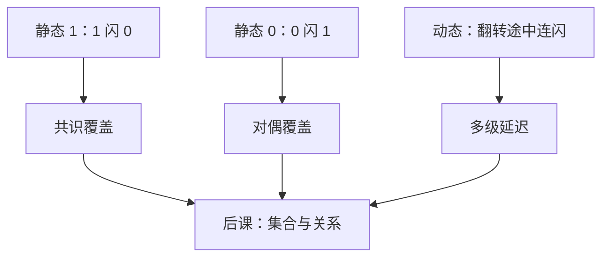

# 静态与动态险象

真值表只看起止取值；路径延迟不同，中间可以闪一下。静态险象是不该变却闪，动态险象是该变一次却闪了三次。

<footer>—— 据 Unger 对组合险象的处理；Harris and Harris, Digital Design and Computer Architecture 整理</footer>

上一课[不完全指定与险象](/cs/dont-care-hazard)钉死了 $X$ 可并入圈，并给出静态 1-险象：相邻两个 $1$ 分属两圈时输出可能短暂变 $0$。本课不重讲无关项语义，也不从触发器另起。缺口是：险象还只开了一条缝。静态 $0$、以及输出**应当**翻转时的动态毛刺，没有命名；多级门之后，「加一个覆盖圈」不够用。

## 问题

单输入变化，起点终点都是 $1$，中间出现 $0$：静态 1-险象。对偶地，起止都是 $0$、中间闪 $1$：静态 0-险象，用 POS 侧的共识项或盖住相邻 $0$ 的圈消除。缺口还包括**动态险象**：起止不同（例如 $0\to 1$），但路径上出现 $0$-$1$-$0$-$1$，三次沿。它往往来自静态险象叠在多级延迟上，单靠两级 SOP 的「相邻 $1$ 共圈」不能一次扫清。

本课假定输入不同时翻转（基本险象）。多输入同时变的功能险象，有的无法用额外门消去，要靠后课状态编码或采样。

### 毛刺不是「逻辑算错」

稳态下输出符合真值表。险象是延迟模型上的瞬态。仿真若只在输入稳定后取样，看不见它；接到时钟敏感点才有害——[建立保持](/cs/setup-hold)再定量。

Unger 区分静态 / 动态 / 本质险象。Harris 用卡诺图消静态 1-险象。本课把静态 0 与动态补全，组合手算到此收束；下一课改用集合语言。

## 方法

静态 1：差一位的两个最小项须被同一乘积项覆盖（共识项 $xy+x\bar y=x$）。静态 0：对偶地覆盖相邻最大项。动态：先消掉会向后传播的静态险象，并检查每条从输入到输出的反相次数；本课不把完整充分条件写成定理，只要求：多级电路要单独查瞬态，不能只信两级覆盖。

## 机制

后课组合输出若只在时钟沿被采样，毛刺可能被忽略；异步置位、锁存器透明窗、时钟门控则不能忽略。本课不引入这些元件，只承认瞬态存在。译码器把 $X$ 收进圈之后，相邻关系变了，险象分析必须用**实现后**的式，不能用原来的 $X$ 图。

## 边界

本课不分析模拟中间电压、不把本质险象（与状态编码纠缠）写完。器件延迟数值从[CMOS](/cs/cmos-inverter)才开始。信息与离散课序在下一课换成集合。

后课默认：静态险象用冗余覆盖消；动态险象要查多级路径。若输出被时钟采样，组合毛刺是否有害另判。

## 小结

- 静态 1 / 0 是起止相同却闪一下；用共识或对偶覆盖消。
- 动态险象是该翻一次却连闪，多出现在多级延迟。
- 稳态真值表看不见毛刺；组合手算化简到此结束。
- 出处：Unger；Harris and Harris。
