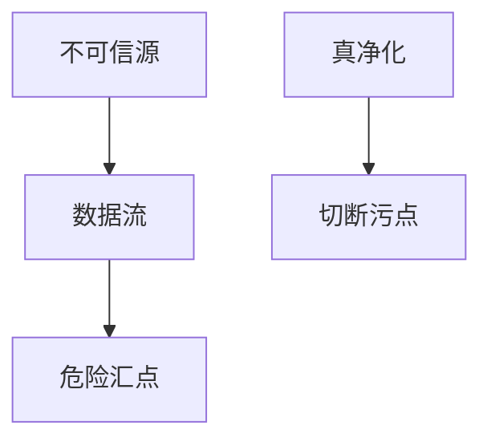

# 静态与污点分析

污点把「不可信来源」标到字节上，看它是否流进「危险汇点」。静态分析不执行程序，因此必须抽象；假阳性是税，假阴性是洞。

<footer>—— 据 Denning 的信息流；Schwartz, Avgerinos and Brumley 对污点的 SoK；Soot/CodeQL 一类工程</footer>

## 定位

上一课[KLEE](/cs/symbolic-execution)沿路径跑。缺口是**不执行也能问流**：源→汇。本课收污点与静态告警的合同，不把 CodeQL 查询写成对外部目标的作战。

后课默认已经读完本课钉下的合同，只补差，不从该领域第一性原理重开。

## 问题

命令注入、SQL、XSS 在 Web 课会再出现：共同形状是不可信数据进解释器。污点：源（输入）、汇（exec/SQL）、净化器。静态：控制流图上的近似。缺口是抽象与净化器是否真净化。

### 净化器撒谎

黑名单替换不是净化。污点会信你标注的 sanitizer。

Denning；BitBlaze/TaintCheck 一类动态污点点名。本课禁止扫描他人站点。

## 方法

画源–汇。对照动态污点（运行时，开销）与静态（编译期，近似）。下一课 sanitizer：把未定义行为变成可 fuzz 的崩溃。

图中节点是本课的机制骨架；课程不把图展开成可运行的攻击步骤。

## 机制

发现要可编码成规则。下一课 ASan/UBSan/MSan 把一类空间/未定义错误变成确定失败。

前提写进合同之后，游戏外的误用只当失败模式点名，不在本课写成操作程序。

## 边界

本课不给绕过 WAF 的污点例子。Sanitizers 下一课。

## 小结

- 符号执行跑路径；污点问源是否到汇。
- 静态要抽象；净化器标注会撒谎。
- 与 Web 解释器洞同形。
- 下一课 Sanitizers。
- 出处：Denning；Schwartz, Avgerinos and Brumley；对照 CodeQL 文档。
