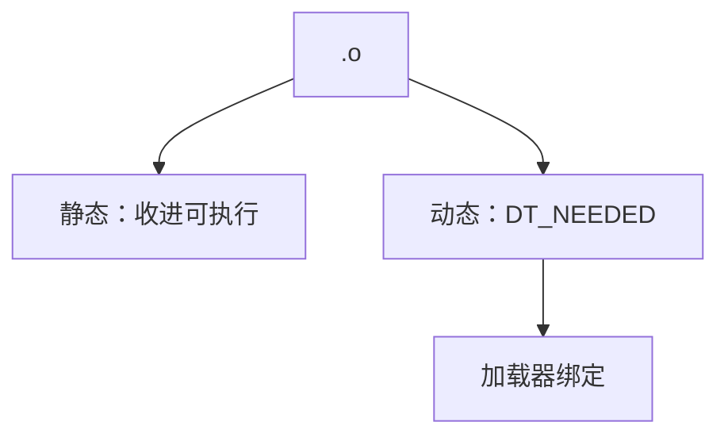

# 静态对动态链接

静态把库目标编进可执行文件；动态把依赖推迟到加载，符号经 GOT/PLT 绑定。二者对体积、更新与启动时间的答案相反。

<footer>—— 据 Levine；主干[GOT 与 PLT](/cs/got-plt)、[加载与动态链接](/cs/load-dynlink)；System V ABI 整理</footer>

上一课[链接脚本](/cs/linker-script-sections) 排段。缺口是**库怎么交付**：`.a` 抽进文本 vs `.so` 运行时映射。主干已有 GOT/PLT。本课钉权衡与符号绑定时机（立即/延迟），插入下一课。

## 问题

静态：闭世界，LTO 狠，无启动解析，体积大、安全更新要重链。动态：共享内存页、可替换 `.so`，启动走加载器，ABI 必须稳。缺口是**选择合同**，不是脚本语法。

PIE：可执行也位置无关，ASLR。静态 PIE 存在，但是另一打包。

### 动态不是「不链接」

仍有链接：产生 `DT_NEEDED` 与重定位。只是把最终地址推迟。不要说动态程序「没被链接」。

Levine。SysV。主干 got-plt、load-dynlink。本课对照表，不重画 PLT 桩。

## 方法

`gcc -static` vs 默认动态。查看：`ldd`、`readelf -d`。静态 libc 的法律与兼容（glibc 不鼓励完全静态）是工程现实。musl 更常静态。

与可见性：动态导出过多则慢且易冲突。`--exclude-libs` 等。

## 机制

版本：`GLIBC_2.xx` 符号版本。静态无此运行时绑定，但内核 syscall 仍在。不要把静态当「无未定义行为」。

插件：`dlopen` 只在动态世界自然；静态要自注册表。

## 边界

本课不写 `LD_PRELOAD` 全文。后课默认：动态靠 GOT/PLT 与加载器。下一课符号插入与 `LD_PRELOAD`。

也不把动态链接当解释器字节码。

## 小结

- 静态：闭世界、体积、更新难。
- 动态：共享与可替换，推迟绑定。
- 仍有链接，只是分阶段。
- 出处：Levine；System V ABI；对照主干 GOT/PLT。
