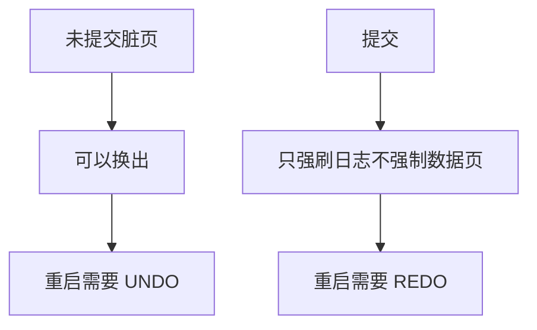

# steal / no-force

未提交事务的脏页可以被换出（steal）；提交时不必把所有脏页立刻刷数据文件（no-force）——前提是日志已经先落盘。

<footer>—— 据 Gray and Reuter；Mohan 等 ARIES 对缓冲策略与 WAL 的整理</footer>

[上一课](/cs/wal)钉死写顺序：日志先于数据页。本课不重讲 redo 记录长什么样。缺口是缓冲池政策：若禁止 steal，内存必须装下未提交脏页；若 force 到提交，提交延迟等于随机刷盘。steal + no-force 是高性能默认，把正确性全部压在日志与 pageLSN 上。ARIES 下一课展开重启。

## 问题

WAL 课留下「崩溃时靠日志」。缓冲仍要决定：脏页能否在提交前换出？提交时要不要把堆页刷完？四种组合里，steal/no-force 需要 UNDO（页上可能有未提交）与 REDO（提交的页可能还没刷）。缺口是**把缓冲政策命名成恢复需求**。

no-steal/force 几乎不用日志就能简单恢复，但吞吐不可接受。实践选 steal/no-force，用 ARIES 付复杂度。

## 方法

换页时若页脏：先保证描述该页的日志已刷（WAL 规则），再把页写出——即使事务未提交（steal）。提交：刷到日志的提交记录，不必 force 数据页（no-force）。pageLSN 记录页上最后一次更新的日志地址，重启时判断要不要 REDO。

## 机制

政策把 [缓冲与脏页](/cs/buffer-dirty) 的 OS 直觉接到事务：OS 不知道提交点。日志是唯一把「已提交」钉在磁盘上的对象。后课 ARIES 的分析阶段要找出脏页表与活跃事务，正是因为 steal/no-force 制造了这两种不确定。

## 边界

本课不把双写缓冲等厂商防撕裂页方案当 WAL 替代。重启三阶段下一课。

后课默认：缓冲可以偷页、提交可以不刷堆。崩溃恢复必须 REDO+UNDO。

## 小结

- steal 允许未提交页下盘；no-force 允许提交后页仍只在缓存。
- 正确性靠 WAL 与 pageLSN。
- ARIES 三阶段下一课。
- 出处：Gray and Reuter；Mohan et al. ARIES。
