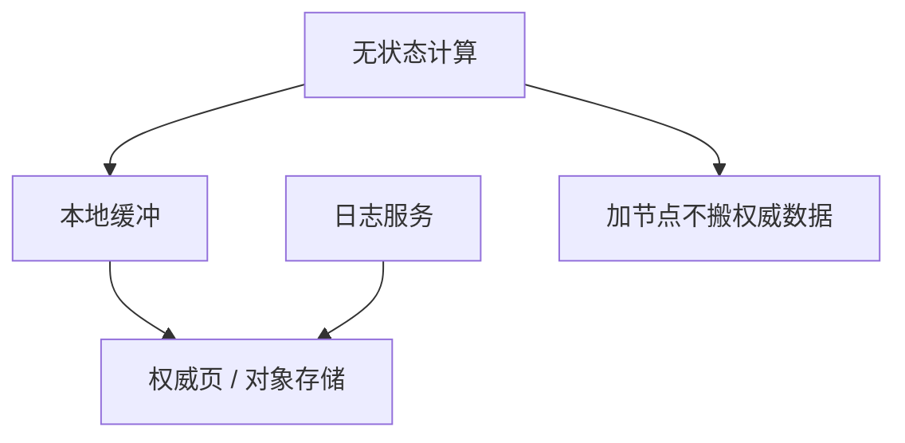

# 存算分离

计算节点无本地权威盘，页与日志在共享存储服务上。弹性扩计算不必搬分片，代价是每次 miss 的网络 RTT 与多租户 QoS。

<footer>—— 据云数据库拆分实践；共享磁盘谱系；缓冲池课的远程化</footer>

[上一课](/cs/shared-nothing-vs-disk)把盘是否私有钉死。本课把「共享」升级为**存储服务**：对象存储或多租户页服务，计算无状态可杀。缺口不是再定义 WAL，而是缓冲、日志、延迟物化全部变成远程 I/O，校准与 2Q 策略要按 RTT 重做。

## 问题

本地 SSD 微秒；网络盘毫秒。缓冲池命中率从优化变成生存。缺口是 **缓存层次**：节点内存 → 本地盘缓存 → 远程权威。写：日志先写高耐久存储服务，数据页异步。与 TDE：密钥在计算侧或存储侧要合同。

弹性：只读副本无状态加计算，读己之写仍要粘滞或读带 LSN 的存储。分片可仍在，但再平衡可只改计算路由而不搬文件——文件在共享命名空间。

Aurora、Snowflake 一类是产品例子。本课机制：权威在存储，计算可丢。不把某云架构当唯一。

## 方法

页服务器：按页号读，写回带 LSN。计算宕机：另一计算从存储拉日志重放或已有页。compaction/vacuum 可在存储侧或计算作业。shuffle 尽量计算间，载荷尽量靠近存储做谓词下推（near-data）。

zone map 放存储侧，减少拉页——跳过索引课的远程版。

## 机制

组提交变成对日志服务的 gRPC fsync。RTO：存储健康则换计算快；存储挂则全体挂——故障域转移到存储集群。优化器必须用远程 I/O 权重，否则全选「扫描」以为像本地。

HTAP 下一课：同一存储两计算形态（行/列）或双引擎。

## 边界

本课不定义 HTAP。也不把存算分离当无 WAL。NewSQL 可分离也可无共享本地盘。

后课默认：云弹性常分离；代价是 RTT 与缓存设计。HTAP：同一数据服务 OLTP+OLAP。

没有本地权威盘，2Q 的「一次性扫描页」更应逐出，因为再填更贵。

## 小结

- 权威在存储服务，计算弹性；命中率与下推决定性能。
- 故障域转移到存储；日志仍先于页。
- HTAP 下一课。
- 出处：共享磁盘谱系；云库实践；缓冲池课。
