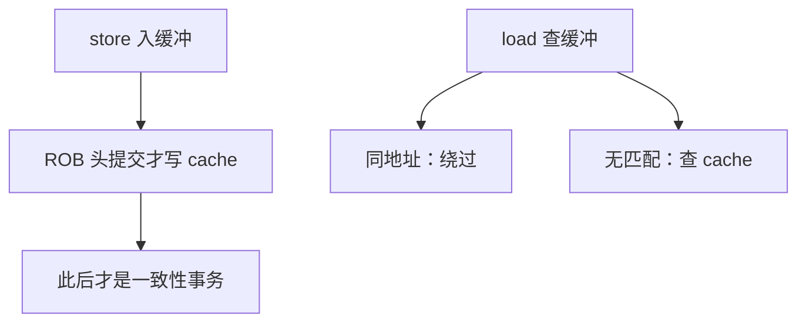

# 存储缓冲与 load 绕过

store 在提交前不能让 cache 对外可见，但后一条 load 同一地址又必须读到这条 store 的数据。

<footer>—— 据 Hennessy and Patterson, Computer Architecture: A Quantitative Approach 整理</footer>

[上一课](/cs/rs-cdb)让 ALU 结果经 CDB 唤醒。[乱序与 ROB](/cs/ooo-rob) 规定未提交 store 不得进一致性世界。[写回与写分配](/cs/write-back-allocate)的写缓冲是已提交写与 DRAM 之间的队列，对象不同。本课不重讲标签匹配。缺口是核内 store buffer：按程序序托住已执行未提交（或已提交未退休到 cache）的写，以及 load 对它的地址匹配与绕过。

## 问题

`sw x1, 0(x2)` 后 `lw x3, 0(x2)`。store 可能还在 ROB 里，cache 仍是旧行。若 load 去 cache，ISA 的 RAW 被打破。若等到 store 提交，独立 load 也全停。缺口不是再加一条 CDB，而是**按地址在 store 队列里搜，命中则把数据转发给 load**（store-to-load forwarding）。

地址尚未算完的年轻 store 挡在前面时，load 不能盲目绕过——可能别名。实现要么等地址，要么预测「不冲突」错了再冲刷。

这是核内的 RAW，不是 MESI。别的核要等 store 提交并走一致性事务才看得到。

## 方法

store 在地址与数据就绪后写入缓冲项，与 ROB 项关联。提交时该项才有资格发 cache/MESI。load 执行时：用有效地址查更年长的 store 缓冲；完全重叠则转发；部分重叠或地址未知则停或按预测走。

缓冲是队列，容量满则停发射 store。这与 MSHR、保留站并列，又一项利用率缺口。

## 机制

TSO 一类模型允许 load 越过更早的 store（对不同地址），正是因为有这条缓冲；同地址仍要转发或停，否则连单线程 ISA 都错。弱序还允许更多重排，栅栏则抽干缓冲。模型课再收；本课只把硬件对象备好。

推测 load 若绕过了一条后来发现同地址的 store，必须取消 load 及其年轻指令。这与分支误预测同一套 ROB 冲刷。

## 边界

本课不引入多线程共享同一缓冲，不把写结合缓冲当成第三种主结构。也不讨论非对齐 load 跨两条 store 的拼接细节。SMT 会让多条逻辑线程抢同一套访存队列——下一课。

后课默认：同核 load 能看见尚未提交到 cache 的年长 store。用多份硬件线程填空档是下一课 SMT。

## 小结

- store 缓冲托住未对外的写；同地址 load 必须绕过。
- 地址未知则等或预测，错了冲刷 ROB。
- SMT 用多线程共享这些队列，是下一课。
- 出处：Hennessy and Patterson, *CA:AQA* 访存序与 store buffer。
