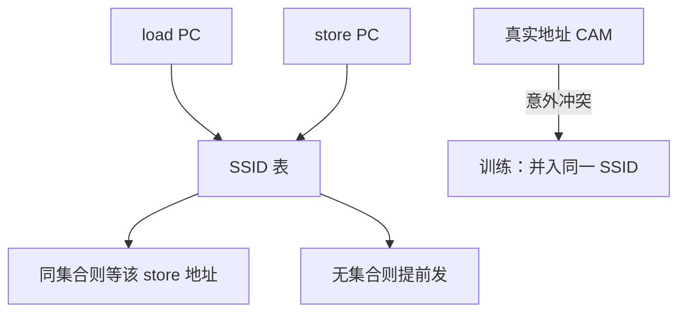

# 存储集预测

多数 load 从不撞前面未完成的 store；少数 PC 对反复冲突。给会冲突的 load/store 打上同一集合号，让 load 等到该集合的 store 地址齐。 

<footer>—— 据 Chrysos and Emer, Memory Dependence Prediction Using Store Sets, ISCA 1998 整理</footer>

[上一课](/cs/lsq-disambiguation)在地址未知时只能全局地等或盲目推测。等则 ILP 掉；盲目则少量真冲突造成 replay 风暴。本课不重画 SQ CAM。缺口是**用历史预测「这个 load 会依赖哪个 store」**，而不是对所有年长 store 保守等待。

## 问题

循环里 `*p = …; … = *q` 若 `p` 与 `q` 几乎总不同，让 load 等 store 的 AGU 是冤枉的。若几乎总相同，放行则每次 replay。冲突关系更随 **PC 对** 而不是绝对地址稳定：同一 load PC 总是撞同一 store PC。缺口不是更大的 SQ，而是**一张预测表：load PC 映射到它应当等待的 store 集合**。

Chrysos–Emer 的 store set：冲突过的 load 与 store 被分进同一 SSID；load 发射受该 SSID 的「最后一个未完成 store」约束。不冲突的 PC 不进任何集合，可以自由提前。

## 方法

两张表：load PC → SSID；store PC → SSID。发现 replay（load 读到了不该看的 cache 值，年长 store 后来显示重叠）则把这对 PC 并入同一集合。预测：load 在 IQ 里除了寄存器就绪，还要「该 SSID 的 store 地址已决或已提交」。无 SSID 的 load 按无依赖发出。

真实 CAM 仍在：预测只减少等待，不取消消歧。漏报（该等没等）仍 replay 并训练；误报（不该等却等）只损失 ILP。

## 机制

与[分支预测](/cs/gshare-predictor) 对照：分支猜方向，存储集猜依赖边。两者都是微结构表，以提交/核对更新，误路径要避免污染。SSID 有限，不同 PC 对会别名，表现为多余等待，通常比漏报便宜。

这为「值预测」让路：若连数据都可以猜，依赖边可能被绕过；但内存依赖仍必须在架构上正确，预测只能加速，不能代替 CAM。

## 边界

本课不把 load 的返回值拿去预测——那是下一课值预测。也不保证多核上的依赖：他核 store 不在本核 store set 里，靠一致性与内存模型。SQ 满、SSID 饱和时退回保守。

后课默认：大多数 load 被预测为无内存依赖；冲突 PC 对被集中管理。寄存器与内存之外，运算结果本身能否猜，是下一课。

## 小结

- store set 按 PC 对学习内存依赖，减少盲目等待与盲目 replay。
- 真实地址 CAM 仍是正确性来源。
- 预测运算结果（而不只是依赖边）是下一课值预测。
- 出处：Chrysos and Emer, *ISCA*, 1998。
