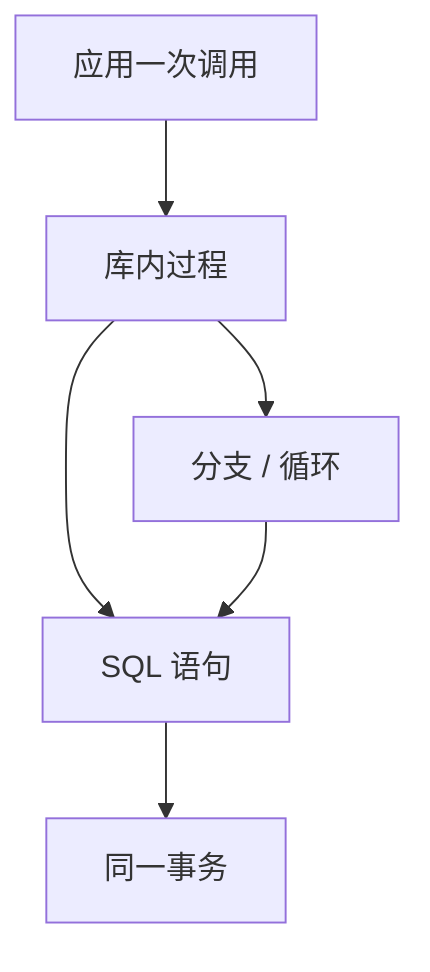

# 存储过程

过程把多条 SQL 与控制流放进库内一次调用；少往返，也把优化边界从「一句声明」换成「一段程序」。

<footer>—— 据 Gray and Reuter 对事务中的过程；Ramakrishnan and Gehrke；SQL/PSM 标准整理</footer>

[上一课](/cs/constraints-triggers)把触发器定为事件上的过程。本课不重写 ECA。缺口是**显式调用**的库内程序：存储过程与函数，参数进、结果出（或侧效写表）。应用一次 RPC 完成多语句，减少延迟；代价是计划缓存、权限与「优化器看不到循环」同时出现。

## 问题

若业务是「扣库存、写订单、写流水」三条语句，客户端三次往返把锁持有时间拉长。过程在库内顺序执行，同一事务、一次网络。缺口不是再讲 ACID——主干 [事务](/cs/acid) 已有——而是过程作为查询接口：它还是声明吗？对优化器，过程体是语句序列加分支循环，一般**不会**把整个过程当成一棵代数树重写。

函数分为只读标量/表值与含 SQL 的过程函数。纯函数有时能下推；含 SQL 或易失的不能。SQL/PSM、PL/pgSQL、T-SQL 是不同表面，本课只锁定：库内控制流 + SQL 语句 + 事务交界。

存储过程不是「更快的 SQL」。快来自少往返、少解析、计划复用。写坏的过程里逐行循环（RBAR）会比一条集合语句慢几个数量级。集合化仍是默认。

## 方法

定义：参数模式（IN/OUT）、过程体、执行权限（定义者/调用者）。调用：`CALL` 或 `SELECT fn()`。事务：过程默认参加调用方事务；有的产品允许自治事务，本课点名其危险（提交脱离外层）。错误处理：异常处理器决定回滚语句还是整个事务。

与预编译语句的关系：过程体内的 SQL 仍走解析与计划；后课计划缓存专门讲绑定与老化。本课只要求过程调用是粗粒度 API。

## 机制

权限：授予 `EXECUTE` 而不授予底层表，可做安全边界——也是 SQL 注入面，若过程用字符串拼 SQL 则退回动态 SQL 风险。确定性：标量函数若声明 IMMUTABLE，优化器可折叠；标错会错结果。

触发器调用过程：ECA 的 A 可以是过程。仍看不见体内部代数。递归过程与递归 CTE 不是同一层：前者是调用栈，后者是查询不动点。

## 边界

本课不讲连接池如何复用会话——再后课。也不把 ORM 的「过程映射」当模型。游标循环在过程里合法，但主干建议能写成集合就不要游标。保存点下一课：过程中的部分回滚。

后课默认：过程是库内 API 与事务脚本，不是另一套关系代数。查询能一句写完的不要拆成过程里的行循环。

往返与锁持有时间是过程的性能理由；语义理由是把不变式维护放进与表同一权限域。

## 小结

- 存储过程减少往返，把多语句收进一次调用与同一事务。
- 优化器通常不把过程体当一棵树；集合 SQL 仍优先。
- 保存点下一课：过程与长事务里的部分撤销。
- 出处：Gray and Reuter；Ramakrishnan and Gehrke；SQL/PSM。
