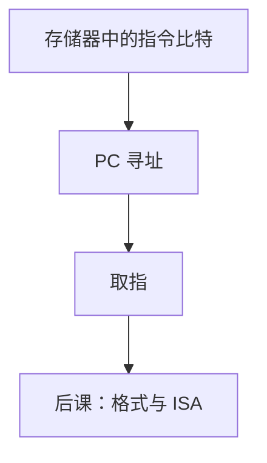

# 存储程序

指令与数据放进同一种可寻址存储器里，控制流就变成改地址；机器不必为每个算法重焊。

<footer>—— 据 Patterson and Hennessy, Computer Organization and Design (RISC-V)；von Neumann, First Draft of a Report on the EDVAC, 1945 整理</footer>

上一课[时钟树与抖动](/cs/clock-jitter)把同步边界说清。硬件上：门、寄存器、阵列、时钟都已够用。本课不重讲 FIFO，也不从「软件工程」另起。缺口是：到现在功能由网表固定。要换算法，必须换接线。**存储程序**把指令编码成比特，放进[存储器阵列](/cs/memory-array-sram-dram)，用 PC 当地址去取。

## 问题

FSM 控制器可以硬连一套步骤。另一套算法就要另一套状态图。缺口是把步骤做成数据：指令字与数据字同一套寻址（或至少同一类阵列）。PC 是可加载计数器，每条指令默认 + 宽度，分支改加载值。这是 Patterson/Hennessy 的冯·诺依曼教学模型；哈佛结构把指令口与数据口分开，仍是存储程序，只是端口不同。

本课只钉「指令在内存里」。位域怎么切，是[下一课](/cs/instruction-format)。

### 存储程序不是「操作系统已经存在」

还没有系统调用、没有进程。只有：一片存储器、一个 PC、一套尚未规定的指令编码。把文件、进程映像提前，会跳过组成课。自修改代码在早期机器合法，RISC-V 教学默认指令侧对软件只读或靠同步指令；本课不鼓励把程序当数据乱写。

EDVAC 草案把指令与数同存。Patterson/Hennessy 用它开篇。附录文献课会回到原报告；主干只取这一句：程序是内存中的比特。

## 方法

复位后 PC 指向已知地址，取指、（尚未细分的）执行、写结果、更新 PC。存储器按字节或按字寻址——RISC-V 字节编址、指令 32 位对齐，细节在格式课。控制与数据开始分离：控制仍是硬件 FSM 或组合译码，数据是指令给出的操作数。

## 机制

同一阵列既可存指令也可存数据，带宽与端口成为瓶颈（冯·诺依曼瓶颈）。后课 Cache 缓解，本课只点名。异常与中断会改 PC 到入口，那是更后的课；本课的控制流还只有顺序与尚未定义的分支指令。复位向量只是 PC 的初值，仍指向存储器里的比特，不是硬连一套算法。

## 边界

本课不规定 RISC-V 操作码，不把编译器请进来。不讨论可计算性：图灵机的带子与「指令放在可寻址存储器里」不是同一层课。

后课默认：程序是内存里的指令序列；PC 指向下一条。指令如何切字段，下一课开始用 RISC-V。

## 小结

- 算法从接线变成内存中的指令比特。
- PC 寻址取指；哈佛与冯·诺依曼差在端口，不差在「程序是否存储」。
- 指令编码尚未定义；下一课切字段。
- 复位只是 PC 初值，仍指向存储器。
- 出处：Patterson and Hennessy, COD (RISC-V)；von Neumann, EDVAC 草案, 1945。
