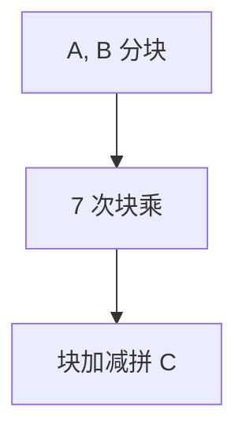

# Strassen

$2\times 2$ 矩阵七次乘加若干次加，代替八次乘；$n$ 阶递归 $O(n^{\log_2 7})\approx n^{2.807}$。

<footer>—— 据 Strassen, Gaussian Elimination is not Optimal, 1969；CLRS 第 4、28 章整理</footer>

上一课[多项式求逆](/cs/polynomial-inverse)把多项式运算收到乘法。矩阵乘朴素 $n^3$ 次标量乘。缺口是 Strassen：分块 $2\times 2$ 的 7 次乘。不重写 Karatsuba 的 3 次——同精神不同恒等式。后课高斯消元谈 $n^3$ 的消元，与本课渐近对照。

## 问题

$C=AB$，$n=2^k$。分成四块。Strassen 七个乘积 $P_i$（块的加减组合），再加减拼 $C$ 的块。$T(n)=7T(n/2)+O(n^2)=\Theta(n^{\log_2 7})$。加法更多，数值稳定性比朴素差，阈值下切回 $O(n^3)$。

缺口是这次双线性恒等式。更快的 $\omega$ 记录（Coppersmith–Winograd 族）点名：理论 $\omega\lt 2.373$，实现仍常 Strassen 或朴素。

### 不是高斯消元已经最优

Strassen 标题即针对消元里的矩阵乘。求逆、行列式也可到同一 $\omega$。本课只乘。数值线性代数实践仍 BLAS 分块朴素乘为主。

Strassen 1969。Winograd 有加法更少的变体。后课高斯消元与线性基是 $O(n^3)$ 结构，不假设已用 Strassen。

## 方法

$n$ 补到 2 的幂或剥层。递归七次。浮点注意误差累积。模意义下精确，加法次数仍贵。

并行七次乘可。

## 机制

$2\times 2$ 一般需要 7 次乘（双线性复杂度下界相关）。递归把下界变成 $n^{\log_2 7}$。与 FFT：多项式卷积不是矩阵乘，不要用 FFT 直接乘两个无关矩阵（除非特殊结构）。张量分解视角点名。

## 边界

本课不写 $\omega$ 的当前世界纪录证明。不写张量秩全文。后课默认：矩阵乘理论 $O(n^\omega)$，$\omega\le\log_2 7$ 已够用；实现有阈值。下一课高斯消元与异或线性基。

## 小结

- 七次半阶乘，$O(n^{2.807})$。
- 小规模切回朴素；浮点要小心。
- 更快 $\omega$ 存在，本课用 Strassen。
- 出处：Strassen, 1969。
