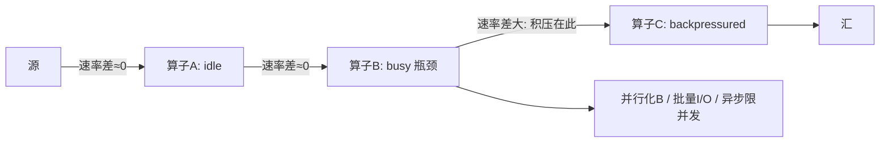
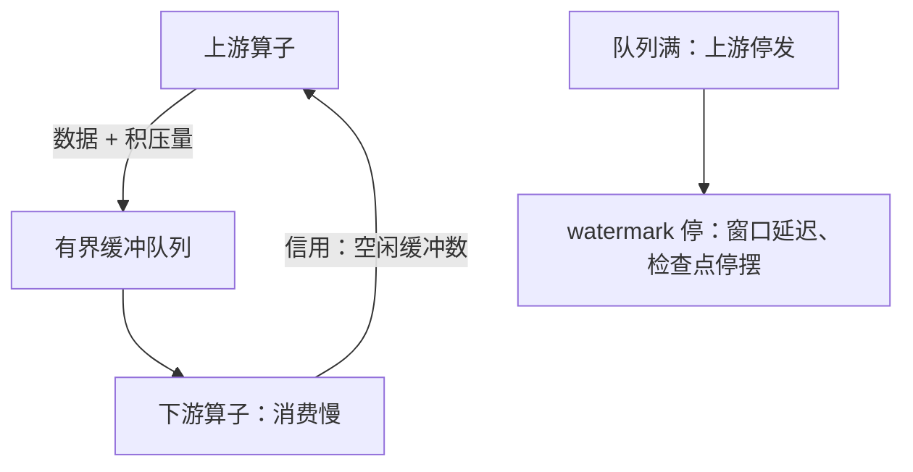

# 背压

背压是让消费者对生产者说「慢一点」的机制。没有它，系统的每一层都在替下游攒一笔还不上的债——债的名字叫无界缓冲。

<footer>—— 据 Reactive Streams 与 Flink credit 流控公开设计；RFC 9110/9112 流控语义整理</footer>

[上一课](/cs/stream-state)把状态放进后端与检查点；状态暴涨最常见的推手是速率不匹配。本课钉背压：当算子消费得比上游生产得慢，速率信号如何向上游传播、在哪里积压、如何诊断与解除。[应用层背压](/cs/app-backpressure)已在网络课的应用层立过原理——窗口、有界阻塞、显式 request；本课讲同一原理在数据流引擎里的形态，以及流系统特有的两个连锁反应。

## 问题

数据流引擎的每条算子边上有缓冲队列。下游慢，队列满，之后发生什么决定系统命运：队列无界，换 OOM；直接丢弃，换正确性；阻塞上游，换延迟。选阻塞就必须回答三件事：信号怎么传（信用、停等还是退让）、传多快、以及传到源头之后源听不听。流系统还有两处特有连锁：上游停，[watermark](/cs/stream-watermark) 也停，窗口关不了——速率问题立刻变成正确性问题；barrier 跟数据一起走，检查点也会停——速率问题又变成恢复点问题。

术语翻译：背压（backpressure）就是让「下游消费得慢」这件事像水流顶回来的压力一样，沿着算子边逐级上传到数据源，让源头自动降速——不是靠运维在中间拼命调缓冲，而是让系统自己把「我吃不下」这句话传回去。

为什么重要：没有背压时，速率不匹配被无界队列悄悄掩盖——表面看一切正常，延迟在涨、内存也在涨，直到一次大促把队列撑爆、进程 OOM，几小时的状态一夜归零。有背压的系统在撑不住的第一秒就开始减速，把故障换成延迟。

## 方法

credit 流控：接收方以空闲缓冲数为信用，发送方只在有信用的通道上发数据，并附带自己的积压量让调度看得见；接收方处理完一批补给信用。这与 [TCP 滑动窗口](/cs/tcp-window)同构，只是对象从字节变成记录批。诊断按三态看每个算子：busy——瓶颈在它自己；backpressured——瓶颈在下游，它只是传话；idle——上游没喂饱。输出队列长度与输入输出速率差指出积压位置。解除按序排查：并行化瓶颈算子、批量化外部 I/O、异步 I/O 但限并发容量、或按第三课的迟到合同显式丢弃（load shedding）。

credit 的在途量上限是接收方缓冲深度，与往返时延无关——停等协议才让 RTT 进吞吐公式。把算子丢进无界线程池或无界队列，等于亲手拆掉背压，OOM 只是时间问题。

诊断三态时沿着速率差从源头查到瓶颈，一条链路上的位置一眼可辨。

## 机制

背压不是故障，是设计：有界缓冲加信用，把「消费者跟得上」从祈祷变成结构。它与检查点的交互在第四课埋过：barrier 要跟数据一起过边，下游不消费，barrier 过不去，对齐检查点停摆——非对齐 barrier 把在途记录写进快照，正是为背压场景设计。它与 watermark 的交互是第三课的镜像：最慢通道冻结全局进度，空闲检测与背压解除是同一件事的两面。环状图（迭代流）里背压成环即死锁：环上没有「最上游」可停，必须靠切断或物化一条边打破。没有背压能力的系统只能二选一：像 [AQM](/cs/aqm-red-codel) 那样主动丢弃保延迟，或像 [bufferbloat](/cs/bufferbloat) 那样无界积压保吞吐——丢弃必须落在迟到合同上，否则等于静默改答案。

## 边界

本课不写具体引擎的指标名与告警阈值；判据是通用的：分清 busy、backpressured、idle，再对症。丢弃策略要接第三课的迟到合同——丢了什么、丢了多少，必须可观测可辩护。也不要把背压与限流混为一谈：限流是入口有意控制速率，背压是下游被动申告容量；前者在 API 网关，后者在算子边。后课默认：引擎的边是有界通道，速率不匹配在边上是可见的、可诊断的，不是神秘的。

## 小结

- 背压靠有界缓冲加 credit：在途量由缓冲深度决定，与 RTT 无关。
- 诊断三态：busy 是自己慢，backpressured 是下游慢，idle 是上游没喂饱。
- 背压停摆会连锁到 watermark 与检查点：速率问题同时是正确性问题。
- 环状图的背压是死锁，必须切断或物化一条边；无界队列等于拆除背压。
- 出处：Reactive Streams 规范；Flink credit 流控公开设计；对照 TCP 窗口、应用层背压与 AQM 课。
