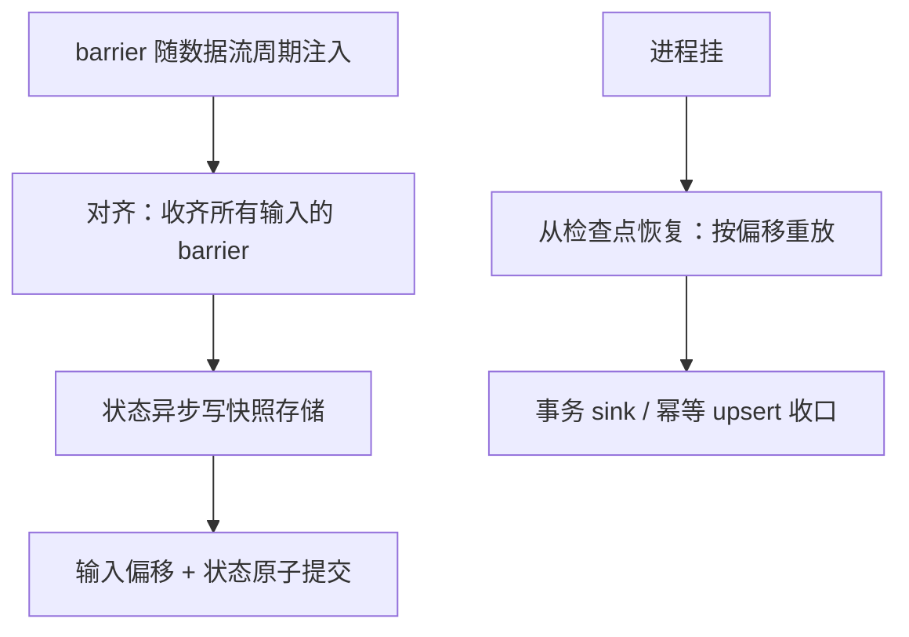
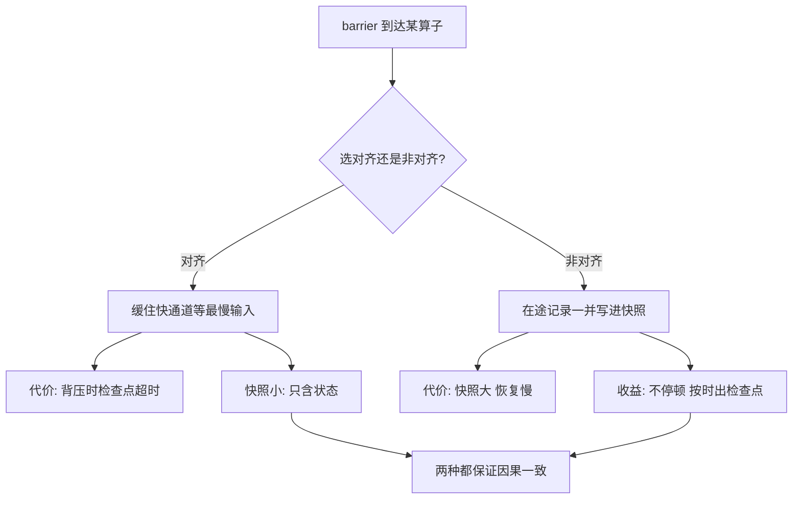

# exactly-once

端到端恰好一次从来不是「消息只送一次」，而是「效果只发生一次」：重复的投递被快照、事务与幂等吸收，结果与只算一次不可区分。

<footer>—— 据 Chandy and Lamport, 1985；Kafka 事务与 Flink 检查点公开设计整理</footer>

[上一课](/cs/stream-watermark)给了事件时间进度钟，窗口可以按时关了。缺口是故障：进程挂在半窗状态上，重启后同一段输入再算一遍，窗口结果被写两次，撤回也救不回对下游的重复冲击。本课钉流系统恰好一次的机制层：它的两条实现路线与各自的代价。投递次数不等于业务效果次数，这条已在[投递语义](/cs/delivery-semantics)与主干[恰好一次](/cs/exactly-once)课立过，本课不重讲定义。

## 问题

重复与丢失分布在三处：输入可能重投（重放本就是恢复手段），算子状态可能回退，sink 可能重复写。恰好一次要求三者原子地进退：要么都停在某个一致点，要么都前进。难点在机制——这是一个持续运行、永不停止的分布式计算，怎么给它拍出「所有算子停在同一逻辑时刻」的快照？全局停机牺牲可用性；各拍各的，快照之间在途记录就成了没人管的缝隙。

快照要的不是「同一墙钟时刻」，而是因果一致：快照里在途的记录，恢复后必须还能重放到位。Chandy–Lamport 的标记协议给出的正是这种一致性，与墙钟无关。

## 方法

路线一：一致性快照加重放。[Chandy–Lamport 快照](/cs/chandy-lamport)用标记消息记录在途内容；Flink 的异步屏障快照把标记（barrier）随数据流周期注入，算子收齐全部输入的 barrier 后把状态异步写进快照存储，barrier 对齐使整张作业图的快照等价于一个逻辑时刻。故障后从上一个检查点恢复，输入按偏移[重放](/cs/kafka-log)，重放无害的前提是确定性重算。路线二：日志事务。把消费-变换-生产包进一个 [Kafka 事务](/cs/kafka-log)，输出与偏移提交同生共死，下游读已提交前缀。sink 收口两条：事务 sink——对支持它的外部系统走[两阶段提交](/cs/two-pc)；或幂等 upsert——用「窗口 + 键 + 版本」做[幂等键](/cs/idempotency-keys)。

## 机制

对齐有代价：收齐 barrier 意味着快的通道等慢的，背压严重时整张图被最慢边拖住，检查点超时失败。非对齐 barrier 把在途记录一并写进快照：快照更大、恢复更慢，但省掉对齐停顿——背压场景里这是唯一能按时出检查点的模式。检查点间隔就是 RPO：间隔内的进度像[异步提交](/cs/group-commit)，故障后重放，重放本身无害，无害的前提是效果幂等。确定性是隐藏前提：恢复后重算，外部时钟、随机数、跨通道竞争都会让第二次结果偏离第一次，恰好一次退化成恰好一次「送达」，还得靠撤回或幂等兜底。Kafka 事务只覆盖 Kafka 下游：跨异构 sink 没有银弹，外部副作用（发邮件）只能幂等。

对齐与非对齐两种拍快照方式各有各的债，选型就是在「等」与「拍重」之间挑更付得起的那个。

常见误区：初学者容易以为「exactly-once 引擎 = 消息绝不重复发送」。实际上 Kafka、Flink 在故障后都会重放或重投同一段数据，恰好一次的成立完全依赖下游用事务、幂等键或快照恢复把重复效果吸收掉——引擎管住的是状态，管不住外部世界。

数字实例：检查点间隔 $30\ s$ 意味着故障后最多重算 $30$ 秒的输入（RPO=$30\ s$）；把间隔缩到 $5\ s$，重算量缩小到六分之一，但每分钟要拍 $12$ 次快照、快照存储与网络开销翻六倍——间隔的选择就是 RPO 与开销的折中。

## 边界

检查点不等于备份：它覆盖进程故障，不覆盖逻辑错误——写错的窗口结果会被一致地快照下来，回滚到正确值要靠重算历史或版本回退。本课不提供绕过幂等去刷外部系统的办法，也不比较各引擎检查点实现的性能数字。后课默认：join 与状态都活在这套快照协议下，故障重放不产生重复效果是已付的成本。

## 小结

- 恰好一次是效果幂等：重放、重投不改变可观测结果。
- 路线一是快照加重放（barrier 对齐或非对齐），路线二是日志事务（Kafka）。
- 确定性重算是重放的前提；非确定算子会把「恰好一次」降级为「恰好一次送达」。
- 检查点间隔即 RPO；sink 靠两阶段提交或幂等键收口，跨异构 sink 无银弹。
- 出处：Chandy and Lamport, TOCS 1985；Carbone et al., 2015（异步屏障快照）；Kreps et al., 2011。
