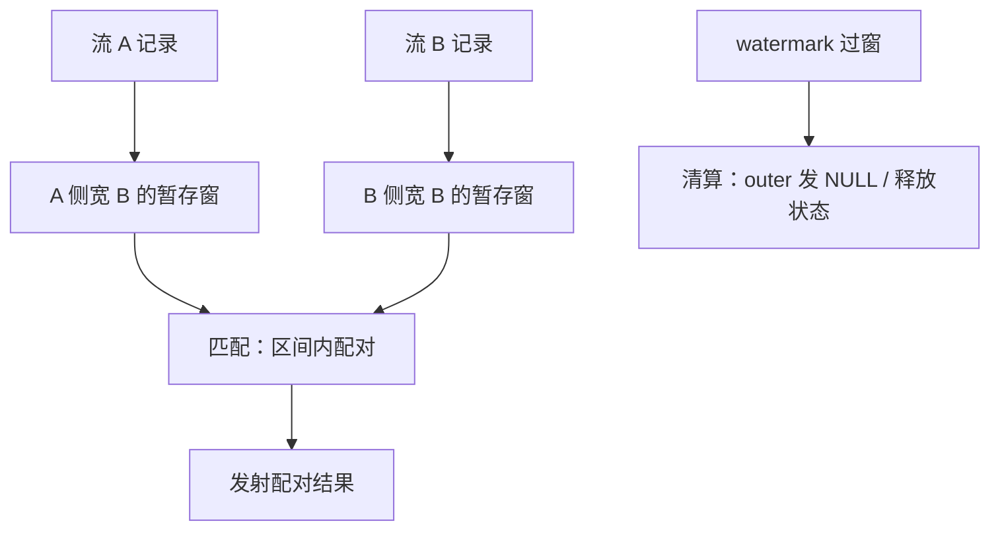

# 流 join

批处理里 join 是关系代数，流处理里 join 是状态管理：每条等待配对的记录都是一笔负债，watermark 是唯一的清算日。

<footer>—— 据 Akidau et al., Streaming Systems, O'Reilly 2018 整理</footer>

[上一课](/cs/stream-exactly-once)保证算子状态在故障下不丢不重——这恰好是流 join 的前提：join 的本质就是把一侧记录暂存成状态，等另一侧来配对。本课钉流 join 的三种形态与状态账；窗口本身的指派规则第二课已立，这里不重复。批一侧的执行算法见 [Grace hash join](/cs/grace-hash-join) 与 [shuffle join](/cs/distributed-join-shuffle)，本课只谈流语义加在它们上面的部分。

## 问题

两条无界流上问「同一用户五分钟内的浏览与下单是否配对」。批处理的答案是一次对两条有界输入的 hash join；流处理必须额外回答四个问题：等谁（按键还是按窗口对齐）、等多久（时间界还是无限等）、等多大的状态（每键暂存量上界是多少）、永远等不到时算什么（outer join 的「确认配不上」由谁、在何时宣布）。没有时间界，暂存状态随运行时长线性涨，任何引擎撑不住；没有进度声明，outer join 说不出「现在可以判负」的时刻，结果永远悬着。

## 方法

流-流：区间 join——记录对匹配的条件是 $|t_a - t_b| \le B$。实现为按时间窗对齐的双边暂存：两侧各自把记录存进宽 $B$ 的窗，watermark 过窗即清算：窗内能配对的发射，配不上的按 outer 合同发 NULL 或转侧输出。流-表：维表 enrichment；表若是 changelog，必须做版本化——按事件时间取记录发生「当时」的行，而不是处理时刻「现在」的行，否则历史重放出的结果随运行日期漂移。流-静态：退化为查找，缓存与回填是工程问题，不改变语义。

区间 join 的状态账：两侧速率各 $r$、窗宽 $B$，每键暂存量级 $\approx 2Br$。一万条每秒、六十秒窗，就是百万条在途状态——这个上界成立的前提是键分布均匀，一个热点键就能把它局部打穿。

## 机制

流 join 的状态是托管状态，受两条规则保护：回收靠 watermark（窗端点一过即清算释放），备份靠检查点（第四课的快照协议）。倾斜是第一杀手：热点键让单个并行实例独扛超额暂存，分区内摊不平——先按 [shuffle 键设计](/cs/distributed-join-shuffle)加盐拆分，或对热点键走广播与局部聚合，与批处理的倾斜治理同源。清算被拖延是第二杀手：一侧通道慢，watermark 冻结，清算推迟，暂存先涨——速率问题在下一课收口。实现选型上，宽窗大状态可以把暂存落盘（把 Grace hash join 的分区落盘换成按窗落盘），用读放大换内存上界；窄窗留在堆里更快。去重：同一条业务事件经重放后可能二次入窗，配对要用幂等键去重，否则恰好一次的合同在 join 这里被自己打破。

## 边界

本课不写 join 算子的实现清单，谓词下推与多方 join 的计划选择是查询优化的事；也不把窗口 join 与区间 join 混为一谈——前者输出按窗聚合，后者输出记录对。outer join 的判负依赖进度声明，没有 watermark 的系统谈不上「确认配不上」。后课默认：join 的暂存、清算、回收都由托管状态承担，状态放哪、多大、怎么备份是下一课的账本。

## 小结

- 流-流 join 靠时间界与进度声明：区间约束给状态上界，watermark 给清算时刻。
- 流-表 join 必须版本化，按事件时间取行；按当前取行，重放即漂移。
- 状态上界 $\approx 2Br$，倾斜键与拖延的 watermark 是打穿上界的两个杀手。
- 重放会二次入窗，配对去重依赖幂等键。
- 出处：Akidau et al., Streaming Systems, O'Reilly 2018；对照批侧 Grace hash join 与 shuffle join 课。
