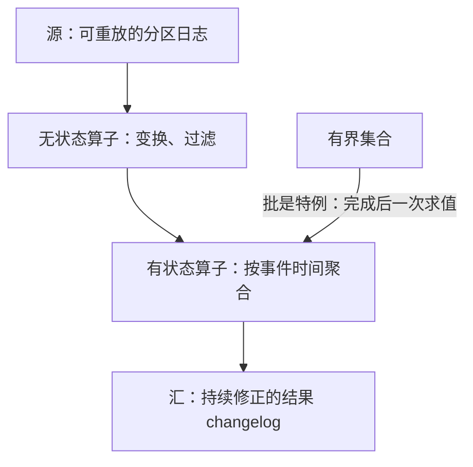
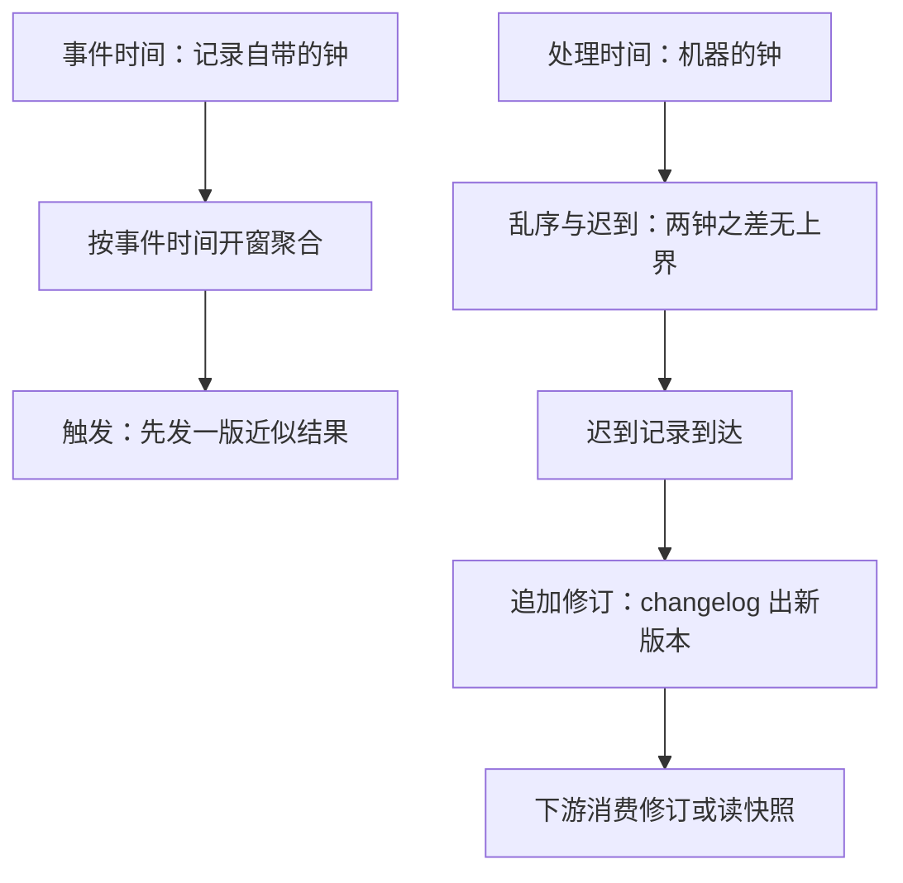

# 流处理模型

数据要么有界要么无界。批处理是流处理在「输入恰好完成」时的特例，而不是相反；把无界数据硬塞进「跑完再说」的框架，丢掉的不是效率，是结果本身的定义。

<footer>—— 据 Akidau et al., The Dataflow Model, VLDB 2015；Streaming Systems, O'Reilly 2018 整理</footer>

[上一课](/cs/cg-debugging-map)给「编译器后端深化」收束：错译找第一个改坏语义的 pass，漏优化找机会消失的那一步，化简、二分与翻译验证各司其职——八课一句总纲，每一层都在信息丢掉之前做决定。编译器的账结了，数据库这边还剩一个默认要翻：整条数据库主干——从[关系模型](/cs/relational-model)到[两阶段提交](/cs/two-pc)——默认同一件事：数据有界，行先落盘，查询后到。本课是「流处理」课程的第一课，前提反过来：数据无界，记录到达即算，永远没有「跑完」。本课钉流处理模型的最小词汇——记录与事件时间、算子与状态、结果作为持续修正的 changelog；窗口、watermark、恰好一次都建在它上面。后课默认已经读完本课。

## 问题

有界数据上，计算是一个函数：输入完成，一次求值，答案确定。无界数据没有「完成」：计数、join、聚合在任意时刻都必须给出可辩护的答案，且答案随新记录修正。三个问题立刻出现：结果定义在哪根时间轴上——事件发生的时间，还是被处理的时刻；记录乱序、迟到时，先前发出去的答案要不要改；机器挂在两条记录之间，已算的部分怎么办。缺口不是「能不能处理数据」，而是先立一套模型，让正确性、延迟、成本三者可以分开陈述，而不是搅在一个引擎名里。

MillWheel（VLDB 2013）把时间戳交给用户数据自己携带，计算只认时间戳不认到达时刻；Dataflow 模型（VLDB 2015）再把窗口、触发器、累积方式拆成互相正交的决定。今天各引擎的词汇表基本是这两篇的展开。

常见误区：「无界」说的不是数据量大到装不下，而是没有完成时刻——一条每秒只来一条的计数流，内存占用恒定，照样是无界流；反过来，昨天的全量日志再大也是有界的。有无界由答案的定义决定，不由数据量决定。

## 方法

模型分四步钉。第一，记录携带事件时间戳：时间属于数据，不属于处理它的机器。第二，计算是有状态或无状态算子组成的 DAG：记录沿边流动，边上的通道必须有限、可恢复。第三，输入可重放：无界流上的故障恢复要求「同一段输入可以再来一遍」，这正是分区追加日志提供的性质——[Kafka 日志](/cs/kafka-log)的按键有序与偏移回退因此是流系统的标准源，而不只是消息队列的实现细节。第四，结果是 changelog 而非表：下游要么消费修订，要么读快照，[湖仓表格式](/cs/lakehouse-table-format)与 [CDC](/cs/logical-replication-cdc) 是它的两个落点。

changelog 的意思就是「不改旧答案，只追加新答案」：第一版说下单量 42，迟到记录到齐后追加一版 47——下游永远读「最新一版」，而不是苦等一个不存在的「最终一版」。数据库的 WAL 与逻辑复制，落点都是同一种结构。

## 机制

事件时间与处理时间是两根独立的钟。两者之差没有上界：消费落后、重试、分区倾斜都能把「事件发生」与「记录被算」拉开几分钟甚至几小时。模型必须让两者分离陈述，否则「昨天的下单量」这个问题的答案随系统负载漂移——按处理时间聚合，重放历史数据得到的是「当时算多少」，不是「当时发生多少」，这是第一批流系统最常见的翻车点。无状态算子只变换记录，状态放在键上；有状态算子把历史压进状态，状态的存活期与回收条件是后两课的主题。正确性换延迟：早发射是近似，后续修订收敛到正确值；坚持等「全了再发」，无界流上永远等不到。批处理把全部修订一次性给全，流处理把修订摊在时间轴上——两者的结果在收敛后应当无差，差了就是语义实现错了。

直觉类比：处理时间像快递的签收时间，事件时间像包裹上写的发货日期——站点拥堵时两者能差好几天。要回答「哪天下单的」，就得按包裹上的日期记账；按签收日记账，答案就会随物流快慢漂移。

## 边界

本课不定义窗口与进度声明（后两课），不处理故障语义（第四课），也不把「流处理」绑定到某个引擎。微批是本模型的一个工程点：用小的处理时间片近似连续流动，实现简单，换掉的是事件时间表达力。更不要把套接字 read 循环叫流系统：没有可重放输入、托管状态与恢复协议，它只是消费者，挂了就丢。后课默认：谈到流聚合，输入可重放、记录带事件时间、结果带修订，这三条已经成立。

## 小结

- 流处理的前提是无界：计算永远在进行，结果以 changelog 持续修正。
- 事件时间属于数据，处理时间属于机器；二者之差无上界，必须分开陈述。
- 可重放输入是故障恢复的前提，分区追加日志因此是标准源。
- 正确性换延迟：早发射加修订，是模型的一部分，不是权宜之计。
- 出处：Akidau et al., MillWheel, VLDB 2013；The Dataflow Model, VLDB 2015；Kreps, Narkhede and Rao, 2011。
