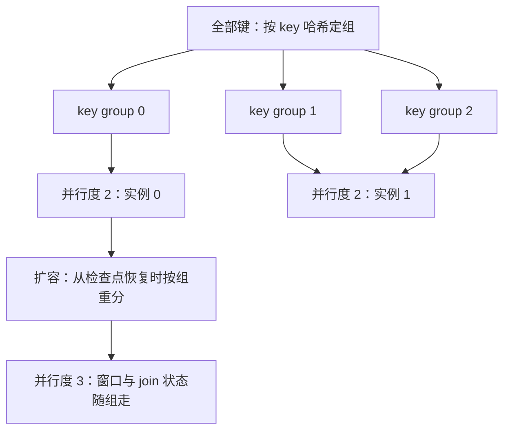
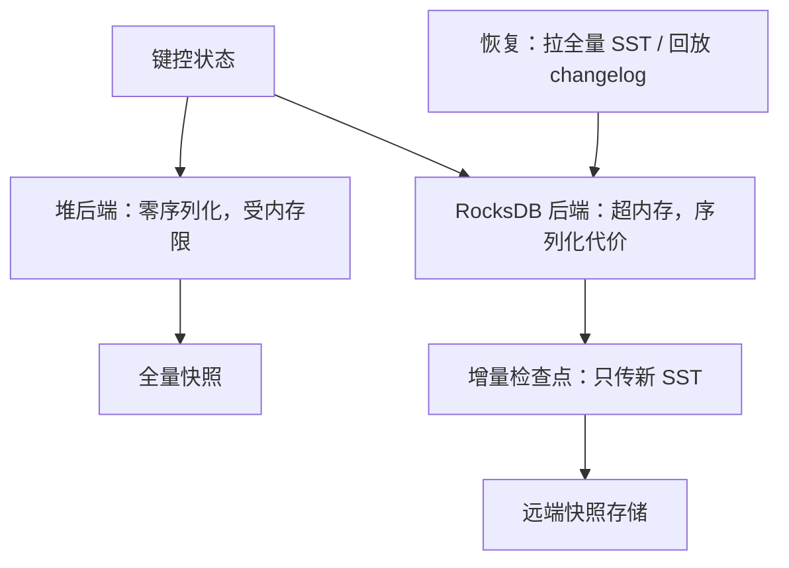

# 状态管理

流的每一次聚合、join 与去重都活在状态里。状态放错地方，错误不在功能上显形，而在恢复时间与账单上显形。

<footer>—— 据 Apache Flink 与 Kafka Streams 状态后端公开设计；RocksDB 工程实践整理</footer>

[上一课](/cs/stream-joins)把 join 写成状态账：暂存、清算、回收。本课把「状态」当一等对象钉下来：放哪、多大、怎么备份、怎么迁移、怎么演进。检查点协议第四课已立，这里只谈状态的工程；状态暴涨最常见的推手——速率不匹配——留给第七课的背压。

## 问题

键控状态天然无界：键空间随业务涨，每键状态随窗口与 TTL 涨。全放堆里，GC 停顿与恢复时间受不了；放本地磁盘的 LSM 存储，序列化与读写放大进账单。围绕状态有四个必须各自可预测的操作：读、写、快照、恢复。快照要跟上写入速率，恢复要满足 SLA，扩缩容要把状态搬走而不丢，代码升级要让旧检查点还能被新代码读。任何一项不可预测，故障那天都会以小时计地还债。

## 方法

分类先行：键控状态（value、map、reducing）按 key 哈希到并行实例；算子级状态含广播状态。后端两族：堆后端——对象直接访问、零序列化，但大小受内存约束，快照要全量遍历；RocksDB 后端——本地磁盘、按 key 序列化读写，靠 [LSM 的 memtable 与 SST 分层](/cs/lsm-compaction)支撑超内存状态，代价是每次读写都过序列化与合并。备份：增量检查点只上传新产生的 SST 文件与预写段，上传量与写入速率成正比，与状态总大小无关。迁移：键空间切成 key group，按 hash 区间分给并行实例，扩缩容按组搬家，窗口与 join 的状态一起走。

恢复时间不看检查点间隔，看状态总大小：增量检查点让每小时只上传 1 GB，恢复时仍要把全部 SST 拉回本地——容量规划应按恢复 SLA 反推状态上限，而不是按上传带宽。

key group 可以想成把全部键按哈希装进 128 个固定编号的抽屉：并行度从 2 扩到 3 时，只需整只搬走一部分抽屉，键本身不用重新分配——抽屉数不变，键落在哪个抽屉也永远不变，搬的是抽屉不是键。

## 机制

TTL 不是可选项：没有 TTL 的 map 状态是签了字的内存泄漏；清理策略分全量压实清理与惰性过期，读放大不同——与 [MVCC 版本回收](/cs/mvcc-gc)同构，旧状态不回收，读性能与存储一起坏。状态模式演进要求序列化格式前后兼容：老检查点里存的是旧 schema 的字节，新代码读不出就是恢复失败——schema 版本号在这里不是企业规范，是恢复的前提。changelog 是另一条路线：Kafka Streams 把本地状态镜像成日志主题，实例挂了从 changelog 回放重建——[WAL](/cs/wal) 的老道理在流状态上重演，恢复时间换成回放时间。查询状态（把内部状态当数据库暴露给外部读）则要另签一致性合同：读到的是「最后检查点」还是「当前值」，两者差着第四课的全部内容。

数字实例：一条无 TTL 的 map 状态每天新增 10 万个键，一年就是约 3650 万条；每条哪怕只占 100 字节，也是 3.6 GB 常驻。TTL 是给每条状态挂「到期即清」的闹钟，清理策略决定闹钟响时当场删还是等下一次压实。

为什么重要：changelog 路线的恢复时间等于回放时间——状态 10 GB、changelog 每秒写 5 MB，冷启动全量回放约需 34 分钟。SLA 定在 5 分钟内，就得靠周期性快照把回放起点往后挪：快照与回放是一对互补的旋钮。

## 边界

本课不替代 RocksDB 调优手册，也不给具体引擎的参数清单；状态大小预算的方法在，数字要按自己的负载量。queryable state 的一致性合同、跨作业共享状态（那是又一个数据库）都不在本课。后课默认：join、窗口、去重的状态都按本课的账本放置、备份与回收；状态账算不清，背压那课的速率问题会更早找上门。

## 小结

- 状态四个操作各自可预测：读、写、快照、恢复；缺一个都是故障日的债。
- 堆后端快而受限，RocksDB 后端超大内存但付序列化与合并。
- 增量检查点上传正比于写入速率；恢复时间正比于状态总大小。
- TTL 与 schema 兼容是恢复的前提，不是优化；changelog 把恢复变成回放。
- 出处：Apache Flink 与 Kafka Streams 状态后端公开设计；RocksDB 文档；对照 LSM 与 WAL 课。
