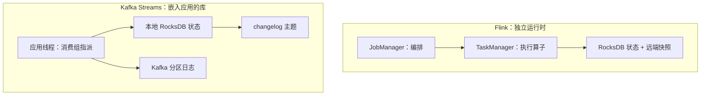

# Flink 与 Kafka Streams 的对照与收束

同一个语义模型可以落在两种架构上：一套独立集群的执行引擎，或一个嵌进应用的库。选哪个不取决于功能表的长短，取决于状态放在谁的运维半径里。

<footer>—— 据 Apache Flink 与 Kafka Streams 公开设计文档；Kreps, Narkhede and Rao, 2011 整理</footer>

[上一课](/cs/stream-backpressure)把速率问题收进引擎的有界边。本课收束本课程：先对照两个代表性系统的架构取舍，再把前七课的语义链条收拢成一张图。本课程到此收束。

## 问题

学完模型、窗口、watermark、恰好一次、join、状态、背压，工程上的问题是：这些机制装在哪个壳里。Flink 与 Kafka Streams 是两个极点——前者是独立分布式运行时，后者是嵌在应用进程里的库。逐项对功能表会越对越乱：两边都有窗口、都有恰好一次、都有状态。分得清的是架构与所有权：算力归谁、状态归谁、失效域多大、恢复走哪条路。

## 方法

Flink：作业图由 JobManager 编排、TaskManager 执行，状态放 RocksDB，快照写远端存储；事件时间、watermark、[credit 流控](/cs/stream-backpressure)都在引擎内，与源的耦合只有一个可重放接口——[Kafka](/cs/kafka-log) 只是源之一。Kafka Streams：没有额外集群——分布就是消费组对分区的任务指派；本地 RocksDB 状态加 changelog 主题做备份，恢复等于从 changelog 回放；恰好一次靠把消费-变换-生产包进 Kafka 事务，走的是第四课的路线二而非路线一。并行度上界就是分区数。SQL 层：Flink 的 Table API 在流上跑连续查询；Kafka Streams 的 DSL 与 ksqlDB 是另一条路。

Kafka Streams 的并行度上限是分区数：实例可以少于分区，不能多于。先扩分区再扩应用，会改变键到分区的映射，按键有序随之破坏——扩容决策要提前于业务增长，不是随时可做。

## 机制

真正的分野是状态的运维半径与失效域。Flink 的状态归作业管：扩缩容走 key group 重分配（第六课），快照与作业同生命周期，失效域是整张作业图——一个算子慢，全图背压（第七课）。Kafka Streams 的状态归应用实例管：实例挂，changelog 回放重建本地状态，失效域是单个实例加它负责的分区；跨实例没有整体背压，速率问题由 Kafka 的消费滞后（lag）暴露。故障恢复对应第四课两条路线的取舍：快照重放换整图一致性，日志事务换运维简单。窗口、watermark、迟到合同两边都遵守第二、三课的语义，差别在实现深度：引擎级的水印传播与对齐比库级更精细。语义模型先于引擎——这是本课程最想留下的判断：先写清 WHAT、WHEN、HOW，再挑壳。

## 边界

对照不构成选型裁决：状态规模、时延要求、团队运维半径、已有 Kafka 投入共同决定；两边也都在演化，快照的边界会过期，语义模型不会。不把「流批一体」当免费午餐：批是特例（第一课），特例的实现路径各有折扣。本课程到此收束：从无界数据的模型出发，经窗口与 watermark 的语义、恰好一次的机制，到 join、状态、背压的工程，最后落回两个系统的架构取舍——后续课程在共识与复制上继续分布式这条线。

## 小结

- Flink 是独立运行时：状态归作业，失效域是全图，恢复走快照重放。
- Kafka Streams 是嵌入库：状态归实例，changelog 即 WAL，恢复是回放，并行度上界是分区数。
- 恰好一次的两条路线（快照、日志事务）分别对应两家的架构。
- 语义模型先于引擎：窗口、进度、幂等的定义不随选型改变。
- 出处：Akidau et al., Streaming Systems, O'Reilly 2018；Kreps, Narkhede and Rao, 2011；Flink 与 Kafka Streams 公开设计文档。
