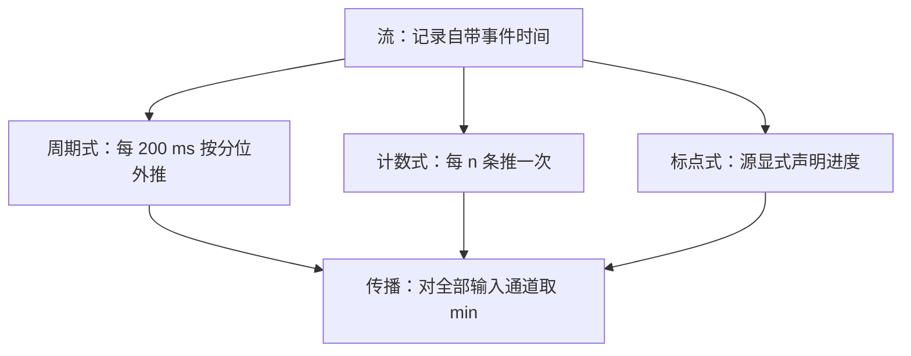
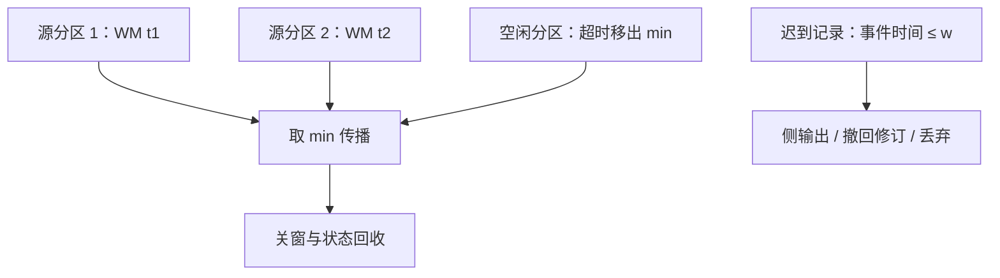

# watermark

watermark 是系统对时间本身下的断言：再不会有比这更早的事件。断言下强了会丢数据，下弱了每个窗口都开不出口——它注定会错，重要的是错的合同。

<footer>—— 据 Akidau et al., MillWheel, VLDB 2013；The Dataflow Model, VLDB 2015 整理</footer>

[上一课](/cs/stream-windows)把窗口语义钉成指派、累积、发射、回收四件套，但把「何时可以放心关窗与回收」留作开放变量。缺口是事件时间进度：无界流上必须有某物宣称「到时间 $t$ 为止的事件到齐了」。本课钉 watermark 的生成、传播与代价；有了进度钟，下一课才谈故障下的恰好一次。

## 问题

乱序是分布式的常态：分区并行、重试、批内重排，都让事件时间 $t$ 的记录在 $t+\Delta$ 才到。完美的 watermark——真的知道不会再有更早事件——在真实源上不存在，除非源本身有序或有限。于是用启发式断言换活性，而断言有两个失败方向：过快关窗，迟到事件变成数据错误；过慢关窗，状态膨胀、结果延迟一起涨。缺口是把迟到从意外变成合同：断言怎么生成、违反断言怎么处理、断言本身的健康怎么监控，三件齐全才算定义完。

watermark 可以翻译成「进度条的水位线」：它不是一个时间点，而是一句断言——「事件时间不晚于 w 的记录应该都到齐了」。断言可能错，错的那部分就是迟到者；合同写清迟到者怎么处理，断言才敢放心用。

## 方法

生成有三种：周期式——每个处理时间间隔按已见事件时间的分位数外推一个水印（Flink 默认每 $200\,\mathrm{ms}$ 生成一次）；计数式——每 $n$ 条推一次；标点式——源显式声明「此事件时间之前的都齐了」。传播：算子对全部输入通道的水印取 $\min$ 再向下游发布，单算子的并行实例之间也要对齐，否则同一算子内部对进度的认知分叉。空闲：某个输入通道一旦停滞，$\min$ 冻结，下游所有窗口与状态回收全部停摆——空闲检测把超时无数据的通道移出 $\min$，恢复后收回，这不是优化项，是必选项。

监控三件事：迟到率（断言被违反的频率）、watermark 与墙钟的滞后（结果延迟的来源）、各输入通道的进度差（谁在拖 min）。只盯其一，故障会从另外两处进来。

数字实例：Flink 默认每 200 ms 生成一次水印，1 分钟就是 300 次断言。若断言说「10:00:00 之前的事件都齐了」，而一条 9:59:58 的记录 10:00:03 才到，它就是迟到——这 3 秒的偏差，完全取决于生成器的外推有多激进。

## 机制

watermark $w$ 的合同是：事件时间 $\le w$ 的记录此后到达即为迟到，走迟到路径——侧输出、撤回修订、或按合同丢弃。选择必须写在接口上，不能靠下游猜：丢弃静默地改变答案，撤回要求下游有修订能力（第二课的累积模式）。活跃窗口状态以 $w$ 为回收水位：所有窗端点 $\le w$ 的窗口即可释放——关窗与状态回收共用同一把钟，两套标准必然漏账。故障恢复要求 $w$ 与窗口状态一起进检查点：丢了 $w$，恢复后要么重复关窗、要么永不关窗。与 [Spanner 的 $\epsilon$](/cs/spanner-truetime) 对照：那边是时钟不确定度，提交等待 $2\epsilon$ 有硬保证；这边是启发式断言，安全性由迟到合同兜底，两者不要混名。

常见误区：初学者容易把 watermark 当成「保证数据到齐」的机制，实际上它只是估计，从不保证——它回答的是「何时敢关窗」，正确性由迟到合同（侧输出、撤回、丢弃）负责，两者分工不同，混为一谈就会把丢数据当正常。

## 边界

watermark 不提供正确性保证——它是启发式，错了不赔偿，赔偿靠迟到合同。本课不比较各引擎生成器的优劣，也不把微批的批边界当作 watermark：批边界是处理时间的事实，不是事件时间的断言。重放历史数据时，按处理时间外推的水印全是假的，重放必须带显式进度或按事件时间重生成。后课默认：事件时间窗口的关窗与回收以 watermark 为准，迟到有书面合同。

## 小结

- watermark 是事件时间进度的启发式断言，注定会错；错的后果由迟到合同定义。
- 传播取 $\min$：最慢通道冻结全局进度，空闲检测因此是必选项。
- 关窗与状态回收共用 watermark 这把钟；检查点必须连 $w$ 一起快照。
- 迟到路径（侧输出、撤回、丢弃）必须显式声明，静默丢弃等于改答案。
- 出处：Akidau et al., MillWheel, VLDB 2013；The Dataflow Model, VLDB 2015；Streaming Systems, O'Reilly 2018。
