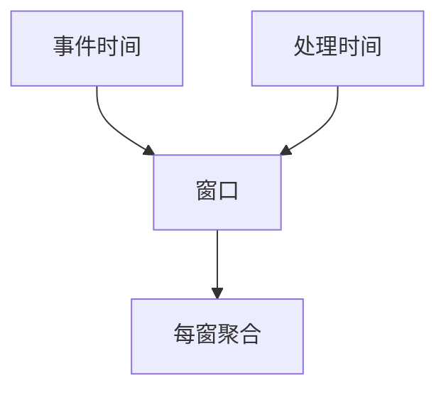

# 流处理与窗口

无界输入没有「作业结束」。窗口把时间切成可聚合的有限包；事件时间与处理时间不是同一根轴。

<footer>—— 据 Akidau et al., The Dataflow Model, VLDB 2015；流系统窗口语义通识</footer>

[上一课](/cs/spark-dag)的 DAG 假定有界输入。缺口是**一直来的记录**：计数、join、聚合必须说清窗口。本课钉窗口；乱序与 watermark 下一课。不把套接字 read 循环当流引擎。

## 问题

滚动、滑动、会话窗口给出不同的键。按处理时间切：简单，结果依赖调度。按事件时间切：可复现，但记录会迟到。缺口是先承认两根时钟，再谈引擎。与批：窗口聚合在有界数据上就是 GROUP BY 时间桶。

Dataflow 模型把事件时间、watermark、触发器分开。不要把「微批 1 秒」叫做事件时间正确。

## 方法

声明窗口（大小、滑动、会话间隔）与时间属性。输出：每个窗口一个结果，或更新修订。状态：按键存窗口聚合。与湖仓：结果表用表格式提交。与背压：网络课的应用背压在此变成算子队列。

## 机制

窗口是把无限流变成无限多个有限关系的规则。滚动不重叠、滑动重叠、会话靠空闲间隔切开。状态按键存累加器，检查点要带走；TTL 驱逐老窗，否则内存线性涨——像 [MVCC GC](/cs/mvcc-gc) 的水位。两流 join 必须在时间上对齐窗口，否则中间积爆炸。并行按键 shuffle 到工人，倾斜键让单窗状态爆。

微批（固定处理时间切）实现简单，不等于事件时间正确。输出可以一次关窗发射，或早期触发出近似值再修订。结果可落入 [时序库](/cs/timeseries-db) 或湖仓表。与 SQL `OVER`：那边行集有界且不收缩；这里窗口才让聚合有结束。

## 边界

本课不写 Flink 算子清单。下一课迟到与 watermark：事件时间进度声明。恰好一次再下一课。不要把套接字循环当流引擎。

后课默认：流聚合必须声明窗口与时间域。没有窗口的「流 GROUP BY」没有指称上的结束。

## 小结

- 流聚合必须声明窗口；事件时间与处理时间要分开。
- 会话与 join 把状态变成一等资源。
- Watermark 与乱序下一课。
- 出处：Akidau et al., VLDB 2015；对照 SQL 窗口课。
