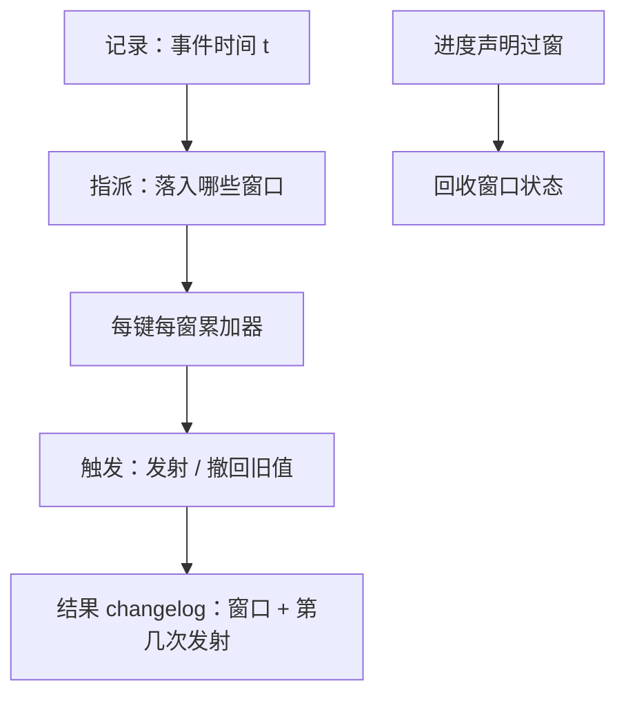
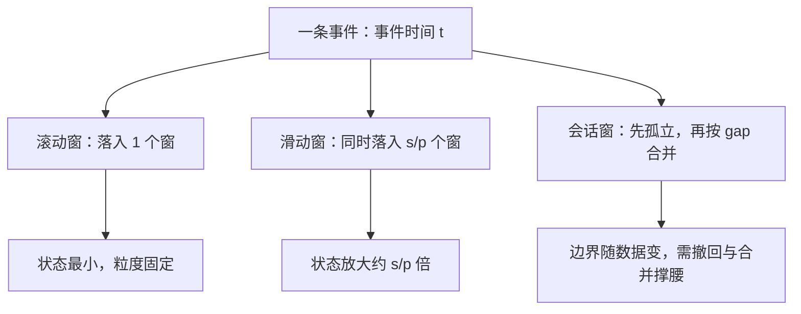

# 窗口语义

窗口不是把流切成段的手段，而是把无界流变成无限多个有限关系的规则；规则没有说清的部分，聚合出来的每一个数都无从辩护。

<footer>—— 据 Akidau et al., The Dataflow Model, VLDB 2015 整理</footer>

[上一课](/cs/stream-model)把无界输入钉成带事件时间的记录与算子 DAG，但留了个缺口：聚合在无界流上没有自然的结束，每来一条记录，历史合计就得改一次。窗口是给聚合人为立边界的机制。本课钉窗口语义的四件套——指派、内容、发射、回收——的全部定义面；「何时可以放心关窗」是进度问题，留给下一课的 watermark。

## 问题

在无界流上问「昨天的下单量是多少」，隐含了按天切分，但引擎不知道。必须显式定义三件事：**指派**——每条记录属于哪个或哪些窗口，由事件时间的确定性函数决定；**累积**——窗口内的状态怎么随记录增长；**发射**——何时发、发几次、旧值怎么处理。不分开就出错：按处理时间切，重放重算结果不同；按事件时间切却不管迟到，关窗时刻是猜测；滑动窗口按「每条记录建独立窗」天真实现，状态量直接爆掉。会话窗更进一层：窗口边界本身依赖数据，晚到的记录可能把两个已关闭的窗并成一个。

滑动窗口的状态放大是可算的：大小 $s$、步长 $p$ 的滑动窗，每个键同时活跃 $s/p$ 个窗口。一小时窗、一分钟步长，就是每键六十个并行累加器——「窗口聚合」的内存账从这里起算，不是从记录数起算。

会话窗的直觉：每条记录先自己撑一顶小帐篷，若下一顶帐篷离得不超过 gap（比如 30 分钟无操作），就把两顶并成一顶——所以会话的个数与边界都不是预先定好的，而是数据自己长出来的；数据晚到，帐篷还会再并一次。

## 方法

指派。滚动窗口把事件时间轴切成不重叠的 $[kt,\; (k+1)t)$；滑动窗口允许重叠，一条记录进入 $s/p$ 个窗；会话窗口先给每条记录一个孤立窗，空闲间隔不超过 gap 的窗在键内合并。累积：每键每窗一个累加器——计数可以直接合并，分位数要用可合并的草图，基数用 [HyperLogLog](/cs/hyperloglog)，重数用 [count-min](/cs/count-min-sketch)；累加器不可合并，窗口聚合就做不了并行。发射与累积模式绑定：丢弃式发增量，累积式发全量，累积加撤回式先收回旧值再发新值。撤回是会话窗与修订语义的硬前提：下游接不住撤回，就不能选这种模式。

```mermaid
flowchart TD
  EVT["记录：事件时间 t"] --> ASG["指派：落入哪些窗口"]
  ASG --> ACC["每键每窗累加器"]
  ACC --> TRG["触发：发射 / 撤回旧值"]
  TRG --> OUT["结果 changelog：窗口 + 第几次发射"]
  GC["进度声明过窗"] --> EV["回收窗口状态"]
```

## 机制

窗口是把无限流变成无限多个有限关系的规则，所以状态的账是双重的：窗数与窗内容。活跃窗数由指派决定（滚动 $1$、滑动 $s/p$、会话随数据密度），窗内容由聚合器决定；两者都必须有回收条件，否则内存随运行时长线性涨——这与 [MVCC 版本回收](/cs/mvcc-gc)是同一问题在两个层的形态：旧版本不回收，读性能与存储一起烂掉。会话窗的合并让「指派后可变」：合并触发撤回两个旧结果、发射一个新结果，序号要能对上。与 SQL [窗口函数](/cs/window-functions)对照：那边 `OVER` 的行集有界且静态，聚合有天然结束；这边正是窗口让聚合获得指称上的结束。与时序库对照：[预聚合降采样](/cs/timeseries-db)是滚动窗的物化特例。微批引擎把窗口绑在处理时间片上，实现简单，换掉的是事件时间正确性——重放即漂移。

```mermaid
flowchart TD
  E["一条事件：事件时间 t"] --> TU["滚动窗：落入 1 个窗"]
  E --> SL["滑动窗：同时落入 s/p 个窗"]
  E --> SE["会话窗：先孤立，再按 gap 合并"]
  TU --> G1["状态最小，粒度固定"]
  SL --> G2["状态放大约 s/p 倍"]
  SE --> G3["边界随数据变，需撤回与合并撑腰"]
```

撤回翻译成白话就是「先作废上一版，再报新版」：会话合并时，两个已发出的旧会话结果都要收回，改发一个合并后的新值——下游若存不下旧值或接不住「撤销」指令，这种累积模式就选不得。

常见误区：把窗口想成「把流剪成段」，段与段互不相干。实际上窗口是给每条记录贴窗号标签、按窗号各自累加——同一条记录在滑动窗下会同时出现在多个窗里，这也是状态要按「窗数 × 窗内容」双重计账的原因。

## 边界

本课只谈指派、累积、发射三件套，不谈关窗的进度依据——那是 watermark 的定义域，迟到事件怎么处理也一并后置。端到端的恰好一次（窗口结果不因故障重发）在第四课。后课默认：每个窗口结果都带着「哪个窗、第几次发射」的坐标，且窗口状态有显式的回收条件；没有坐标的结果无法撤回，没有回收条件的窗口是泄漏。

## 小结

- 窗口语义四件套：指派、累积、发射、回收；少定义一件，结果就无从辩护。
- 滑动窗的状态放大是 $s/p$ 倍；会话窗需要合并与撤回机制撑腰。
- 累加器必须可合并，窗口聚合才能并行；撤回能力决定可选的累积模式。
- 事件时间窗口让聚合有指称上的结束；处理时间窗口在重放下不成立。
- 出处：Akidau et al., The Dataflow Model, VLDB 2015；Streaming Systems, O'Reilly 2018。
