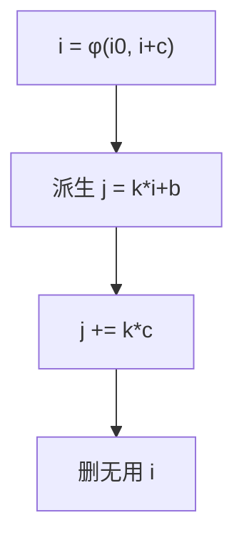

# 强度削弱与归纳变量

归纳变量每圈加常数；乘以常数的地址可改成每圈加法。强度削弱把贵运算换成便宜更新。

<footer>—— 据 Allen, Cocke, Cocke–Kennedy；龙书归纳变量；Muchnick 整理</footer>

上一课[LICM](/cs/licm)把不变式搬出去。缺口是**随圈线性变**的量：`a[i]` 的地址 `&a + i*sizeof`。基本归纳变量 $i$，派生 $j=4*i+b$。削弱：循环外算初值，圈内 `j+=4`。本课钉 IV 与削弱，不写展开。

## 问题

识别：SSA 上 $i = \phi(i_0, i+c)$ 形态。派生：循环内 $j = i*k + b$ 且 $k,b$ 不变。缺口是**改写合法性**（溢出、指针 provenance），不是外提。

删除无用 IV：若 $i$ 只服务地址，削弱后 $i$ 可 DCE。比较：`i<n` 可改成 `p<end`，少一个名——重写退出条件。

### 削弱不是「乘法变移位」的窥孔

窥孔把 `*4` 变移位，是单条指令。IV 削弱是跨迭代的递推。二者都做，层不同。

Cocke–Kennedy 强度削弱。龙书 9.1.2。LLVM 的 IndVarSimplify。本课整数与指针；浮点归纳少见且危险。

## 方法

找循环的 φ 加法。建 IV 族。为每个派生插初始化与加法。更新比较。跑 DCE。

与寄存器：多个派生 IV 增加名，可能要合并或保留 $i$。启发。

## 机制

有符号溢出：C 中 $i$ 递增若 UB，削弱后的指针运算须仍在对象内——语言规则。不要把 `i*i` 当线性 IV。

非线性（`i*i`）可差分化成递推，少见，点名。

## 边界

本课不写循环展开因子选择。后课默认：线性 IV 可削弱成加法。下一课展开与剥离：用已知行程复制体。

也不把强度削弱当密码学的「削弱」。

## 小结

- 基本 IV 每圈加常数；派生可递推更新。
- 削弱后 DCE 旧 IV；注意溢出与指针规则。
- 不同于单指令窥孔。
- 出处：Allen/Cocke/Kennedy；龙书；Muchnick。
