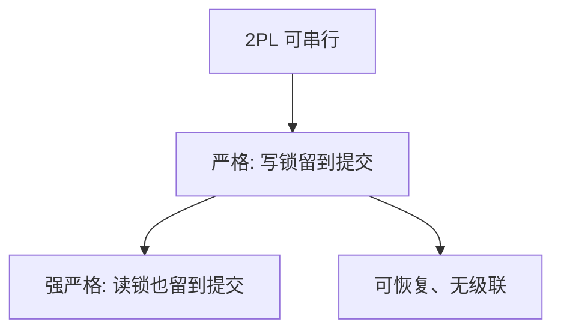

# 严格与强严格 2PL

严格 2PL 把写锁留到提交，堵住脏读与级联回滚；强严格连读锁也留到提交，调度成为可恢复的严格串行。

<footer>—— 据 Eswaran et al.；Bernstein 对严格 2PL；Gray and Reuter</footer>

[上一课](/cs/two-pl)给出增长/收缩两阶段，保证冲突可串行。本课不重画锁点。缺口是收缩太早：写锁在提交前释放，别人读到未提交值，然后你回滚——级联。严格：直到结束才放写锁。强严格（SS2PL）：读写锁都留到结束。MVCC 下一课对照读为何可不加锁。

## 问题

2PL 课留下「严格 2PL 顺带挡住脏读」。需要钉术语。可恢复调度：若 i 读了 j 的写，j 必须先提交。级联回滚：j 撤则 i 也要撤。严格 2PL 通过「提交前不放 X 锁」得到可恢复且无级联。强严格再推迟 S 锁，便于提交序与锁点一致。缺口是**锁释放时机相对提交点**。

生产系统几乎都用严格或更严，很少在收缩阶段提前放写锁。死锁概率上升是代价，后课检测。

## 方法

事务提交/中止时一次性释放。隔离级别若允许提前放 S 锁，会换来不可重复读——后课级别表。本课只钉严格族与 2PL 的关系：严格 2PL ⊂ 2PL，仍可串行，且可恢复。

## 机制

写锁持有到提交，使 wr 边的源头必已持久或尚未被读。这与 [WAL](/cs/wal) 配合：未提交写可以 steal 到页上，但别人读不到（锁），UNDO 不必追读者。读锁提前放则允许 rw 在提交前发生，可串行仍可能，重复读不保证。

## 边界

本课不把 SI 当 2PL 的一种。长读挡住写的问题，下一课用多版本缓解。

后课默认：锁实现常用严格 2PL。只读不想挡写，走 MVCC。

## 小结

- 严格 2PL 提交前不放写锁，避免脏读与级联。
- 强严格连读锁一起留。
- 多版本下一课。
- 出处：Bernstein；Eswaran 1976；Gray and Reuter。
