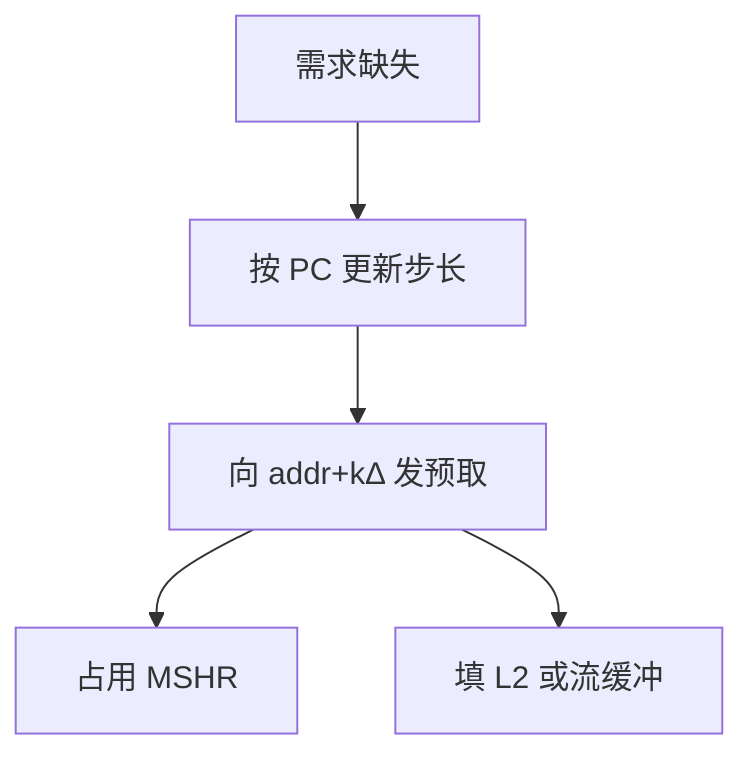

# 步长与流预取器

连续缺失若地址相差固定块距，就按该距向前发；流缓冲把预取与 L1 隔开，避免直接映射被未来块踢伤当前行。

<footer>—— 据 Jouppi, ISCA 1990；Baer and Chen, An Effective On-Chip Preloading Scheme, ISCA 1991 整理</footer>

[上一课](/cs/mlp-memory-parallelism) 要飞行中的请求。[主干预取课](/cs/cache-prefetch) 已给出直觉。本课在进阶课序里把**步长预测与流预取器**写具体：如何检出 $\Delta$，发到哪一层，和 [MSHR](/cs/mshr) 怎么分账。不重讲强制缺失的定义。

## 问题

数组 `a[i]`、矩阵行、包描述符环：缺失地址呈 $b, b+\Delta, b+2\Delta$。需求 load 才去 L2/DRAM 则 MLP 有，但第一条仍然付满延迟。缺口不是牺牲缓存（那是过去的受害者），而是**为每条流维持一个游标，提前 $k$ 块发出读**。

Baer–Chen 在 TLB/表里记上一地址与步长。Jouppi 的 stream buffer 是 FIFO：预取进缓冲，CPU 命中再提升。现代核在 L1/L2 各有预取器，L2 的流更长。

## 方法

按 load PC（或页）记录上次缺失地址。若新缺失 − 上次 = $\Delta$（块对齐），则确认步长，向 $addr + k\Delta$ 发预取，$k$ 为距离。多流：多组寄存器，按 PC 分配。页边界停止或换 $\Delta$。

软件预取指令是同一接口的显式版：地址由编译器算，失败不得 trap。

## 机制

预取成功时，强制缺失的有效延迟下降，MLP 看起来更高。$\Delta=0$ 或随机 PC 不要训练。间接数组 `a[b[i]]` 步长在 `b` 上不在 `a` 上，简单步长器失效——那是相关预取/指针预取，本课不展开。

与 [RRIP](/cs/rrip-dead-block)：预取填入应插成较远 RRPV，否则扫描预取变成合法的污染。下一课专讲时机与污染。

## 边界

本课不把 GPU 合并访存当步长器。也不把预取距离调参写成操作系统 API。指令预取（I-stream）类似但用取指 PC，与分支预测交互，容易在跳转后作废。

后课默认：固定 $\Delta$ 的流可以硬件预取。发早了、发错了会占带宽并踢热块，需要反馈。

## 小结

- 步长器按 PC 学习 $\Delta$，流缓冲隔离预取与 L1。
- 预取占用与需求 miss 同一套 MSHR。
- 时机与污染的反馈是下一课。
- 出处：Jouppi, *ISCA*, 1990；Baer and Chen, *ISCA*, 1991。
