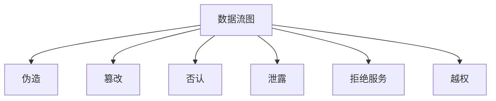

# STRIDE

伪造、篡改、否认、信息泄露、拒绝服务、越权：六类检查清单，把威胁模型从一张空图变成可枚举的问句。

<footer>—— 据 Howard and Lipner；Shostack, Threat Modeling；Anderson 对把威胁写下来的强调</footer>

[上一课](/cs/threat-model)要求先写敌手、资产与信任边界。本课不重画 Kerckhoffs。缺口是检查时容易漏轴：[CIA](/cs/cia-triad) 是三根，工程审查常用 STRIDE 六类把「谁能干什么」问全。它是清单，不是攻击教程。后课 Dolev–Yao 再把网络敌手收成代数。

## 问题

威胁模型课留下「映射到机制」。评审一张数据流图时，每个过程、每个数据流、每个存储都要问：身份能否被假冒，数据能否被改，事件能否被抵赖，秘密能否流出，服务能否被停，授权能否被绕过。缺口是**把这些问题命名成 STRIDE**，避免只盯着加密。

STRIDE 来自微软一线教材，不是密码学定理。否认（R）常要日志与签名，和 CIA 的 I 相关但不相同。

## 方法

对图上每个元素过六问，记下「不防谁」。然后才选后课机制：对称加密对泄露，MAC 对篡改，认证对伪造，隔离对越权，容量设计对 DoS。本课不把某一次审查表格当标准正文。

## 机制

清单迫使每个信任边界都有对应控制，而不是全局一句「有 TLS」。它与后课访问控制、握手、沙箱是多对多：一种机制可挡多类，一类威胁要多层。本栏不提供利用步骤，只要求设计时能指出控制落点。

## 边界

本课不把 STRIDE 当成完备分类，不引入攻击树的全部记号。能改写、能注入的网络敌手下一课用 Dolev–Yao 形式化。

后课默认：审查用六类问句。协议层敌手能力下一课钉死。

## 小结

- STRIDE 是威胁模型上的检查清单，不是新的 CIA。
- 每问应对到后课某一机制。
- 网络代数敌手下一课 Dolev–Yao。
- 出处：Howard and Lipner；Shostack；Anderson, *Security Engineering*。
