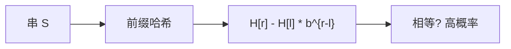

# 字符串哈希

把串看成 $b$ 进制整数模素数；子串哈希用前缀一次减一次乘，相等则以高概率当相等。

<footer>—— 据 Karp and Rabin, Efficient Randomized Pattern-Matching Algorithms, IBM J. Res. Develop. 1987；Cormen, Leiserson, Rivest and Stein 第 32 章整理</footer>

[上一课](/cs/palindromic-tree) 与 [SAM](/cs/suffix-automaton)、[SA](/cs/suffix-array) 都是确定性索引，空间或预处理不菲。只需比较若干子串是否相等时，滚动哈希期望 $O(1)$。[前缀和](/cs/prefix-sum-difference) 的形状几乎相同。本课不建 fail。缺口是多项式哈希 / Karp–Rabin：前缀 $H[i]$，子串 $[l,r)$ 为 $H[r]-H[l]\cdot b^{r-l}$。

## 问题

朴素比子串 $\Theta(长度)$。哈希：选底 $b$ 与模 $M$（或双模），碰撞概率约 $\Theta(q^2/M)$ 于 $q$ 次比较（生日）。缺口不是通用散列族全文（后课），而是**串上的滑动与前缀**，使模式匹配、LCP 二分、去重期望变快。

Karp–Rabin 1987。模 $2^{64}$ 自然溢出不是素数域，对抗输入可打；教学合同写随机模或双质数。

## 方法

预处理 $H$ 与幂 $p[i]=b^i$。比较：哈希相等再可选逐字符验证（确定性保险）。滚动：窗口右移减最左字符加最右。KMP 确定性线性；KR 期望线性、实现短。

与后缀数组：哈希可二分 LCP（每次中点比哈希），期望 $O(|P|\log n)$ 类，常数小；最坏碰撞要承认。

## 机制

必须固定一种下标与 $b^{len}$。溢出与负差要加 $M$。不要把哈希当加密；本课是数据结构加速。字母映射成 $1..|\Sigma|$，避免前导零歧义。

下一课 Rope 处理的是可编辑大串，不是哈希；编辑会让前缀 $H$ 失效，除非树节点存哈希——那是结合。

## 边界

本课不证明通用散列全部定理。完美散列给静态键集零碰撞，后单元。对抗哈希要用随机种子，合同写期望。

后课默认：静态子串相等可用哈希。可持久大串编辑用 Rope。

## 小结

- 多项式哈希：前缀 $O(n)$，子串 $O(1)$，期望无碰撞。
- 模与底要随机化；可验证。
- 可编辑串结构是 Rope。
- 出处：Karp and Rabin, 1987；Cormen et al. 第 32 章。
