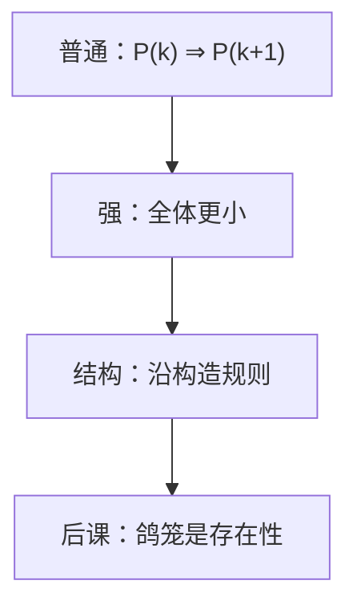
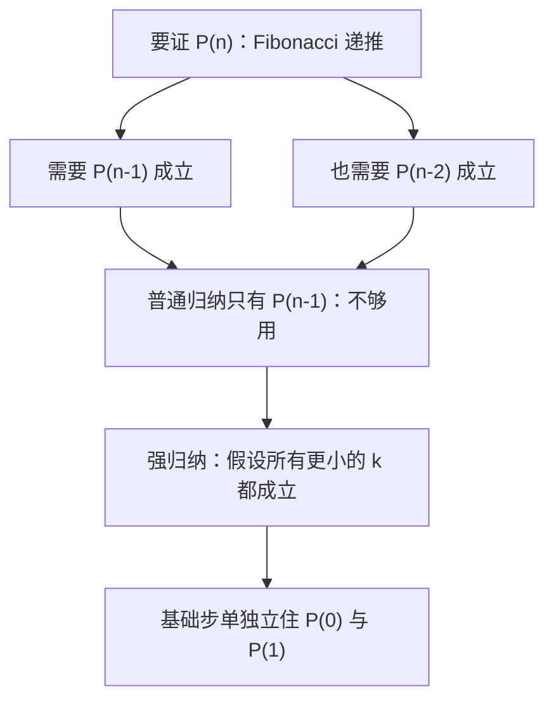

# 强归纳与结构归纳

有时 $P(n)$ 并不从 $P(n-1)$ 长出来，而从所有更小的实例长出来；公式和树则沿定义的构造规则推。

<footer>—— 据 Rosen, Discrete Mathematics and Its Applications 整理</footer>

上一课[数学归纳](/cs/mathematical-induction)钉死了 $P(0)$ 与 $P(k)\Rightarrow P(k+1)$，并点名强归纳与结构归纳，当时不展开。本课不重写自然数梯子，也不从 Peano 另起。缺口是：Fibonacci、摊还里的「拆成更小的两段」、语法树的性质，普通一步假设不够，或对象根本不是 $\mathbb{N}$ 上的下标。

## 问题

$F_n=F_{n-1}+F_{n-2}$ 的证明要同时用 $P(n-1)$ 与 $P(n-2)$。缺口因此不是新的 $P$，而是强归纳：要证 $P(n)$，可假设**所有** $k\lt n$ 已成立（基础仍覆盖最小的若干个）。它与普通归纳在 $\mathbb{N}$ 上等价，写法不同：当递推宽度大于 $1$ 时，强形式更省事。

强归纳翻译成白话：普通归纳像扶着前一级台阶上楼，强归纳允许踩在已经爬过的所有台阶上——证 P(n) 时，P(0) 到 P(n-1) 全部拿来当已知。两者在自然数上等价，但递推要往后看两步时，普通形式会写不下去。

结构归纳：对象由规则生成（空树；由子树造新树；命题由原子与连接词生成）。对每条规则证：子对象有性质则对象有性质。这不是「对树高做普通归纳」的散文——必须对准定义的条款。后课[循环不变式](/cs/loop-invariant)仍是 $\mathbb{N}$ 上的普通归纳；抽象语法是结构归纳。

### 强假设不是免费午餐

基础步往往要写 $P(0)$ 与 $P(1)$，或所有最小构造。漏掉第二条规则（空表、空树），整棵倒掉。在归纳步里调用 $P(n)$ 自身，仍是循环论证。

常见误区：以为强归纳只需基础步 P(0)。递推宽度是 2（如 Fibonacci）时，归纳步要引用 P(n-2)，所以 P(0) 与 P(1) 都得单独立住——少证一个，整座塔从第二层开始就是空的。

Rosen 把强归纳与「完全归纳」对照，并用递归定义的公式做结构归纳。后课图若无环，可沿拓扑序做归纳；有环则结构归纳的「子对象更小」先要另找良基关系。

## 方法

写清 $P(n)$。强归纳：固定 $n$，假设 $\forall k\lt n\,P(k)$，证 $P(n)$；检查 $n$ 较小时不引用不存在的前项。结构归纳：按定义分情形，每情形只引用真子结构。

```mermaid
flowchart TD
  WEAK["普通：P(k) ⇒ P(k+1)"] --> STR["强：全体更小"]
  STR --> ST["结构：沿构造规则"]
  ST --> LATER["后课：鸽笼是存在性"]
```

## 机制

递归程序的正确性：参数在某良基序上变小，对那个序做强归纳或结构归纳。后课树高、表达式求值、合式公式的唯一读法，都走结构归纳。渐近记号仍未进场：归纳证的是「对每个 $n$ 成立」，不自动给出 $O$。

```mermaid
flowchart TD
  FN["要证 P(n)：Fibonacci 递推"] --> P1["需要 P(n-1) 成立"]
  FN --> P2["也需要 P(n-2) 成立"]
  P1 --> HYP["普通归纳只有 P(n-1)：不够用"]
  P2 --> HYP
  HYP --> SI["强归纳：假设所有更小的 k 都成立"]
  SI --> BASE["基础步单独立住 P(0) 与 P(1)"]
```

直觉类比：结构归纳像验收积木楼——不去数楼层，而是检查每种拼装规则：单块积木合格吗？两摞合格的楼拼起来还合格吗？规则条条过关，所有能拼出来的楼就都合格，包括还没拼的那些。

## 边界

本课不引入序数、超限归纳。鸽笼、容斥是后面的计数工具，不是归纳格式的替代。也不把数学归纳与自然科学的「归纳推理」混名。

后课默认：递推宽度大于 $1$ 用强归纳；递归数据类型用结构归纳。存在性计数下一课才换工具。

## 小结

- 强归纳允许使用所有更小实例；基础要盖住递推宽度。
- 结构归纳对准递归定义的每条规则。
- 正确性归纳仍不代替代价；鸽笼是另一条存在原理。
- 出处：Rosen, *Discrete Mathematics and Its Applications*。
