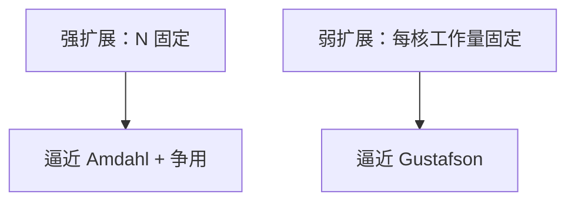

# 强扩展与弱扩展

强扩展：问题不动，加核看时间掉不掉；弱扩展：每核工作量大致不变，看效率能不能稳住。两条曲线回答的不是同一个问题。

<footer>—— 据并行计算实践与 Hennessy and Patterson, CA:AQA 整理</footer>

[上一课](/cs/gustafson-law) 区分了两种规模假设。实验室和论文里要用成对术语，避免只丢「加速比 16×」却不说输入。本课不重推公式。缺口是 **强扩展 vs 弱扩展的实验设计，以及 NoC/NUMA 如何让曲线弯折。**

## 问题

只报强扩展：大核数上 [阿姆达尔](/cs/cpi-amdahl) 加上 [目录热点](/cs/directory-scalability) 让曲线塌掉，于是有人说「并行无用」。只报弱扩展：问题变大，cache 工作集、通信体积都变，效率看起来很好，用户的单个实例并未变快。缺口不是新定律，而是**两套曲线都要，并写清每核工作量。**

效率 $E = T_1 / (n T_n)$（强）或相对单核同等每核工作量。通信/计算比随强扩展变差（表面积/体积），弱扩展下更稳定。

## 方法

强：固定 $N$，画 $T(n)$。弱：固定每核点数，画 $T(n)$ 是否平坦。同时记录：跨 [socket](/cs/multi-socket-interconnect) 比例、LLC miss、NoC 拥塞计数（下一课 PMU）。

## 机制

强扩展把通信摊到更少的本地工作上，[合并](/cs/memory-coalescing) 与 halo 交换相对变贵。弱扩展保持算术强度，更接近 [Roofline](/cs/roofline-model) 的带宽上限是否随节点线性涨。GPU 上「加 SM」类似弱扩展若每个 SM 仍吃一块固定 tile。

跨 [socket](/cs/multi-socket-interconnect) 时两条曲线都会提前弯折：强扩展把远程 miss 占比拉高，弱扩展若每核工作集仍拟合本地 DRAM 则还能看。报告里应附每核工作集与 NUMA 命中比例，否则「效率 90%」无法复核。

## 边界

本课不规定必须用哪种 MPI 模式。SPEC 下一课：许多 CPU 基准是固定输入的强扩展（其实单进程），并行套件另说。陷阱在输入与编译选项。

后课默认：扩展曲线要标明强/弱。读 SPEC 分数前先问：测的是哪套输入、是否允许自动并行。

## 小结

- 强扩展固定问题；弱扩展固定每核工作量。
- 通信比随强扩展恶化更明显。
- SPEC 等基准的陷阱是下一课。
- 出处：Gustafson；Hennessy and Patterson, *CA:AQA*。
