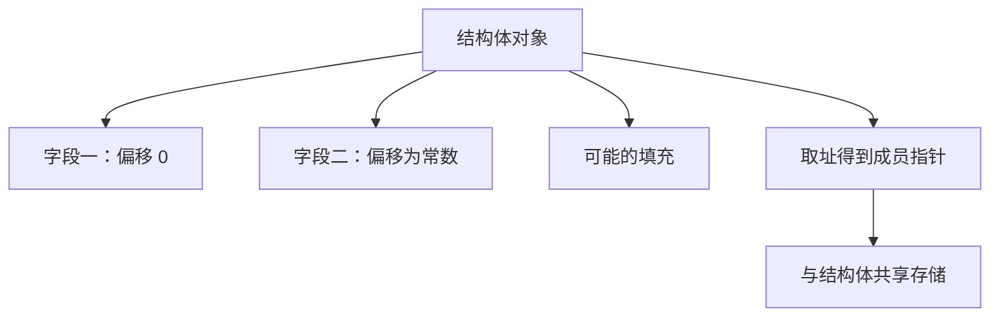

# 结构体内存布局

结构体把若干对象按声明次序排进一块存储；偏移是编译器算好的常数，不是运行时查表。

<footer>—— 据 Kernighan & Ritchie, The C Programming Language, 2nd ed.；ISO/IEC 9899；Bryant and O'Hallaron, Computer Systems: A Programmer's Perspective 整理</footer>

上一课[数组与指针衰减](/cs/array-decay)把连续元素钉死：数组是同类型的一排，衰减会丢掉长度。本课不重讲衰减，也不从「对象系统」另起。缺口是：要在一块存储里放下**不同类型**的字段，并且用名字而不是下标去取。编译器如何给每个字段一个固定偏移，字段之间为什么会出现空洞。

## 问题

`struct` 是对象的聚合。成员按声明顺序分配，地址递增。取成员 `s.x` 在机器上是「基址加偏移再按该成员类型解释」。缺口因此不是语法点号，而是**布局成为 ABI 的一部分**：同一结构体在调用双方必须有相同偏移，否则传值、传指针都会各读各的。数组做不到异构；结构体专门补这一块。

把结构体当成「一袋命名变量」而忽略它们挤在同一对象里，会漏掉：取址 `&s.x` 得到的指针别名的是结构体的一部分；通过结构体指针改一个字段，与通过字段指针写入是同一存储。上一课的别名规则在此继续有效。

### 结构体不是「字段的集合类型」而已

语言保证顺序，不保证紧凑。字段之间、结构体尾部都可以有填充，使得下一字段或下一数组元素满足对齐。本课先承认「有偏移、可能有洞」；洞为什么必须存在、怎样改声明顺序缩小洞，是[下一课](/cs/alignment-padding)。也不要把结构体等价于 C++ 对象：这里还没有虚表、没有构造，只有布局。

K&R 用结构体描述二进制记录与系统调用参数。CSAPP 强调：结构体的机器视图就是基址加常数偏移。ISO C 允许实现插入填充，但不允许重排字段顺序——顺序是程序员写进源码的契约。

## 方法

声明顺序即内存顺序。第一个成员偏移为 0。指向结构体的指针可以转换成指向首成员的指针，来回可逆。结构体赋值与传值拷贝整块对象（含填充比特，那些比特的值未指定）。数组作为成员时不衰减：它跟着结构体一起被拷贝。

`offsetof` 把偏移变成可打印的整数，便于核对 ABI。联合体让若干成员共享起始地址，本课只点名：同一存储的另一种解释，别名规则更紧。位域把若干比特挤进存储单元，可移植布局更弱，主干不依赖它。

柔性数组成员把「最后一项是变长数组」写进类型，对象大小不再是编译期常数，分配必须按实际元素数来。这仍是同一套偏移规则，只是尾部长度由运行时决定。与指针指向别处的堆块相比，柔性成员把变长数据贴在同一对象里，寿命自动一起结束，有利于 RAII。本课主干仍用定长字段；知道有这条扩展，就不必用 `char tail[1]` 的老写法去骗过编译器。

## 机制

固定偏移让字段访问编译成一条带位移的访存，没有运行时名字查找。这是 C 作为系统语言能直接描述设备寄存器与报文头的原因。代价是：布局一旦被二进制协议或动态库钉死，改字段顺序或插入字段就会破坏兼容。后课模块与头文件会把「共享布局」写成跨翻译单元的契约。

结构体参数按值传递时，调用约定要决定整块怎么进栈或寄存器——那是[调用约定直觉](/cs/calling-convention-preview)的缺口。本课只准备好「一块带内部偏移的对象」。嵌套结构体把内层布局嵌进外层偏移；数组的结构体则是该布局的周期重复。

布局一旦被系统调用、文件格式或另一门语言的 FFI 钉死，就不再只是「这个 .c 里的方便」。调用约定会按整块大小与对齐把结构体放进栈或寄存器；改一个 `int` 为 `int64` 而不重编所有包含者，就是静默的 ABI 破裂。后课头文件把这份布局复制到每个翻译单元，正是为了让偏移一致。位域与打包属性会打破可移植偏移，主干算法不要依赖它们来省那几个填充字节。

## 边界

本课不计算每种 ABI 的具体填充表，不讲虚函数指针。下一课专门解释对齐约束如何强迫这些洞。后课默认：结构体按声明顺序布局；成员访问是基址加偏移；字段指针与结构体别名同一对象。

## 小结

- 结构体是异构字段的连续对象，偏移在编译期确定。
- 字段顺序是契约；填充可以存在，但实现不得擅自重排。
- 成员取址得到的指针与结构体别名；按值拷贝带走整块。
- 下一课解释对齐为何插入填充。
- 出处：K&R 结构体；ISO C 聚合布局；CSAPP 对偏移寻址的说明。
