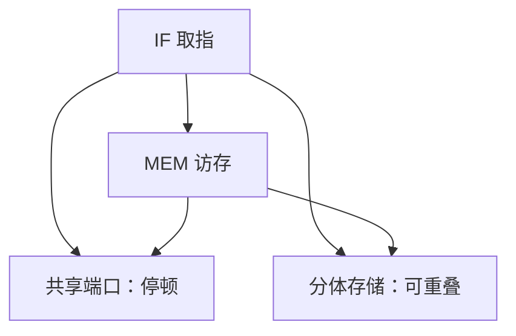

# 结构冒险

流水线假定每一级在同一拍都能得到它要的硬件；两级抢同一端口，重叠就退回停顿。

<footer>—— 据 Patterson and Hennessy, Computer Organization and Design (RISC-V) 整理</footer>

[上一课](/cs/pipeline-registers)把 RISC-V 整数通路切成 IF/ID/EX/MEM/WB，并假定指令存储器与数据存储器可以同时访问。本课不重讲五级划分。缺口是：真实硅上端口、ALU 和写回通路都是有限份，两级在同一拍要同一份，重叠无法发生。本课只命名结构冒险，并指出用复制资源或停顿来消掉它。

## 问题

若指令和数据共用一个存储器端口，IF 取指与 MEM 访存会在同一拍冲突。若寄存器堆只有一个写口，而设计又想在 ID 读、WB 写之外再塞一条写，也会撞。缺口不是数据相关——操作数可以已经准备好——而是**功能单元的个数不够同时服务流水线里的那几条指令**。

单周期从来不会有这个问题：一拍里只有一条指令占用全部硬件。重叠一旦开始，资源日历必须按级排。本课不处理寄存器值尚未产生的情况，那是[数据冒险与转发](/cs/data-hazard-forward)。

Hennessy/Patterson 把冒险分成结构、数据、控制三类。结构是资源日历，不是值依赖。

## 方法

先列出每级每拍要占用的端口：IF 读指令、ID 读寄存器、EX 用 ALU、MEM 读或写数据、WB 写寄存器。若某拍两级指向同一不可共享资源，插入气泡：后来的指令在前一级停住，冲突级空转一拍。

另一条路是复制：哈佛结构把指令与数据分开；寄存器堆做成两读一写，正好匹配 ID 与 WB。经典五级教学机靠这两份复制，把结构冒险从整数核里拿掉，后面才好单独讲数据相关。

## 机制

停顿把理想 CPI 从 1 抬高：每发生一次结构冲突，吞吐少一条。复制把面积和布线换成冲突消失。设计选择是定量的：端口少、停顿多，还是端口多、面积大。[CPI 与阿姆达尔](/cs/cpi-amdahl)会把这类损失写进公式；本课只承认损失来自资源不够。

写回与译码可以安排在寄存器堆的不同相：前半拍写、后半拍读，让同一拍内 WB 的结果对 ID 可见。这是时序技巧，不是转发；转发处理的是更早还在 ALU 里的值。

## 边界

本课不引入 cache：存储器端口暂时仍是理想的组合阵列。[SRAM 与 DRAM 阵列](/cs/memory-array-sram-dram)已经说明 DRAM 做不到每拍随机访问，那是局部性课才接上的缺口。也不处理多发射：超标量会让结构冒险重新变严重，因为每拍要更多端口。

后课默认：经典五级整数核已用分体存储和两读一写堆消掉结构冒险；再谈到停顿，先怀疑数据或控制相关。

## 小结

- 结构冒险是同一拍两级抢同一份硬件，不是值没算完。
- 消法是复制端口，或插入气泡。
- 数据相关与分支是后课的缺口。
- 出处：Patterson and Hennessy, *COD* RISC-V；Hennessy and Patterson, *Computer Architecture: A Quantitative Approach*。
