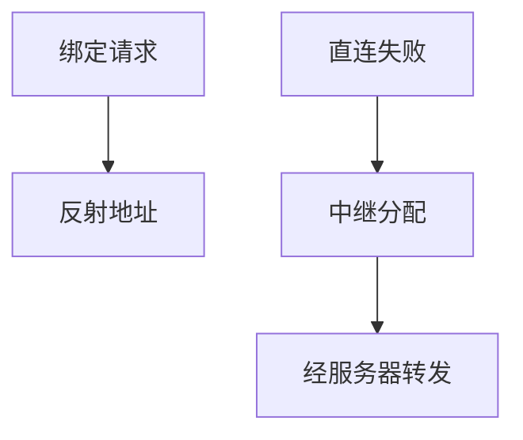

# STUN / TURN

STUN 问「我在 NAT 外看起来是谁」；TURN 在打不通时分配中继传输。ICE 把两者当候选来源，不是替代。

<footer>—— 据 RFC 8489 STUN；RFC 8656 TURN 整理</footer>

[上一课](/cs/webrtc-ice) 使用候选。[FTP 被动](/cs/ftp-passive) 已见 NAT。[NAPT](/cs/napt) 改端口。缺口是 **STUN/TURN 协议本身**。本课不把 DASH 写完。

## 问题

主机只知私网地址。STUN：向公网服务器发绑定请求，应答告映射地址，得 srflx 候选。洞可短时保持，要刷新。仍可能两边都对称 NAT。TURN：分配 relay 地址，数据经服务器转发，费带宽与延迟，但总能通（若 UDP/TCP 被允许）。认证防滥用成开放中继。

不要把 STUN 写成 VPN。

RFC 8489、8656。TURN over TCP/TLS 应对禁 UDP。本课不写绕过企业政策的操作指南。

### 发现映射与保底中继

STUN 不问通不通两端；TURN 费带宽换可达。未认证中继会成开放转发。ICE 同时试。

## 方法

对照：仅 STUN / 加 TURN。画：绑定得到映射；Allocate 得到中继。与 GRE：TURN 是用户态中继，GRE 是 IP 隧道。

方法止于选定对象与对照；机制才说它如何嵌入已有分层与主干课。

## 机制

DoH 不帮 NAT。GeoDNS 可找近的 TURN，减中继 RTT。计费：中继吃运营 $C$。ICE 同时试，成功则停 TURN 省钱。SSH 反向隧道是另一中继。

安全：未认证 TURN 会成放大器，必须凭证。

## 边界

本课不引入 ICE-TCP 的全部。DASH/HLS 是下一课。后课默认：STUN 发现映射；TURN 保底中继。

只部署 STUN 在严格 NAT 上不够。

上一课留下的缺口在本课收口；「STUN / TURN」进入后课词汇表后只引用。文献用来钉对象与边界，不把本课写成该主题的独立综述。下一课[DASH / HLS](/cs/dash-hls)。

## 小结

- STUN 发现 NAT 映射。
- TURN 提供中继候选。
- ICE 选择最便宜通的路。
- 后课只引用本课钉死的对象，不从该领域总问题重开。
- 出处：RFC 8489；RFC 8656。
