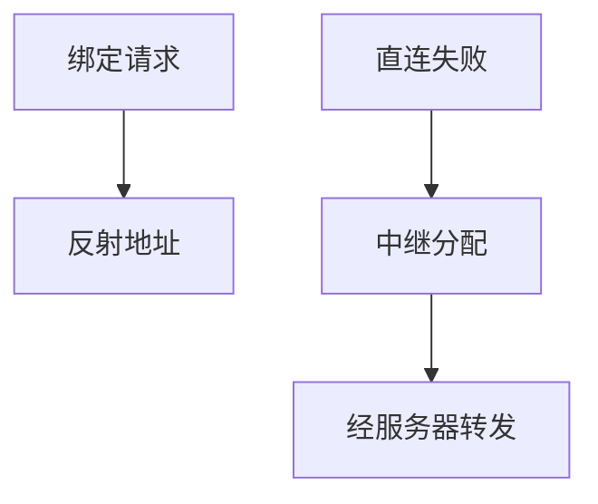

# STUN / TURN

STUN 问「我在 NAT 外看起来是谁」；TURN 在打不通时分配中继传输。ICE 把两者当候选来源，不是替代。

<footer>—— 据 RFC 8489 STUN；RFC 8656 TURN 整理</footer>

[上一课](/cs/webrtc-ice)把候选拿去配对连接，[FTP 被动](/cs/ftp-passive)里已见过 NAT 的影子，[NAPT](/cs/napt)讲过端口改写。本课补两个候选来源的协议本身：STUN 与 TURN。DASH 留给下一课，不在本课写完。

## 问题

主机只知自己的私网地址，不知道在 NAT 外呈现出哪个公网映射。STUN 的做法：向公网服务器发绑定请求，服务器把见到的源地址端口写回应答，主机据此得到 srflx 候选；这条 NAT 上的洞只保留短时间，要周期刷新。但 STUN 有边界——对称 NAT 对不同目的地分配不同映射，反射地址对另一端无用，两边都对称时打不通。TURN 是保底：向服务器 Allocate 一个中继地址，数据一律经服务器转发，多付带宽与延迟，但只要 UDP 或 TCP 被放行就总能通；中继必须凭证认证，否则沦为开放中继。

STUN 只回答「我看起来是谁」，不建隧道、不转发数据，不是 VPN。

RFC 8489、8656。TURN over TCP/TLS 应对 UDP 被禁的网络。本课不写绕过企业政策的操作指南。

### 发现映射与保底中继

分工要清楚：STUN 只发现映射，不与对端交互，不保证两端能通；TURN 用带宽与延迟换可达，是最后手段而非默认。未认证的中继会被人拿去开放转发流量。ICE 把 STUN、TURN、主机候选一起收集、配对试连，谁先通用谁。

## 方法

设计时做对照：只部署 STUN 的方案在严格 NAT 与企业防火墙下连不通，加 TURN 才有可达性保证。流程两步：绑定请求得到反射地址，Allocate 请求得到中继地址。与 GRE 对照：TURN 是用户态中继，逐条流转发；GRE 是 IP 层隧道，封装整个包——层次与粒度都不同。

```mermaid
flowchart TD
  STUN["绑定请求"] --> MAP["反射地址"]
  FAIL["直连失败"] --> TURN["中继分配"]
  TURN --> RELAY["经服务器转发"]
```

## 机制

DoH 加密的是 DNS 查询，帮不了 NAT 穿越——那是转发面问题，不是名字解析问题。运营上 TURN 集群的位置重要：GeoDNS 把用户引到最近的 TURN，中继段的 RTT 变小；计费上中继吃双向带宽，是最贵的路径，ICE 在直连候选上成功后应释放 TURN 分配省钱。SSH 反向隧道是同一中继思想的手工版。

安全上必须凭证：未认证的 TURN 是任何人可用的转发器与流量放大器。

## 边界

本课不展开 ICE-TCP 的全部细节。后课默认：STUN 发现映射，TURN 保底中继；只部署 STUN 在严格 NAT 上不够。下一课[DASH / HLS](/cs/dash-hls)。

## 小结

- STUN 问「我看起来是谁」，发现 NAT 映射。
- TURN 分配中继候选，用带宽换可达。
- ICE 收集全部候选，选最便宜的通路。
- 后课只引用本课钉死的对象，不从该领域总问题重开。
- 出处：RFC 8489；RFC 8656。
