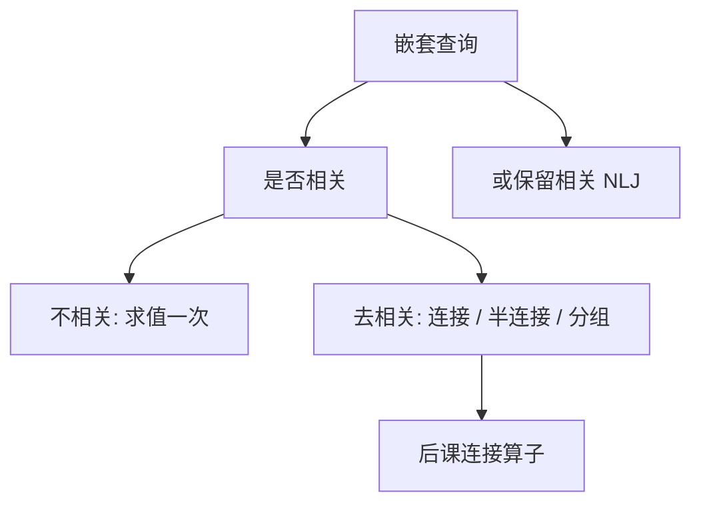

# 子查询去相关

相关子查询按外层行一次次求值；去相关把它改成连接、半连接或聚合，指称不变，计划才能用连接算法。

<footer>—— 据 Kim, On Optimizing an SQL-like Nested Query, TODS 1982；Seshadri et al. 对复杂子查询；Ramakrishnan and Gehrke 整理</footer>

[上一课](/cs/window-functions)把邻居计算收进 `OVER`。本课不重讲帧。缺口是嵌套：`WHERE x IN (SELECT …)`、`EXISTS`、标量子查询，尤其外层列出现在内层时——朴素执行是嵌套循环，优化器看不见 [连接算法](/cs/join-algorithms)。去相关（decorrelation）是改写，不是换一种 SQL 方言。

## 问题

[查询改写](/cs/query-rewrite) 已点名「相关子查询去相关，以便进入连接」。本课补机制。相关：内层查询的谓词引用外层元组。逐行求值语义清楚，代价是内层反复启动。不相关子查询可先物化一次；相关则必须对每个外层行换参数。

缺口是**把嵌套演算改回代数**：`IN`/`EXISTS` 变半连接；标量聚合子查询变分组再连接；`NOT EXISTS` 变反半连接。改写必须在包语义与 NULL 下保持指称：`IN` 遇 NULL 走三值，不是简单等值连接。

Kim 1982 给出嵌套查询的分类与变换。后来的论文处理 `COUNT` 陷阱：空内层 `COUNT` 为 0，内连接会丢掉外层行，需外连接补零。本课承认这类缝，不假装所有子查询都能无脑变 inner join。

## 方法

先分类：不相关 / 相关；标量 / 存在 / 量化（`ALL`/`ANY`）；是否含聚合。不相关且无副作用：一次求值，结果当临时关系。相关存在：`R ⋉ S`（半连接），`S` 带外层参数改成连接条件。相关聚合：内层按相关列 `GROUP BY`，再与外层连接；空组用外连接与 `COALESCE`。

优化器也可以选择**不去相关**，用索引做相关嵌套循环——当内层有可用索引且外层小时，这比哈希连接更便宜。去相关是合法变换集合，不是强制。

## 机制

去相关之后，[谓词下推](/cs/predicate-pushdown) 与连接顺序搜索才有树可动。窗口与分组仍是防火墙：内层若含窗口，变换更窄。标量子查询运行时应保证最多一行；去相关后用聚合或显式基数检查表达同一约束，违反则运行时错，不是「悄悄变包」。

`EXISTS` 只关心非空，不关心投影列；半连接可以提前在内层停。这与后课 [集合运算与 EXISTS](/cs/set-ops-exists) 的声明写法衔接：本课动的是计划形状，下一课把集合差、存在量化收成用户可写的算子对照。

## 边界

本课不把每家优化器的「子查询拉平」规则表抄进来。有副作用的函数、易失表、相关更新语句，去相关可能改变求值次数——主干把它们标成防火墙。也不处理递归 CTE；那是下一课之后。

后课默认：嵌套查询有指称；执行可以是相关 NLJ 或去相关后的连接。谈到「子查询慢」，先问是否相关、是否可改成半连接，而不是先加索引碰运气。

COUNT 与空集、NULL 与 IN，是去相关必须逐条核对的缝，不是边角。

## 小结

- 去相关把嵌套改成连接或半连接，指称不变才合法。
- 空组与 `COUNT`、三值 `IN` 是变换陷阱。
- 保留相关 NLJ 有时更优；去相关不是教条。
- 出处：Kim 1982；Seshadri 等；Ramakrishnan and Gehrke。
