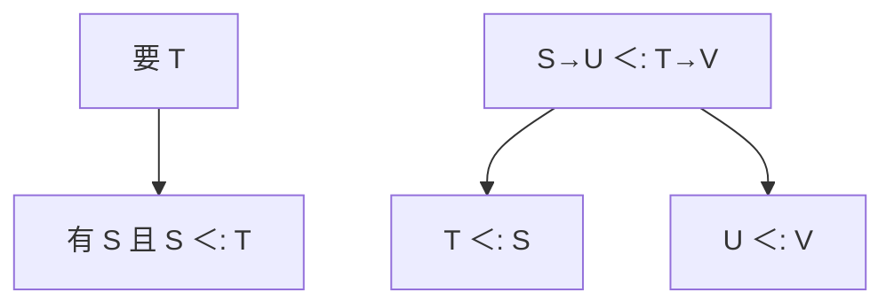

# 子类型与协变逆变

$S\lt :T$ 表示 $S$ 的值可用在要 $T$ 的地方。函数在参数上逆变、在结果上协变；容器的可变性决定能不能协变。

<footer>—— 据 Cardelli, Type Systems；Pierce TAPL 第 15–16 章；Liskov, Data Abstraction and Hierarchy 整理</footer>

上一课[值限制](/cs/let-polymorphism)处理量化与可变。缺口是另一轴：**子类型**——名义或结构的宽化，以及数组/函数的变型（variance）。主干[overload 与强制](/cs/overload-coerce)有强制转换；本课钉 $\lt :$ 规则，不把 Java 数组协变的历史事故当推荐设计。

## 问题

HM 合一对称。面向对象与记录：`Dog <: Animal` 则 `Dog` 的值可传给要 `Animal` 的参数（宽度子类型可再谈字段）。函数：若用 $S\to U$ 去填 $T\to V$ 的坑，需要 $T\lt :S$（参数更挑剔）且 $U\lt :V$（结果更宽大）。缺口是**变型**，不是再写 W。

可变数组：写与读同时存在，只该不变（invariant）。Java 历史上让数组协变，运行时 `ArrayStoreException`——类型在静态上不健全。

### `<:` 不是继承图的别名

继承可诱导名义子类型；结构子类型看字段。强制（`int` 到 `float`）有时不是子类型而是另一次转换。不要混。

Pierce TAPL 子类型章。Cardelli 综述。Liskov 替换原则是规格层，本课用它对照「能不能代换」与「函数变型」。Appel 在面向对象章点过方法类型。

## 方法

给出记录的宽度/深度规则（点名即可）。函数变型按上面陈述。泛型参数标 `+`/`-`/`0`（Scala/Kotlin 习惯），检查定义体是否遵守。检查算法：加入子类型约束后不再是对称合一，要用边界或双向检查（后课渐进也会用）。

与 HM：可先实例化再问子类型，或把量化与子类型合成（有界量化 $\forall\alpha\lt :T$），本课点名，不写 System F${}_{\lt :}$ 全文。

## 机制

可变引用：`ref S <: ref T` 只当 $S=T$。只读视图可以协变；只写可以逆变。这与值限制同一精神：可变破坏宽化。

不要为了「方便把 Dog[] 当 Animal[]」牺牲健全性；API 用不变泛型或只读切片。

## 边界

本课不写多重继承的 C3，不算结构子类型的判定复杂度细节。后课默认：函数参数逆变、结果协变；可变不变。下一课泛型实现：单态化对擦除——变型在擦除语言里靠桥接方法。

也不把 Python 的鸭子类型当静态 $\lt :$。

## 小结

- 子类型是安全代换；函数参数逆变、结果协变。
- 可变容器应不变。
- 与 HM 量化正交，可合成有界量化。
- 出处：Pierce TAPL；Cardelli；对照 Liskov。
