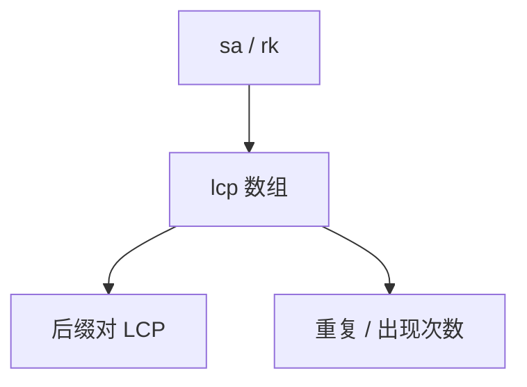

# 后缀数组的应用

后缀排序加上 LCP，$O(1)$ 任意后缀对最长公共前缀；子串、重复、字典序区间都变成数组上的区间。

<footer>—— 据 Manber and Myers, Suffix Arrays, 1993；Kasai 等 LCP 线性；Kärkkäinen–Sanders 线性 SA 整理</footer>

上一课[最小表示法](/cs/minimal-rotation)可用 $s+s$ 的最小后缀。[后缀数组](/cs/suffix-array)已给出构造，本课不重写倍增/SA-IS。缺口是**应用**：LCP、子串次数、最长重复、两个串的 LCS（拼接）。后课 Lyndon。把 `sa[i]` 当第 $i$ 小后缀起点，配合 `rk`、`lcp`。

## 问题

Kasai：按名次顺序用已有 LCP 减一延长，$O(n)$ 得 `lcp[i]=LCP(sa[i],sa[i-1])`。任意两后缀 LCP = `rk` 之间 `lcp` 的 RMQ。子串出现次数：对应 SA 上一段，长度用 LCP 二分或单调栈。最长重复子串：$\max lcp$。两串最长公共子串：拼接后看相邻 SA 来自不同串的 $lcp$。

缺口是查询，不是再排序后缀。

### 不是后缀树课

后缀树能同样做，空间与常数不同。本课数组。不要把 SAM 当 SA。

Manber–Myers 1993。Kasai LCP。后课 Lyndon 分解与 SA/Duval 接口。正则爆炸下一单元末。

## 方法

构造 SA+LCP。RMQ 预处理。具体题化成 SA 区间或 LCP 直方图（单调栈矩形）。

多串加不同分隔符。

## 机制

后缀排序使相同前缀相邻，LCP 相邻最小，远的取区间 min。与 Z：Z 是与全串，LCP 任意对。与 KMP：单模式；SA 管所有子串。

## 边界

本课不写 SA-IS 逐步证明。不写压缩后缀数组全文。后课默认：子串统计优先 SA+LCP。下一课 Lyndon 分解。

## 小结

- SA + LCP + RMQ = 后缀 LCP 查询。
- 重复与出现次数在 LCP 直方图上。
- 构造当黑盒，本课用。
- 出处：Manber and Myers, 1993；Kasai 等。
