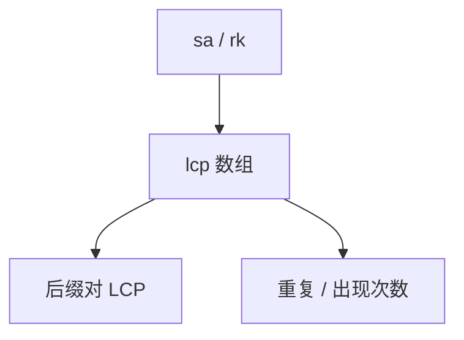
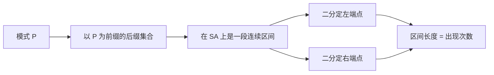

# 后缀数组的应用

后缀排序加上 LCP，$O(1)$ 任意后缀对最长公共前缀；子串、重复、字典序区间都变成数组上的区间。

<footer>—— 据 Manber and Myers, Suffix Arrays, 1993；Kasai 等 LCP 线性；Kärkkäinen–Sanders 线性 SA 整理</footer>

上一课[最小表示法](/cs/minimal-rotation)可以用 $s+s$ 的最小后缀求循环同构。[后缀数组](/cs/suffix-array)已给出构造，本课不重写倍增/SA-IS，缺口是**应用**：任意后缀对的 LCP、子串出现次数、最长重复子串、两串最长公共子串（拼接法）。后课 Lyndon。约定 `sa[i]` 是第 $i$ 小后缀的起点，配合名次数组 `rk` 与相邻 LCP 数组 `lcp`。

## 问题

Kasai 算法 $O(n)$ 求 `lcp[i]=LCP(sa[i],sa[i-1])`：按名次从大到小算，利用「名次减一的后缀，其 LCP 至少是当前值减一」从上次的值接着比，均摊线性。有了相邻 LCP，任意两后缀的 LCP 就是它们名次之间 `lcp` 的区间最小值，RMQ 预处理后 $O(1)$ 回答。子串 $p$ 的出现次数：所有以 $p$ 为前缀的后缀在 SA 上是一段连续区间，区间端点用 LCP 比较二分或单调栈定出，区间长度即次数。最长重复子串：$\max lcp$，取到最大处对应的后缀起点即答案。两串最长公共子串：拼接后取相邻两项来自不同串的 $lcp$ 的最大值。

拿 $T=$ `banana` 代一次：六个后缀排完得 $sa=[5,3,1,0,4,2]$。以 `ana` 开头的后缀是起点 3 和 1，恰占 SA 上连续一段（下标 1 到 2），区间长度 2 就是 `ana` 的出现次数——不用再逐个位置找。

缺口是把查询做出来，不是再排一遍后缀。

### 不是后缀树课

后缀树能做同样的事，但空间与常数不同，本课全用数组。也不要把 SAM（后缀自动机）当 SA：自动机是另一套状态结构，转移语义与字典序名次无关。

Manber–Myers 1993。Kasai LCP。后课 Lyndon 分解与 SA/Duval 接口。正则爆炸下一单元末。

## 方法

流程固定：构造 SA 与 LCP，RMQ 预处理，然后把具体题翻译成 SA 上的一段区间，或 LCP 直方图上的最大矩形（单调栈）。多串问题给各串加分隔符后拼接；分隔符必须互不相同且不出现在原串里，否则两串会在分隔处产生假的公共前缀。

```mermaid
flowchart TD
  SA["sa / rk"] --> LCP["lcp 数组"]
  LCP --> RMQ["后缀对 LCP"]
  LCP --> APP["重复 / 出现次数"]
```

多串加不同分隔符。## 机制

机制核心：后缀排序把共享前缀的后缀排到相邻，共享多深由相邻 LCP 记录；不相邻两后缀的公共前缀不会超过区间内任何一段相邻 LCP，所以取区间 min。与 Z 函数对照：Z 给的是各后缀与全串的 LCP，SA+RMQ 给任意两后缀。与 KMP 对照：那是单模式匹配；SA 把所有子串装进一个结构，管的是统计。

术语翻译：RMQ 就是「区间最小值查询」——给定数组和一堆询问 $[l,r]$，每个询问返回这段里的最小值。用稀疏表 $O(n\log n)$ 预处理后每次 $O(1)$；这里最小化的对象是相邻 LCP。

把「出现次数 = 区间长度」这条主用法的机制拆开看。

```mermaid
flowchart LR
  P["模式 P"] --> SUF["以 P 为前缀的后缀集合"]
  SUF --> INT["在 SA 上是一段连续区间"]
  INT --> L["二分定左端点"]
  INT --> R["二分定右端点"]
  L --> LEN["区间长度 = 出现次数"]
  R --> LEN
```

初学者容易以为求最长重复子串要枚举全部 $O(n^2)$ 个子串再逐个验证，实际上它就是 $\max lcp$：重复意味着两个后缀共享前缀，而共享前缀的深度已经被 LCP 数组逐段记录了。

## 边界

本课不写 SA-IS 的逐步证明，也不写压缩后缀数组的全文索引。后课默认：子串统计优先走 SA+LCP 这套。下一课 Lyndon 分解。

## 小结

- SA 加 LCP 加 RMQ，任意后缀 LCP 可 $O(1)$ 回答。
- 最长重复与出现次数都落在 LCP 直方图上。
- 构造当黑盒，本课只消费查询。
- 出处：Manber and Myers, 1993；Kasai 等。
