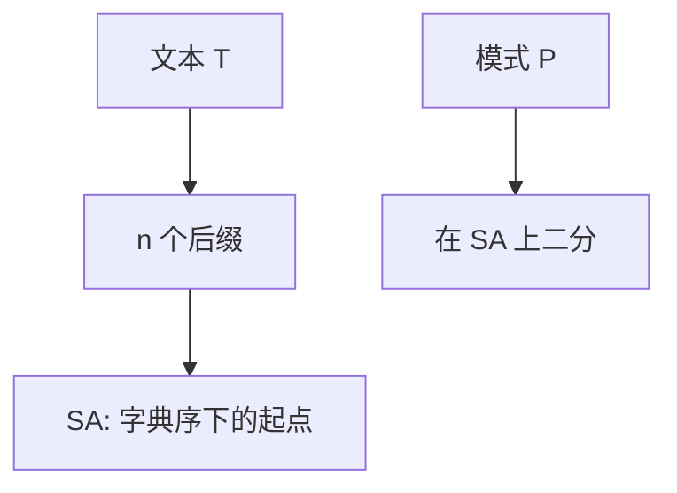

# 后缀数组

把文本每一个后缀的起点按字典序排好，模式查找就变成在这张起点表上二分。

<footer>—— 据 Manber and Myers, Suffix Arrays: A New Method for On-Line String Searches, SIAM J. Comput. 1993；Kärkkäinen and Sanders, Simple Linear Work Suffix Array Construction, ICALP 2003 整理</footer>

[上一课](/cs/space-filling-curve) 把网格线性化。字符串要的是「所有后缀谁更小」。[KMP](/cs/kmp) 只预处理模式；文本多次查询或子串统计需要文本侧索引。[Trie](/cs/trie) 可挂全部后缀但空间差。本课不写 Hilbert。缺口是后缀数组 $SA[i]$ = 第 $i$ 小后缀的起点。

## 问题

文本 $T[0..n)$（常加哨兵）。$n$ 个后缀，比较两后缀最坏 $\Theta(n)$，朴素排序 $\Theta(n^2\log n)$。后缀数组存排列，空间 $\Theta(n)$ 整数，远小于后缀树节点。查找 $P$：在 $SA$ 上二分，每次用 $T[SA[\cdot]..]$ 与 $P$ 比较，时间 $O(|P|\log n)$。缺口是**用排列代替显式树**，以及后课 LCP 把比较加速。

Manber–Myers 倍增 $O(n\log n)$。DC3/skew（Kärkkäinen–Sanders）线性时间。本课钉语义与二分查找；构造选倍增即可讲清。

## 方法

倍增：先按首字符秩，再按 $(rank[i],rank[i+2^k])$ 当对排序，k 增加。名次相同则后缀相等前缀更长。实现用整数排序。不要把后缀树 Ukkonen 提前当必须。

与哈希：期望匹配可以 Karp–Rabin，后课再收；后缀数组确定性、支持所有子串的序结构。

## 机制

$SA$ 上相邻后缀可能公共前缀很长，朴素二分反复重比——这正是下一课 LCP 与 Kasai 的缺口。逆数组 $ISA[SA[i]]=i$ 把位置映回秩，构造与 LCP 都要用。

本课不把 BWT 全文写完，只承认 BWT 是 $SA$ 的邻近字符排列。

## 边界

本课不要求实现 DC3。动态插入字符使 $SA$ 全失效，属动态后缀结构，主干不提前。LCP 数组是下一课必做预处理。

后课默认：静态文本子串查找可用 $SA$ 二分。相邻后缀的公共前缀用 LCP。

## 小结

- 后缀数组：后缀的字典序排列，$\Theta(n)$ 空间。
- 模式查找：$O(|P|\log n)$ 二分。
- 相邻 LCP 下一课线性算。
- 出处：Manber and Myers, 1993；Kärkkäinen and Sanders, ICALP 2003。
