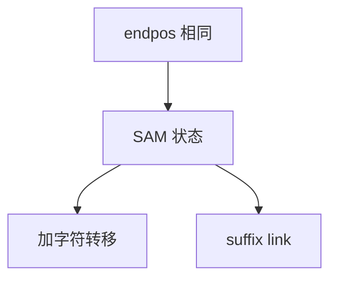

# 后缀自动机

把「结束位置集合相同」的子串收成一个状态；转移是加一个字符，后缀链指向更短的同类。

<footer>—— 据 Blumer et al., The Smallest Automaton Recognizing the Subwords of a Text, J. ACM 1985；Crochemore and Rytter；Gusfield 整理</footer>

[上一课](/cs/suffix-tree) 节点对应分支子串，状态数线性但常比自动机多。接受 $T$ 的全体子串（或全体后缀）的最小 DFA 是后缀自动机（SAM / DAWG）。本课不画 Ukkonen 活动点。缺口是 endpos 等价类：线性状态、线性转移（固定字母表）。

## 问题

子串 $u,v$ 若在 $T$ 中每次出现结束下标集合相同，则它们应同一状态。状态的 `len` 是该类最长串长度；后缀链接指向次长可能的另一类。在线加字符：克隆节点以保持确定性与最小化直觉。缺口是**用等价类而不是每条后缀一条叶**，从而子串计数、不同子串个数、首次出现在 DAG 上线性做。

Blumer et al. 1985, *JACM*。状态 $\le 2n-1$，转移 $\le 3n-4$（二字母等经典界）。构造在线 $O(n)$。

## 方法

维护 last 状态。加字符 $c$：新建 $p$，沿后缀链补转移，必要时 clone。查询子串：从初始状态走 $|P|$ 步。不同子串数：对转移 DAG 做路径计数（每状态 $\mathrm{len}-\mathrm{len}(link)$）。

与后缀树：存在互转；SAM 更省，后缀树更好报告出现位置几何（子树）。与 KMP：KMP 只要模式的前缀函数，SAM 索引整篇 $T$。

## 机制

最小化接受全部子串的自动机本质唯一（同构）。clone 保证不破坏已有更短串的转移。实现用 map 或数组转移。不要把 SAM 当通用正则引擎——字母表与文本固定。

回文不是 endpos 能直接给的结构；下一课回文自动机（eertree）另建失配。

## 边界

本课不把 SAM 与后缀树的同构证明写完。动态删前缀属变体。大字母表转移不是数组。

后课默认：子串自动机用 SAM。回文串全体用回文树。

## 小结

- SAM：endpos 等价类 DFA，线性规模。
- 后缀链 + 克隆完成在线构造。
- 回文结构下一课另建。
- 出处：Blumer et al., *JACM*, 1985；Crochemore；Gusfield。
